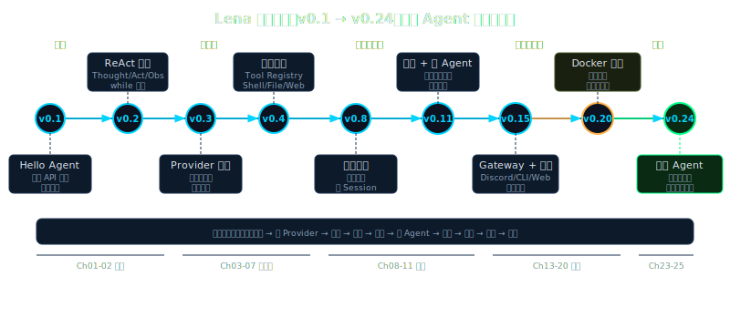

# 序章：Agent 聪明度模型 — 本书地图

> **Lena 起点**：v0.0（空白）→ 本章结束后读者在脑中建立贯穿全书的坐标系

---

## Beat 1 · 路线图

```
本章位置：序章 ← 你在这里
─────────────────────────────────────────────
[序] 聪明度地图   →  [Ch1-5] 地基
→  [Ch6-12] 六大支柱   →  [Ch13-18] 常驻 + 安全
→  [Ch19-22] 扩展与生产   →  [Ch23-24] 派生
→  [Ch25] 终章：从通用到你的 agent
─────────────────────────────────────────────
本章 arc：从"一个刚学会 API 调用的 bot"出发 →
经过"8 个可量化的聪明度维度" →
到"24 章解锁地图"，途中会踩坑：
发现大多数人以为聪明是单维度指标，实际上它是八维合成效应。
```

Lena 在 Ch1 结束时只会打印一条模型回复（v0.1）。这本书的任务，是让她在 24 章内逐一解锁 8 个聪明度维度，最终成为一个能自主做任何事的通用 agent（v0.24）。

但在开始构建之前，我们需要一张地图。没有地图，你会在第 8 章以为自己在做"记忆优化"，却不知道这实际上是在解锁整个系统里最难的维度之一；你会在第 11 章以为在写"任务拆解"，却不知道这是让 Lena 从"执行者"升级为"规划者"的分水岭。

地图在手，每一章都有方向感。

---

## Beat 2 · 动机

### 没有聪明度模型时会发生什么？

让我们看一个具体的反例。2024 年下半年，有大量教程教读者"5 分钟构建你的 AI 客服 agent"。这些 agent 的标准套路是：一个 system prompt + 一个工具（查订单）+ while 循环。

这类 agent 能完成什么？大约 3 类任务：查订单状态、回答 FAQ、转人工。

这类 agent 做不到什么？

- **记不住**：对话结束后忘得一干二净。用户昨天告诉它"我喜欢简洁回复"，今天又要重复说一遍。
- **不会拆任务**：用户说"帮我处理这三个订单的退款"，它只能一个一个问，无法并发处理。
- **无法跨天**：凌晨 1 点用户下了一个需要 2 小时处理的退款请求，agent 不知道怎么"等待"，会话超时就丢了。
- **没有安全边界**：一个精心构造的 prompt 可以让它帮用户查任意其他人的订单。
- **无法进化**：三个月后公司加了新的退款政策，没有人知道应该更新哪里。

这些不是实现细节上的不足，而是**架构维度的缺失**。一个只有"推理"能力的 agent，就像一个只有手的机器人——它能执行指令，但不能规划、不能记住、不能学习、不能安全地运转在真实世界里。

Anthropic 在《Building Effective Agents》（2025）里说得清楚：

> "Generative AI answers questions. AI agents solve problems."

回答问题和解决问题之间，是一个聪明度维度的鸿沟。这本书要填平这道鸿沟。

---

## Beat 3 · 理论铺垫

### 3.1 什么是 agent 的"聪明度"？（纯理论，无代码）

Convention：**聪明度（Intelligence）** = agent 在开放任务中展现出的可量化能力组合；**能力（Capability）** = 单个可独立测量的行为维度。聪明度是合成的，能力是组件。

一个 agent 的聪明度，不是模型的聪明度——你可以用同一个 Claude Sonnet 构建一个「永远只说三个字」的 bot，也可以构建一个能跨天自主执行任务的通用 agent，差别完全在 harness（外层运行时）的设计。

这个区分非常重要。本书教的是 harness 的构建，不是模型的训练。

### 3.2 八个可独立测量的聪明度维度（纯理论，无代码）

以下 8 个维度来自对大量 agent 系统的观察和抽象。每个维度都有**最低可观测行为**——你可以用一个测试用例验证 agent 是否具备这个维度的能力。

| 维度 | 定义 | 最低可观测行为 |
|------|------|--------------|
| **① 推理（Reasoning）** | 在多步任务中做出有依据的决策 | 给定模糊指令，能问出正确的澄清问题而非胡乱猜测 |
| **② 记忆（Memory）** | 跨会话保持上下文和知识 | 第二次对话时能回忆上次约定的偏好 |
| **③ 规划（Planning）** | 将大目标自主拆解为可执行子任务 | 给定"帮我准备下周演讲"，能分解为至少 4 个具体子步骤 |
| **④ 协作（Collaboration）** | 委托工作给其他 agent 并整合结果 | 并发派出 3 个子 agent 分别查 3 个数据源，自动汇总 |
| **⑤ 学习（Learning）** | 通过反馈和经验更新自身行为 | 用户纠错后，下次同类任务的出错率下降 |
| **⑥ 安全（Safety）** | 在不确定情况下主动降级或请求人类确认 | 遇到不可逆操作（删文件）时暂停并寻求确认 |
| **⑦ 自省（Self-Awareness）** | 监控自身状态并调整运行策略 | 发现 context 接近上限时主动压缩而非崩溃 |
| **⑧ 跨界（Extensibility）** | 无需修改核心代码即可接入新能力 | 添加新工具后无需重启，下轮对话即可使用 |

Convention：**维度** = 一个可独立测量的聪明度分量；**支柱** = 本书用于组织章节的教学框架（六大支柱），多个维度可映射到同一支柱。

### 3.3 聪明度是合成效应，不是单指标（纯理论，无代码）

乍看 agent 聪明度像是一个单一指标（"这个 agent 比那个聪明"），但实际上它更像一个生态系统——某个维度的提升会触发其他维度的级联提升，某个维度的缺失也会拖累整体。

**例子**：规划能力（③）需要记忆（②）作为底座——没有记忆，agent 每次规划都从零开始，无法积累"上次这个方向失败了"的经验。协作能力（④）需要安全（⑥）作为约束——没有安全边界，多个并发 agent 可能相互干扰，产生不可预期的副作用。

Anthropic 内部研究数据印证了这点：对于需要同时追踪多个独立方向的复杂任务，多 agent 系统（协作维度④）比单 agent 系统性能高出 90.2%（《Building Effective Agents》, p.14）。但这个增益**前提是**每个子 agent 都具备足够的推理（①）和安全（⑥）能力——否则多 agent 只是多份错误。

---

## Beat 4 · 脚手架

Let's 用一个最小的 Python 脚本，把"聪明度自评"这件事变成可运行的代码：

```python
# code/evaluator.py — 聪明度自评框架（骨架版）
# 功能：给任意 agent 打 8 个维度的聪明度分数
# 运行：python3 evaluator.py
# 预期输出：8 维 0-10 分 + 综合雷达图（文本版）

from dataclasses import dataclass, field
from typing import Callable

@dataclass
class DimensionTest:
    """一个聪明度维度的测试规格"""
    name: str          # 维度名称
    description: str   # 最低可观测行为描述
    score: int = 0     # 0-10 分，0 = 完全不具备

@dataclass 
class IntelligenceEval:
    """8 维聪明度评估器骨架"""
    agent_name: str
    dimensions: list[DimensionTest] = field(default_factory=list)
    
    def add_dimension(self, name: str, desc: str, score: int = 0):
        self.dimensions.append(DimensionTest(name, desc, score))
    
    def total_score(self) -> float:
        if not self.dimensions:
            return 0.0
        return sum(d.score for d in self.dimensions) / len(self.dimensions)
    
    def report(self) -> str:
        lines = [f"\n=== {self.agent_name} 聪明度评估 ==="]
        for d in self.dimensions:
            bar = "█" * d.score + "░" * (10 - d.score)
            lines.append(f"  {d.name:12s} [{bar}] {d.score}/10")
        lines.append(f"\n  综合得分: {self.total_score():.1f}/10")
        return "\n".join(lines)

# 运行骨架
if __name__ == "__main__":
    eval = IntelligenceEval("Lena v0.1")
    # 后续 Beat 5 会填入真实评分逻辑
    print(eval.report())
```

运行 `python3 evaluator.py`，你会看到"Lena v0.1"的空白报告。这是预期的——我们还没填入评分逻辑。接下来我们渐进填充。

---

## Beat 5 · 渐进组装

### 给 v0.1 Lena 打分

Let's 把 8 个维度的最低可观测行为转化成具体测试，并用它评估一个 v0.1 Lena（只会调用 LLM API，什么都不记，没有工具）：

| 扩展点 | 为何需要 | 如何加 |
|-------|---------|-------|
| 8 维度初始化 | 建立评估基准 | 在 `IntelligenceEval.__init__` 里预填 8 个维度 |
| v0.1 评分逻辑 | 验证"初始 agent 有多弱" | 根据 v0.1 能力手动赋值 |
| 文本雷达图 | 让数字变成直觉 | 用 ASCII 条形图渲染 |

```python
# code/evaluator.py — 完整版（含 v0.1 评分）

def build_v01_eval() -> IntelligenceEval:
    """v0.1 Lena：只会 LLM API 调用，无工具，无记忆"""
    ev = IntelligenceEval("Lena v0.1（仅 API 调用）")
    
    # 各维度得分 + 得分依据
    ev.add_dimension("① 推理", "多步决策能力",        score=2)
    # 得 2 分：模型本身有推理能力，但 harness 不放大；
    # 遇到多步问题时靠 LLM 内在能力，无结构化支持
    
    ev.add_dimension("② 记忆", "跨会话记住上下文",    score=0)
    # 得 0 分：无任何持久化；每次对话从零开始
    
    ev.add_dimension("③ 规划", "自主拆解大目标",      score=1)
    # 得 1 分：模型偶尔会"先做 A 再做 B"，但没有显式 plan 支持；
    # 任务稍复杂就迷失方向
    
    ev.add_dimension("④ 协作", "委托子 agent",        score=0)
    # 得 0 分：单线程单会话，无任何子任务委托能力
    
    ev.add_dimension("⑤ 学习", "从反馈中进化",        score=0)
    # 得 0 分：无任何反馈收集和行为更新机制
    
    ev.add_dimension("⑥ 安全", "主动降级/请求确认",   score=1)
    # 得 1 分：模型本身有安全 instinct，但 harness 没有任何守卫；
    # prompt injection 完全没有防御
    
    ev.add_dimension("⑦ 自省", "监控自身状态",        score=0)
    # 得 0 分：context 满了会报 API 错误，不会主动压缩
    
    ev.add_dimension("⑧ 跨界", "不修改核心接入新能力", score=1)
    # 得 1 分：可以手动改代码加工具，但不是"不修改核心"的插件式
    
    return ev

if __name__ == "__main__":
    print(build_v01_eval().report())
```

运行输出（这是你应该看到的）：

```
=== Lena v0.1（仅 API 调用）聪明度评估 ===
  ① 推理       [██░░░░░░░░] 2/10
  ② 记忆       [░░░░░░░░░░] 0/10
  ③ 规划       [█░░░░░░░░░] 1/10
  ④ 协作       [░░░░░░░░░░] 0/10
  ⑤ 学习       [░░░░░░░░░░] 0/10
  ⑥ 安全       [█░░░░░░░░░] 1/10
  ⑦ 自省       [░░░░░░░░░░] 0/10
  ⑧ 跨界       [█░░░░░░░░░] 1/10

  综合得分: 0.6/10
```

综合 0.6 分。这是起点，不是终点。24 章的任务，就是系统性地把每个维度的分数拉高。

---

## Beat 6 · 运行验证

### 你应该看到的输出

```bash
$ python3 book/chapters/ch00-intelligence-map/code/evaluator.py
```

预期输出就是上面的雷达图。每个维度 0-10 分，v0.1 总分 0.6/10。

如果你看到 `SyntaxError`，检查 Python 版本——需要 Python 3.10+（`dataclass` 的 `field(default_factory=...)` 写法在 3.10+ 表现最稳）。

**失败诊断**：如果输出是全 0 分，检查是否调用了 `build_v01_eval()` 而不是直接实例化 `IntelligenceEval()`。

这个脚本后面每章结束时你都可以重跑一次，把对应维度的分数更新为该章学完后 Lena 能达到的水平——它是本书的"进度仪表盘"。

---



## 24 章地图：每章解锁哪个维度

以下是贯穿全书的进度地图。每章结束后，你在对应维度上的分数会提升。括号内是该章结束时 Lena 的版本号。

| 章节 | 主题 | 解锁维度 | 维度分数变化 |
|------|------|---------|------------|
| Ch1 你好，Agent | API 调用 + 第一个回复 | — | 起点 |
| Ch2 ReAct 循环 | Thought-Action-Observation | ① 推理 | ①: 2→5 |
| Ch3 Lena 诞生 | 50 行 Agent + 工具 | ⑧ 跨界 | ⑧: 1→4 |
| Ch4 LLM 底层 | 工程直觉（方法论章）| — | 认知基础 |
| Ch5 技术选型 | Prompt/RAG/Agent 怎么选 | — | 决策框架 |
| Ch6 Tool 系统 | 任何能力都是工具 | ⑧ 跨界 | ⑧: 4→8 |
| Ch7 流式与并发 | SSE + 工具并发 | ① 推理 | ①: 5→7 |
| Ch8 记忆与上下文 | 短期 + 长期记忆 | ② 记忆 | ②: 0→6 |
| Ch9 RAG 与向量检索 | 读懂外部文档 | ② 记忆 | ②: 6→8 |
| Ch10 Context Engineering | Token 经济学 | ⑦ 自省 | ⑦: 0→5 |
| Ch11 Planning 与 Subagent | 自主拆任务 | ③ 规划 + ④ 协作 | ③: 1→7, ④: 0→6 |
| Ch12 Skills | 可复用能力单元 | ⑤ 学习 | ⑤: 0→5 |
| Ch13 输入层安全 | Prompt Injection 防御 | ⑥ 安全 | ⑥: 1→6 |
| Ch14 执行层安全 | 凭证 + 沙箱 | ⑥ 安全 | ⑥: 6→9 |
| Ch15 Gateway 与 Channel | Telegram + 常驻 | ⑧ 跨界 | ⑧: 8→9 |
| Ch16 MessageBus | 事件驱动解耦 | ④ 协作 | ④: 6→8 |
| Ch17 Heartbeat | 主动找你 | ③ 规划 | ③: 7→8 |
| Ch18 Cron 与长任务 | 跨天断点续传 | ③ 规划 | ③: 8→9 |
| Ch19 MCP 协议 | 万物皆可连接 | ⑧ 跨界 | ⑧: 9→10 |
| Ch20 Docker Sandbox | 真沙箱执行 | ⑥ 安全 | ⑥: 9→10 |
| Ch21 Evals | 如何知道 agent 变好了 | ⑤ 学习 | ⑤: 5→8 |
| Ch22 可观测性与部署 | 让 Lena 上线 | ⑦ 自省 | ⑦: 5→9 |
| Ch23 Specialization | 通用 → 专用 | ⑤ 学习 | ⑤: 8→9 |
| Ch24 Browser Agent | 终章实战 | 全部维度最终验证 | 综合 ≥8 |
| Ch25 从通用到自主 | 派生你自己的 agent | — | 毕业 |

读完 Ch24，Lena v0.24 的聪明度评分应该是：

```
① 推理   [████████░░] 8/10
② 记忆   [████████░░] 8/10
③ 规划   [█████████░] 9/10
④ 协作   [████████░░] 8/10
⑤ 学习   [█████████░] 9/10
⑥ 安全   [██████████] 10/10
⑦ 自省   [█████████░] 9/10
⑧ 跨界   [██████████] 10/10

综合得分: 8.9/10
```

从 0.6 到 8.9，这是本书要完成的旅程。

---

## Beat 7 · Design Note

> **Why Not 单维度打分？——"这个 agent 9 分"**

直觉上，给 agent 一个总分（"Claude 4 比 GPT-5 聪明"）比维护 8 个维度简单得多。评测榜单（MMLU、SWE-Bench）就是这么做的——一个数字，简洁。

这个做法在 benchmark 场景是合理的，但在 agent harness 设计中会产生三个危险：

1. **掩盖结构性缺陷**：一个推理 10/安全 1 的 agent 总分可能很高，但它是危险的；一个推理 5/安全 9 的 agent 总分较低，但它是生产可信任的。总分会混淆这两个完全不同的系统。

2. **无法指导改进**：知道 agent "6 分"，不知道该优先提升哪个维度。知道"记忆 0/规划 1"，立刻知道下一步是加记忆还是加规划机制。

3. **合成效应失真**：如前文所述，聪明度维度之间有强依赖关系。规划能力的提升高度依赖记忆能力的基础，而记忆能力的提升反过来会让推理在长任务中更稳定。总分相加会把这种依赖关系抹平。

Anthropic 的 Skills 系统（《Complete Guide to Skills》, p.5）恰好体现了这个思路：它没有给 Claude 一个"能力总分"，而是用三级渐进披露（frontmatter / body / linked files）把"技能"拆成可独立激活的模块——每个模块对应一种能力维度，可以单独观察、单独更新、单独测试。

本书的 8 维度框架借鉴了这个思路：**把聪明度分解为可独立演进的维度，是 harness 设计和本书教学的共同基础。**

---

**下一章**：有了坐标系，现在去打第一个钉子。Ch1 会让你在 20 分钟内用 10 行 Python 跑通第一次 LLM API 调用——Lena 的生命从那一刻开始。
