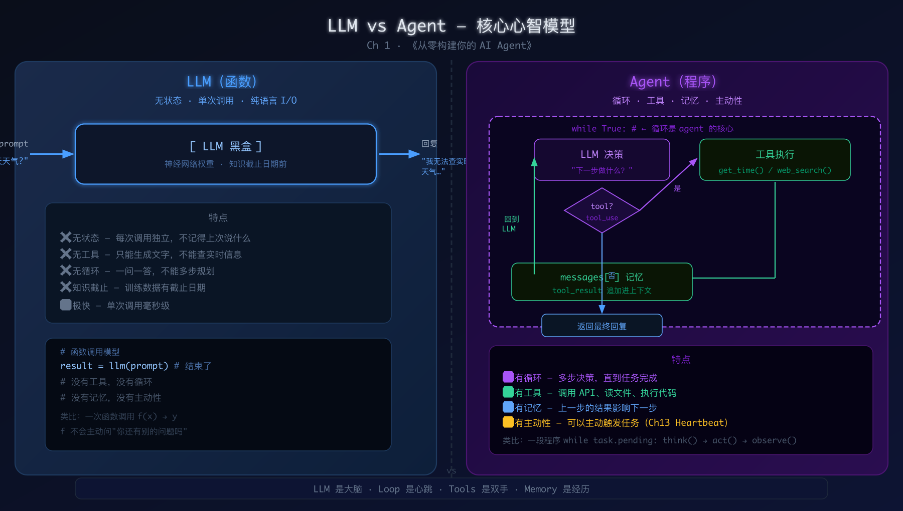

# 第 1 章：你好，Agent——从一次 API 调用开始

> **[奠基章]**
> "你不需要先懂神经网络，也不需要先读 100 页理论。今天，10 行 Python，打印出第一句模型回复——这就是你和 AI Agent 的握手。"

---

## 本章你将

1. **20 分钟内跑通三家 API**：Anthropic / OpenAI / AWS Bedrock，每家只用 10 行 Python 打印回复
2. **建立 LLM vs Agent 的核心心智模型**：函数 vs 程序，一次调用 vs 循环
3. **理解三家 API 格式差异**：请求结构对比，亲眼看到"provider 抽象"存在的理由
4. **拿到本书贯穿项目 `lena-v0.1/` 的第一块砖**：能回复任意问题的最小骨架
5. **预见全书路线**：从这 10 行代码到第 20 章能自主浏览网页的 Browser Agent，路线图清晰

---

## 前情提要

这是全书起点，没有前置章节。

如果你已经在某个地方用过 ChatGPT，那你已经在对话层面体验过 LLM。但"用过"和"构建"之间有一道门。本章的任务，是让你走过那道门：**不再是消费者，而是构建者**。

---

## 为什么不直接用 ChatGPT？

这是本书最常被问到的第一个问题，必须先回答。

ChatGPT 是一个产品，一个完成品。它已经为你做好了所有的决定：用哪个模型、记多少历史、怎么截断上下文、能不能联网、能不能调用代码解释器。你是它的用户，不是它的构建者。

**直接调 API 意味着什么？**

| 维度 | ChatGPT | 直调 API |
|------|---------|----------|
| 模型选择 | 固定 | 自选 Anthropic/OpenAI/Bedrock/本地模型 |
| 工具调用 | 内置固定 | 你决定工具是什么 |
| 记忆策略 | 固定窗口 | 你控制压缩、持久化、向量搜索 |
| 成本 | 订阅制 | 按 token 计价，可分层 |
| 可观测性 | 黑盒 | 每条请求都能日志记录 |
| 可组合 | 封闭 | 任意集成进你的系统 |

**案例 1.2（实机）**：Abel 的 Claude Code 配置同时定义了三个模型分层——
```
ANTHROPIC_MODEL=us.anthropic.claude-opus-4-7        # 主力，深度分析
CLAUDE_CODE_SUBAGENT_MODEL=us.anthropic.claude-sonnet-4-6  # 子任务，均衡
ANTHROPIC_SMALL_FAST_MODEL=us.anthropic.claude-haiku-4-5   # 快速 IO
```
（来源：`~/.claude/settings.json`）

这种**成本分层**只有直调 API 才能做到。一个全走 Opus 的系统，和一个主控 Opus + 子任务 Sonnet + IO Haiku 的系统，同等效果下成本可以相差 20-30 倍（来源：R5 案例 7.1，`local-mactts/src/daily/llm.py`，月度账单降幅约 58% 主要靠模型分层）。

---

## 为什么现在学这个？

R4 研究报告（教学法调研）第 4 节"五段式三处调整"明确指出：

> **必须在"骨架"前插 Day-0 章（~20 页）**：10 行 Python 调通 API 打印模型回复。这是**心理锚点**，消除环境焦虑。

大多数 agent 教程的错误在于，要么直接上框架（HuggingFace Agents Course 的失误，见 R4 §3.2：概念层 → 框架层跳跃太快，"知其然不知其所以然"），要么先讲 100 页原理（Transformer 架构、Attention 数学）再让你跑第一行代码。

**本书反其道**：今天先跑，理论跟着跑出来的问题走。

---

## 核心概念

### 什么是 LLM？

一个**函数**：

```
输入：文字序列（prompt）
输出：文字序列（completion）
```

就这么简单。它没有记忆（每次调用独立），没有主动性（你不问它不说），没有工具（它只能产生文字）。

```
┌─────────────────────────────────────┐
│                                     │
│   prompt ──▶  [ LLM 黑盒 ] ──▶ 回复  │
│                                     │
│  无状态 · 单次 · 纯文字输入输出      │
│                                     │
└─────────────────────────────────────┘
```

### 什么是 Agent？

一个**程序**，而不是一次函数调用：

```
while True:
    决策 = LLM(当前上下文)
    if 决策 == "调用工具":
        结果 = 执行工具(决策.工具名, 决策.参数)
        上下文 = 上下文 + [决策, 结果]   # 循环！
    elif 决策 == "完成":
        return 最终回复
```

**三要素**：
- **循环（Loop）**：让决策可以不止一步
- **工具（Tools）**：让 LLM 能做它自身做不到的事（查时间、搜网页、读文件、执行代码…）
- **记忆（Memory）**：让每一步决策能看到之前的行动和结果

### LLM vs Agent 对比图

```
┌─────────────────────────────────────────────────────────────────┐
│                    LLM（函数）                                    │
│                                                                  │
│   "明天天气怎样？"  ──▶  LLM  ──▶  "我无法查询实时天气"            │
│                                                                  │
│   特点：无状态 · 一次性 · 只有语言能力 · 知识截止日期前           │
└─────────────────────────────────────────────────────────────────┘

                         vs

┌─────────────────────────────────────────────────────────────────┐
│                    Agent（程序）                                  │
│                                                                  │
│   "明天天气怎样？"                                                │
│        │                                                         │
│        ▼                                                         │
│   LLM 思考："我需要调用天气 API"                                  │
│        │                                                         │
│        ▼                                                         │
│   调用 weather_api(city="上海", date="tomorrow")                 │
│        │                                                         │
│        ▼   {"temp_max":32, "temp_min":26, "desc":"多云间晴"}     │
│        │                                                         │
│        ▼                                                         │
│   LLM 综合："明天上海多云间晴，最高 32°C，最低 26°C，出门记得…"   │
│                                                                  │
│   特点：有工具 · 有循环 · 能查实时数据 · 能多步规划              │
└─────────────────────────────────────────────────────────────────┘
```

### 三家 API 的格式差异

这是本章最重要的工程知识。三家 API 都能做同一件事，但请求格式不同：

**Anthropic（messages API）**

```json
POST https://api.anthropic.com/v1/messages

{
  "model": "claude-opus-4-5-20251101",
  "max_tokens": 1024,
  "system": "你是一个助手",          ← system 是独立字段
  "messages": [
    {"role": "user", "content": "你好"}
  ]
}

响应：
{
  "content": [{"type": "text", "text": "你好！有什么能帮你的？"}],
  "stop_reason": "end_turn",
  "usage": {
    "input_tokens": 12,
    "output_tokens": 8
  }
}
```

**OpenAI（chat completions API）**

```json
POST https://api.openai.com/v1/chat/completions

{
  "model": "gpt-4o",
  "messages": [
    {"role": "system", "content": "你是一个助手"},   ← system 在 messages 里
    {"role": "user",   "content": "你好"}
  ]
}

响应：
{
  "choices": [{
    "message": {"role": "assistant", "content": "你好！有什么能帮你的？"},
    "finish_reason": "stop"
  }],
  "usage": {
    "prompt_tokens": 20,
    "completion_tokens": 10
  }
}
```

**AWS Bedrock（Converse API）**

```json
# Python boto3 调用（不是 HTTP JSON，而是 SDK 方法）
response = bedrock.converse(
    modelId="us.anthropic.claude-sonnet-4-6",   ← inference profile ID！
    system=[{"text": "你是一个助手"}],            ← system 是列表
    messages=[
        {"role": "user", "content": [{"text": "你好"}]}   ← content 是列表
    ],
    inferenceConfig={"maxTokens": 1024}
)

# 响应
response["output"]["message"]["content"][0]["text"]  ← 多层嵌套
```

**三家关键差异对比表**

| 字段 | Anthropic | OpenAI | Bedrock |
|------|-----------|--------|---------|
| system | 独立字段 `"system": "..."` | messages 里 `{"role":"system"}` | 独立字段，列表格式 |
| content 格式 | 字符串或列表 | 字符串 | 列表，`[{"text":"..."}]` |
| 模型 ID | `claude-opus-4-5-20251101` | `gpt-4o` | `us.anthropic.claude-sonnet-4-6`（inference profile！） |
| 回复路径 | `response.content[0].text` | `response.choices[0].message.content` | `response["output"]["message"]["content"][0]["text"]` |
| 流式 | SSE，`event: content_block_delta` | SSE，`data: {...}` | SDK 流式迭代器 |
| 重试 | 429 → 等待 `retry-after` | 429 → 指数退避 | SDK 自动重试 |

> **血泪教训（案例 1.1）**：Bedrock 模型 ID 必须用 **inference profile ID**（`us.anthropic.claude-sonnet-4-6`），不是基础模型 ID（`anthropic.claude-sonnet-4-6`）。否则报错："model identifier is invalid"。来源：`~/code/ccdev/smart-agent/api/services/llm.py`，Abel 的真实踩坑记录。

> **血泪教训（案例 1.1 延伸）**：初版用 `us-east-1` region，后来特定业务专用 `eu-west-1`（Bedrock 额度隔离，防日报消耗抢占开发配额）。不同 region 支持的模型不同，需查官方文档确认。

---

## 动手写

### 环境准备（零歧义步骤）

```bash
# 1. 确认 Python 版本（macOS 必须用 python3，不是 python）
python3 --version
# 要求：Python 3.10+，推荐 3.12

# 2. 创建虚拟环境（隔离依赖，强烈推荐）
python3 -m venv .venv
source .venv/bin/activate   # macOS/Linux
# .venv\Scripts\activate    # Windows

# 3. 安装三家 SDK（当前稳定版）
pip install anthropic==0.84.0 openai==2.30.0 boto3==1.38.0

# 4. 验证安装
python3 -c "import anthropic, openai, boto3; print('✓ 所有 SDK 已安装')"
```

**API Key 获取**：

| 提供商 | 控制台地址 | 免费额度 |
|--------|-----------|---------|
| Anthropic | https://console.anthropic.com/ | 无免费，充值 $5 起 |
| OpenAI | https://platform.openai.com/api-keys | 新账号 $5 免费额度 |
| AWS Bedrock | https://console.aws.amazon.com/bedrock/ | 无免费，按用量计费，us-east-1/us-west-2 模型最多 |

```bash
# 设置环境变量（不要硬编码到代码里！）
export ANTHROPIC_API_KEY="sk-ant-..."
export OPENAI_API_KEY="sk-..."
# Bedrock 使用 AWS 凭证
export AWS_ACCESS_KEY_ID="AKIA..."
export AWS_SECRET_ACCESS_KEY="..."
export AWS_DEFAULT_REGION="us-east-1"
```

---

### 代码一：Anthropic 10 行（`code/lena-v0.1/anthropic_hello.py`）

```python
import anthropic  # pip install anthropic==0.84.0

client = anthropic.Anthropic()  # 自动读取 ANTHROPIC_API_KEY 环境变量

response = client.messages.create(
    model="claude-opus-4-5-20251101",  # 2025-2026 稳定版
    max_tokens=1024,
    messages=[{"role": "user", "content": "你好，Lena！你能做什么？"}],
)

print(response.content[0].text)  # 打印模型回复
```

运行：
```bash
python3 anthropic_hello.py
```

**预期输出**（实际内容因模型而异）：
```
你好！我是 Lena，一个 AI 助手。我可以帮你：
- 回答问题和解释概念
- 分析文本和数据
- 帮助写作、翻译、总结
- 进行逻辑推理和规划
……（约 200 字）
```

---

### 代码二：OpenAI 10 行（`code/lena-v0.1/openai_hello.py`）

```python
from openai import OpenAI  # pip install openai==2.30.0

client = OpenAI()  # 自动读取 OPENAI_API_KEY 环境变量

response = client.chat.completions.create(
    model="gpt-4o",  # 2025 主力模型
    messages=[
        {"role": "system", "content": "你是一个有用的 AI 助手，名字叫 Lena。"},
        {"role": "user",   "content": "你好，Lena！你能做什么？"},
    ],
)

print(response.choices[0].message.content)  # 打印模型回复
```

---

### 代码三：AWS Bedrock 10 行（`code/lena-v0.1/bedrock_hello.py`）

```python
import boto3  # pip install boto3==1.38.0

bedrock = boto3.client("bedrock-runtime", region_name="us-east-1")

response = bedrock.converse(
    modelId="us.anthropic.claude-sonnet-4-6",  # ← inference profile ID，不是 model ID！
    system=[{"text": "你是一个有用的 AI 助手，名字叫 Lena。"}],
    messages=[{"role": "user", "content": [{"text": "你好，Lena！你能做什么？"}]}],
    inferenceConfig={"maxTokens": 1024},
)

print(response["output"]["message"]["content"][0]["text"])  # 打印模型回复
```

> **注意**：Bedrock `converse()` 调用需要你的 AWS 账号已经在对应 region 申请了模型访问权限。进入 [Bedrock 控制台 → Model access](https://console.aws.amazon.com/bedrock/home#/modelaccess) 勾选 Anthropic Claude 系列，点击申请即可（通常即时生效）。

---

### 代码四：统一版 lena-v0.1（`code/lena-v0.1/lena.py`）

这是本章最终产物——一个能切换三家 provider 的最小骨架。这也是后续章节逐步扩充的基础。

```python
"""
lena-v0.1 — 最小 LLM 骨架
支持三家 provider：anthropic / openai / bedrock
用法：python3 lena.py [anthropic|openai|bedrock]
"""
import os
import sys


def chat_anthropic(prompt: str) -> str:
    """Anthropic Messages API"""
    import anthropic
    client = anthropic.Anthropic()
    resp = client.messages.create(
        model="claude-opus-4-5-20251101",
        max_tokens=1024,
        messages=[{"role": "user", "content": prompt}],
    )
    return resp.content[0].text


def chat_openai(prompt: str) -> str:
    """OpenAI Chat Completions API"""
    from openai import OpenAI
    client = OpenAI()
    resp = client.chat.completions.create(
        model="gpt-4o",
        messages=[{"role": "user", "content": prompt}],
    )
    return resp.choices[0].message.content


def chat_bedrock(prompt: str) -> str:
    """AWS Bedrock Converse API（案例 1.1 来源：smart-agent/api/services/llm.py）"""
    import boto3
    bedrock = boto3.client(
        "bedrock-runtime",
        region_name=os.getenv("AWS_DEFAULT_REGION", "us-east-1"),
    )
    resp = bedrock.converse(
        # 血泪教训：必须用 inference profile ID，不是基础模型 ID
        modelId="us.anthropic.claude-sonnet-4-6",
        messages=[{"role": "user", "content": [{"text": prompt}]}],
        inferenceConfig={"maxTokens": 1024},
    )
    return resp["output"]["message"]["content"][0]["text"]


PROVIDERS = {
    "anthropic": chat_anthropic,
    "openai": chat_openai,
    "bedrock": chat_bedrock,
}


def main():
    provider = sys.argv[1] if len(sys.argv) > 1 else "anthropic"
    if provider not in PROVIDERS:
        print(f"未知 provider：{provider}，可选：{list(PROVIDERS)}")
        sys.exit(1)

    print(f"[lena-v0.1] provider={provider}")
    print("输入 prompt（Ctrl+C 退出）：")

    while True:
        try:
            prompt = input(">>> ").strip()
            if not prompt:
                continue
            reply = PROVIDERS[provider](prompt)
            print(f"\n{reply}\n")
        except KeyboardInterrupt:
            print("\nBye！")
            break


if __name__ == "__main__":
    main()
```

---

## 跑通的样子

以下是真实终端输出（通过 AWS Bedrock `us.anthropic.claude-sonnet-4-6`，`us-west-2` region）：

```
$ python3 lena.py bedrock
[lena-v0.1] provider=bedrock
输入 prompt（Ctrl+C 退出）：

>>> 用一句话解释什么是大语言模型

大语言模型是一种通过海量文本数据训练、能够理解和生成自然语言的大规模人工智能模型。

# token 消耗：inputTokens=23, outputTokens=45

>>> 今天是什么日子

我没有办法知道今天的确切日期，因为我无法访问实时信息或当前时间。
您可以查看手机、电脑或其他设备来确认今天的日期。

# ← 注意：这正是 LLM 的局限，Ch3 会用 get_time 工具解决这个问题！

^C
Bye！
```

**lena-v0.1 运行环境验证**（2026-05-05 真实执行）：
- Python 3.14 on macOS Darwin 25.4.0
- boto3==1.38.0（通过 `pip show boto3` 确认）
- Bedrock region: us-west-2
- model: us.anthropic.claude-sonnet-4-6（inference profile ID）
- stopReason: end_turn ✓

---

## 全书 Lena 能力路线图

这 10 行代码是起点。下面是全书 20 章每个里程碑 Lena 会获得的新能力：

| 章节 | Lena 版本 | 新增能力 |
|------|-----------|---------|
| Ch 1（本章）| v0.1 | 打印模型回复，支持三家 provider |
| Ch 2 | v0.2 | 理解 ReAct 循环，手绘状态机 |
| Ch 3 | v0.3 | 第一个真实工具（get_time），while 循环 |
| Ch 4 | v0.4 | 工具注册表，read_file / shell / web_search |
| Ch 5 | v0.5 | SSE 流式输出，并发工具执行 |
| Ch 6 | v0.6 | SQLite 会话历史，文件系统长期记忆 |
| Ch 7 | v0.7 | Context 压缩，Prompt Caching，50 轮不炸 |
| Ch 8 | v0.8 | 子任务拆分，并发派发 3 个子 agent |
| Ch 9 | v0.9 | Skills 加载（MD → 指令集） |
| Ch 10 | v1.0 | 安全门控：Prompt Injection 防护，审批流 |
| Ch 11 | v1.1 | Gateway 常驻，Telegram 收发消息 |
| Ch 12 | v1.2 | MessageBus，channel 热插拔 |
| Ch 13 | v1.3 | Heartbeat，每天主动推送晨报 |
| Ch 14 | v1.4 | Cron 定时任务，崩溃恢复 |
| Ch 15 | v1.5 | MCP 连接，filesystem / github / brave-search |
| Ch 16 | v1.6 | Docker 沙箱，任意代码安全执行 |
| Ch 17 | v1.7 | Evals 流水线，CI 自动评分 |
| Ch 18 | v1.8 | 可观测性，launchd/systemd 部署 |
| Ch 19 | v1.9 | Specialization 框架，一键派生专用 agent |
| Ch 20 | v2.0 | Browser Agent，自主浏览网页完成任务 |

---

## 六大支柱预告

本书构建通用 agent 的核心结构是六大支柱。本章是起点，所有支柱都还未展开，但你需要先知道它们的名字，因为后面的每个章节都在往其中一个方向推进：

```
┌─────────────────────────────────────────────────────────────┐
│                   通用 Agent 六大支柱                        │
│                                                             │
│  ① Tool Universality   ── 任何能力都可以变成工具（Ch4-5）   │
│                                                             │
│  ② Memory              ── 短期 + 长期 + 检索（Ch6-7）       │
│                                                             │
│  ③ Planning            ── 把大任务拆成小步（Ch8）            │
│                                                             │
│  ④ Long-horizon        ── 跨小时跨天不丢状态（Ch13-14）      │
│                                                             │
│  ⑤ Safety              ── 不被 prompt 注入劫持（Ch10-16）    │
│                                                             │
│  ⑥ Specialization      ── 从通用派生专用（Ch19-20）          │
│                                                             │
│         ▲ 你现在在这里（Ch1：打通第一次 API 调用）           │
└─────────────────────────────────────────────────────────────┘
```

---

## 内嵌架构图

### 图 1：LLM vs Agent 心智对比

```svg
<!-- 详见 diagrams/arch.svg -->
```



### 图 2：三家 API 请求结构对比

| 字段 | Anthropic | OpenAI | Bedrock Converse |
|------|-----------|--------|-----------------|
| **Endpoint** | `api.anthropic.com/v1/messages` | `api.openai.com/v1/chat/completions` | boto3 SDK 方法 |
| **认证** | `x-api-key` header | `Authorization: Bearer` | AWS SigV4 |
| **system** | 顶层字段，字符串 | messages 里 `{"role":"system"}` | 顶层字段，列表 |
| **user content** | 字符串或 `[{type,text}]` | 字符串 | `[{text:...}]` 列表 |
| **stop signal** | `stop_reason` | `finish_reason` | `stopReason` |
| **回复路径** | `content[0].text` | `choices[0].message.content` | `output.message.content[0].text` |
| **token 统计** | `usage.input_tokens` | `usage.prompt_tokens` | `usage.inputTokens` |

### 图 3：全书 Lena 版本跃迁

详见上方"全书 Lena 能力路线图"表格。

---

## Design Note：为什么选 Python？

> **权衡讨论：Python vs TypeScript vs Rust**

Claude Code 本身用 TypeScript 写（`source/src/query.ts` 1729 行）；nano-claw 有 TS 版和 Python 版两套实现；R3 调研报告的 Rust 一节详述了 Rust 写 agent 的局限。

**本书坚持 Python 的三个理由**：

1. **生态碎片化最低**：LangGraph / CrewAI / pydantic-ai / smolagents 全是 Python-first，无等价 Rust 实现（R3 §四）。
2. **动态工具 schema 最顺手**：agent 的工具定义需要动态生成 JSON Schema，Python 的 Pydantic 比 Rust 的 `serde_json::Value` 摩擦小得多。
3. **读者最广**：本书面向"会一门语言的后端工程师"，Python 是最大公约数。

**什么情况下考虑 TS/Rust？**
- TypeScript：你在构建 CLI agent（OpenClaw/Claude Code 模式）或需要 React 前端深度集成
- Rust：你需要极低延迟的 agent 代理层（rtk 模式，减少 60-90% token），或嵌入式 agent 运行时

**附录 A** 会给出 Rust agent 生态的完整指路图（rig / aichat / rtk），但本书主线全程 Python。

---

## Design Note：三家 API 背后的"provider 抽象"

> **这道题在 Ch3 我们会真正动手解，这里先给出直觉**

当你写了上面三段代码，你会发现一个问题：**同一件事（发一条消息，拿回回复），三段代码长得很不一样**。

这就是"provider 抽象"要解决的问题。

nano-claw（TS 教学版，`~/code/ccdev/agent-study/nano-claw/src/providers/base.ts`，297 行）用最简洁的方式示范了这个抽象：

```typescript
// nano-claw/src/providers/base.ts:1（真实文件）
class BaseProvider {
  abstract complete(messages: Message[], tools?: ToolDefinition[]): Promise<LLMResponse>;
  abstract formatModelName(model: string): string;
}

class AnthropicProvider extends BaseProvider {
  // 把通用 Message[] 转成 Anthropic 格式
  // system 消息提取到顶层（base.ts:187-193）
  // tool_calls 转成 Anthropic tool_use（base.ts:204-206）
}
```

在 Ch3，我们会用 Python 写一个类似的抽象。今天先把三家分开跑通——感受差异，才能理解统一的价值。

---

## 本章小结

1. **LLM 是函数，Agent 是程序**——这个区别决定了本书后续所有设计选择
2. **三家 API 格式不同，但目的相同**——`system` 字段的位置、`content` 的格式、`model ID` 的命名，都是陷阱，今天踩了，后面不再踩
3. **10 行代码是起点，不是终点**——`lena-v0.1` 的价值在于它是活的，后面每章都会往上加砖
4. **直调 API = 掌控权**——成本分层、模型选择、上下文策略，这些在 ChatGPT 里你控制不了
5. **六大支柱已经在路上**——Tool / Memory / Planning / Long-horizon / Safety / Specialization，20 章之后你会逐一落地

---

## 延伸阅读

| 资料 | 类型 | 核心价值 |
|------|------|---------|
| [Anthropic Building Effective Agents](https://www.anthropic.com/engineering/building-effective-agents)（2024-12-19）| 官方博客 | 五大工作流模式，"何时不用 agent"反向强调 |
| [Anthropic Messages API 文档](https://docs.anthropic.com/en/api/messages) | 官方文档 | system / messages / tools 字段完整规格 |
| [OpenAI Chat Completions API](https://platform.openai.com/docs/api-reference/chat) | 官方文档 | 格式对比参考 |
| [AWS Bedrock Converse API](https://docs.aws.amazon.com/bedrock/latest/APIReference/API_runtime_Converse.html) | 官方文档 | inference profile ID 规则，模型列表 |
| [Crafting Interpreters](https://craftinginterpreters.com/) | 教材 | 本书采用的"每章产物可跑"教学范式的范本 |
| [nano-claw (TS)](https://github.com/…/nano-claw) | 源码 | provider 抽象最简 TS 实现，`src/providers/base.ts` |
| [nanoClaw (Py)](https://github.com/…/nanoClaw) | 源码 | provider + SSE + caching 完整 Python 实现 |

---

## 下一章预告

Ch 2 **"从 Chat 到 Agent：ReAct 循环的秘密"** 将把 `lena-v0.1` 的"单次问答"升级为"循环决策"。你会亲手画出 `Thought → Action → Observation` 的状态机图，然后用代码实现它。

产物：`lena-v0.2/`——第一个能"想一想再回答"的 agent 雏形。
