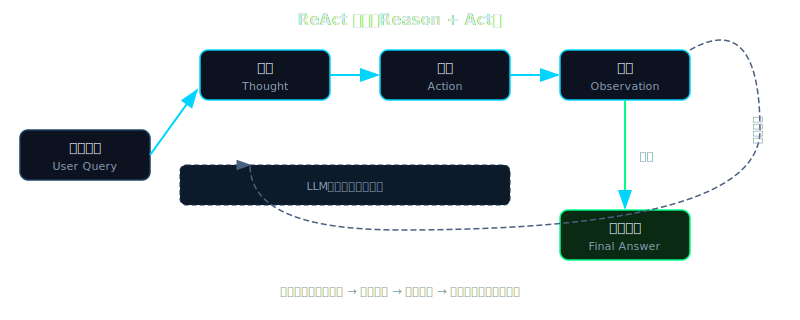

# Ch 02 · 从 Chat 到 Agent：ReAct 循环的秘密

---

## Beat 1 — 路线图

```
Ch 01 → [Ch 02] → Ch 03 → Ch 04 → ...
  ↑         ↑
Lena v0.1  Lena v0.2（本章）
打印回复   理解循环的心智模型
           （代码在 Ch 03 实现）
```

本章从一个问题出发：**为什么 ChatGPT 帮不了你真正做事？**

经过 ReAct 循环的心智模型铺垫（Thought → Action → Observation 的直觉起点）、Anthropic "Building Effective Agents" 五大工作流模式的概念地图、Tool Use 协议的格式对比，最终到达一个清晰的认知：agent 和聊天机器人的本质差异不在于模型更聪明，而在于**架构里多了一个回路**。

途中会遇到一个让很多人困惑的地方：为什么工具返回结果时，消息的 `role` 是 `"user"` 而不是 `"tool"`？这个细节会在协议讲解部分解开。

Lena 在本章从 v0.1 升级到 v0.2——代码文件完全相同，但你对它的理解已经发生了飞跃。本章的核心产物是一张**手绘状态机图**，这是下一章写代码的草图。

> **🧠 聪明度增量（v0.1 → v0.2）**：Lena 第一次具备"自主推理下一步"的心智架构——理解 ReAct 循环（Thought → Action → Observation）后，她不再是一次性问答机，而是一个能自主决定何时调用工具、何时停止的 agent。这一章教读者把 ReAct 循环思维长在自己 agent 上的方法。



---

## Beat 2 — 动机：聊天机器人为什么不够用


设想一个具体任务：你希望 Lena 帮你"清理项目目录里三个月没有修改的日志文件"。

Ch 01 的 `lena-v0.1` 会怎么回答？

```
你:   帮我清理项目目录里三个月没有修改的日志文件
Lena: 好的，你可以用以下命令：
      find /path/to/logs -name "*.log" -mtime +90 -delete
      请注意，执行前先备份……
```

它给了你一条命令。任务没完成——你还要自己去执行。

这不是模型不够聪明。换成 GPT-4o、Claude Opus、Gemini 1.5 Pro，回答会更详细，但结构是一样的：**给建议，不做事**。根本原因是结构性的：单次 API 调用缺少"执行→观察→再推理"的回路。

让我们用数字来感受这个差距。Yao et al. 的 ReAct 论文（ICLR 2023，arxiv: 2210.03629）在两类任务上做了对比：在 HotpotQA 多步问答上，ReAct 显著超过纯 CoT，解决了 chain-of-thought 容易产生幻觉的问题；在 ALFWorld 决策任务上，ReAct 比模仿学习（imitation learning）基线高出 **34 个百分点**的绝对成功率。

34 个百分点不是边际改进，是结构跃升。背后的原因很简单：多步推理任务需要中间状态，而中间状态必须来自真实的外部反馈，不能靠模型内部"想象"。

这就是本章要回答的核心问题：那个"真实的外部反馈"回路，究竟是什么？

---

## Beat 3 — 理论铺垫

### 3.1 三个节点：从直觉开始 {#three-nodes}


2022 年，普林斯顿/Google Research 的研究员发表了论文 [ReAct: Synergizing Reasoning and Acting in Language Models](https://arxiv.org/abs/2210.03629)（arxiv: 2210.03629）。你不需要读完它，只需要知道核心结论：

> **把推理（Reasoning）和行动（Acting）交织在同一个 LLM 调用流程里，效果比纯推理或纯行动都好。**

"交织"是关键词。不是先把所有推理做完再行动，也不是随机行动后才推理——而是每次推理之后立刻行动，每次行动之后立刻观察，观察结果成为下次推理的起点。这个"推理→行动→观察→推理→……"的链条，就是 ReAct 循环。

它有三个节点，直觉上很好理解：

**Thought（推理）**：LLM 的"内心独白"。它看到当前状态，想清楚下一步要做什么。比如："用户要删除三个月没修改的日志文件，我需要先知道哪些文件符合条件，得先列出来看看。"

**Action（行动）**：LLM 发出一个工具调用请求。比如："执行 `find /logs -mtime +90 -name '*.log'`"。注意，这一步 LLM 只是*请求*执行，它自己不能运行代码——工具调用是发给外部执行器的指令。

**Observation（观察）**：工具真实执行后，把结果返回给 LLM。比如："找到 3 个文件：access.log.2024-01，error.log.2024-01，debug.log.2024-01"。这是**真实世界的反馈**，不是 LLM 猜的。

Convention：Thought = LLM 输出的文本推理段落（内心独白）; Action = LLM 发出的工具调用请求（尚未执行）; Observation = 工具实际执行后返回的结果（真实数据）。后续统一用这三个词。

三个节点构成一个循环。每次循环结束，Observation 的内容被追加到对话历史，LLM 在下一次 Thought 时就能看到它。循环直到 LLM 判断"任务完成"才退出。

这就是 agent 和聊天机器人的本质差异：**聊天机器人没有这个循环，它每次都是一次性推理；agent 有这个循环，它能基于真实反馈持续推理直到完成任务。**

### 3.2 messages 数组：账本视角 {#messages-ledger}


理解 ReAct 的另一个视角是把 messages 数组想象成**账本**。每次循环，账本里都会新增几条记录：

```
[初始]
  user: "清理三个月没修改的日志文件"

[第 1 轮 Thought + Action 后新增]
  assistant: [Thought 文本] + [Action: find 命令请求]

[第 1 轮 Observation 后新增]
  user: [tool_result: 找到 3 个文件]

[第 2 轮 Thought + Action 后新增]
  assistant: [Thought: 确认这 3 个文件可以删除] + [Action: rm 命令请求]

[第 2 轮 Observation 后新增]
  user: [tool_result: 删除成功]

[第 3 轮 Final Thought 后新增]
  assistant: [Final: 已清理 3 个日志文件]
```

这个账本有两个重要性质：

**第一，账本是 LLM 每次推理的唯一输入**。LLM 没有"记忆"——它只能看到 messages 数组里的内容。每次循环的 Observation 被追加进去，就成了下一轮推理的基础。账本越长，LLM 看到的上下文越完整。

**第二，Observation 是无法伪造的**。账本里的 tool_result 来自真实的工具执行，不是 LLM 自己生成的。这是 ReAct 比"纯推理（让 LLM 假装执行工具，自己编结果）"更可靠的根本原因：每一步推理都锚定在真实世界的反馈上。

一个自然的问题是：这个账本在 Anthropic API 里长什么样？`tool_result` 的 `role` 为什么是 `"user"` 而不是 `"tool"`？这个问题在下面的协议部分回答。

---

## Beat 4 — 脚手架：ReAct 循环的最小骨架

在看任何代码之前，先把心智模型转化成伪代码。一个有效的 ReAct 循环，骨架只需要这几步：

```
1. 把用户消息加入 messages 账本
2. 循环开始:
   a. 用当前 messages 调用 LLM → 得到 Thought + (可选)Action
   b. 如果没有 Action → 这是最终回复，退出循环
   c. 如果有 Action → 执行工具，得到 Observation
   d. 把 Observation 加入 messages 账本
   e. 回到步骤 2a
```

这就是 ReAct 的全部。五步。现在让我们看看它在 Python 里的最小实现形态是什么样的。

下面逐步追踪每个真实 agent 底层最小 Python 结构，验证核心循环：

```python
# ReAct 循环的最小骨架（未接入真实工具，仅展示结构）
# 来源：build-your-own-openclaw/01-tools 教学范例的骨架抽取

def agent_loop(client, messages: list, tools: list, max_steps: int = 10) -> str:
    """
    ReAct 循环的最小形态。

    参数:
        client      - Anthropic API 客户端
        messages    - 初始消息列表（包含用户输入）
        tools       - 可用工具的定义列表
        max_steps   - 最大循环次数（防止无限循环，默认 10）
    返回:
        最终的文本回复
    """
    for step in range(max_steps):
        # Thought：调用 LLM，得到推理和（可能的）工具调用请求
        response = client.messages.create(
            model="claude-sonnet-4-6",  # 2026 Claude 4.X 系列（2024 版已 deprecated）
            max_tokens=1024,
            tools=tools,
            messages=messages,
        )

        # 把 assistant 回复追加进账本
        messages.append({"role": "assistant", "content": response.content})

        # 判断出口：没有工具调用 = 任务完成
        if response.stop_reason == "end_turn":
            # 提取最终文本回复
            for block in response.content:
                if block.type == "text":
                    return block.text
            return ""

        # Action + Observation：执行所有工具调用，收集结果
        tool_results = []
        for block in response.content:
            if block.type == "tool_use":
                result = execute_tool(block.name, block.input)   # 真实工具执行
                tool_results.append({
                    "type": "tool_result",
                    "tool_use_id": block.id,
                    "content": result,
                })

        # 把 Observation 追加进账本，开始下一轮
        messages.append({"role": "user", "content": tool_results})

    return "已达到最大步骤数，任务未完成"
```

预期输出：调用 `agent_loop()` 并传入一个工具（如 `get_time`），你应该能看到循环执行 1-2 步后输出一句自然语言回复。如果工具返回了错误，LLM 会在下一轮 Thought 里根据错误信息重新推理——这也是 Observation 的一部分。

注意两个细节：

1. **`stop_reason == "end_turn"` 是出口**，不是 `stop_reason == "tool_use"`。Anthropic API 用 `stop_reason` 来告诉你"为什么停止生成"：`"tool_use"` 意味着 LLM 想调用工具（循环继续），`"end_turn"` 意味着 LLM 认为任务完成或不需要工具（循环退出）。

2. **Observation 的 `role` 是 `"user"`，不是 `"tool"`**。这是 Anthropic 的设计——从 API 的视角，工具结果被包在 user 消息里（`content` 数组里有 `type: "tool_result"` 的 block）。OpenAI 的设计不同，它用 `role: "tool"`。这个差异在下面的协议对比里详细说明。

---

## Beat 5 — 渐进组装：从骨架到可运行的循环

骨架有了，现在往里添加"真实系统需要的特性"。每次只加一个。

| 扩展点 | 为何需要 | 如何加 |
|--------|---------|--------|
| 真实工具注册与执行 | 骨架里的 `execute_tool()` 是占位符，需要映射工具名到实际函数 | 用字典 `tool_registry = {"get_time": fn_get_time}` 做派发 |
| max_steps 保护 | 无限循环是生产事故的常见来源——tools 报错后 LLM 可能陷入"报错→重试→报错"死循环 | `for step in range(max_steps)` 硬封顶，超出后返回错误说明 |
| 工具执行错误捕获 | 工具可能抛出异常（网络超时/权限错误/参数错误），必须把错误也作为 Observation 返回 | `try/except` 包裹工具调用，错误信息写入 `tool_result.content` |
| stop_reason 断言 | 防御性编程：如果出现未知的 `stop_reason`，应该及时发现而不是静默跳过 | `assert response.stop_reason in ("end_turn", "tool_use")` |

下面逐一添加这些特性并验证：

**扩展 1：接入真实工具**

```python
import datetime

# 工具注册表：名字 → 实现函数
TOOL_REGISTRY = {
    "get_current_time": lambda args: datetime.datetime.now().strftime("%Y-%m-%d %H:%M:%S"),
    "calculate": lambda args: str(eval(args.get("expression", "0"))),  # 演示用，生产中不要用 eval
}

# 工具定义（发给 LLM 的 JSON Schema）
TOOLS = [
    {
        "name": "get_current_time",
        "description": "返回当前本地时间，格式 YYYY-MM-DD HH:MM:SS",
        "input_schema": {"type": "object", "properties": {}, "required": []},
    },
    {
        "name": "calculate",
        "description": "计算数学表达式",
        "input_schema": {
            "type": "object",
            "properties": {
                "expression": {"type": "string", "description": "要计算的数学表达式，如 '2 + 3 * 4'"}
            },
            "required": ["expression"],
        },
    },
]

def execute_tool(name: str, args: dict) -> str:
    """工具派发：名字 → 实现函数"""
    fn = TOOL_REGISTRY.get(name)
    if fn is None:
        return f"错误：未知工具 '{name}'"
    try:
        return fn(args)
    except Exception as exc:
        return f"工具执行失败：{exc}"
```

运行后打印：`execute_tool("get_current_time", {})` 应输出类似 `"2026-05-05 14:32:01"` 的字符串。如果看到这个，工具层已经就位。

**扩展 2：完整的循环（把骨架 + 工具注册合并）**

```python
import anthropic

def run_agent(user_input: str) -> str:
    """完整 ReAct 循环，含工具执行和错误处理"""
    client = anthropic.Anthropic()
    messages = [{"role": "user", "content": user_input}]

    for step in range(10):  # max_steps = 10
        response = client.messages.create(
            model="claude-sonnet-4-6",  # 2026 Claude 4.X 系列（2024 版已 deprecated）
            max_tokens=1024,
            tools=TOOLS,
            messages=messages,
        )

        # 追加 assistant 回复进账本
        messages.append({"role": "assistant", "content": response.content})

        # 打印当前步骤状态（调试用）
        print(f"[Step {step+1}] stop_reason={response.stop_reason}, "
              f"blocks={[b.type for b in response.content]}")

        if response.stop_reason == "end_turn":
            for block in response.content:
                if hasattr(block, "text"):
                    return block.text
            return ""

        # 执行所有工具调用，收集 Observation
        tool_results = []
        for block in response.content:
            if block.type == "tool_use":
                result = execute_tool(block.name, block.input)
                print(f"  → {block.name}({block.input}) = {result[:80]}")  # 中间结果
                tool_results.append({
                    "type": "tool_result",
                    "tool_use_id": block.id,
                    "content": result,
                })

        messages.append({"role": "user", "content": tool_results})

    return "已达到最大步骤数"
```

运行并打印中间结果：

```python
result = run_agent("现在是几点？顺便帮我算一下 137 * 256 是多少")
print("\n最终答案:", result)
```

预期看到类似这样的输出：

```
[Step 1] stop_reason=tool_use, blocks=['text', 'tool_use', 'tool_use']
  → get_current_time({}) = 2026-05-05 14:32:01
  → calculate({'expression': '137 * 256'}) = 35072
[Step 2] stop_reason=end_turn, blocks=['text']

最终答案: 现在是 2026-05-05 14:32:01。137 × 256 = 35072。
```

两步完成，一次调用了两个工具（并行 Action）。这是真实的 ReAct 循环。

---

## Beat 5.5 — Wire-Level Trace：完整的 messages 数组快照

上面的打印输出只展示了摘要。但真正让 ReAct 循环从"概念"变成"可调试的系统"的，是能够看到 **messages 数组在每一轮循环后的完整 JSON 状态**。这是你排查 agent bug 时唯一可靠的证据来源。

以下是运行 `run_agent("帮我查一下现在几点，然后算 137 * 256")` 时，messages 数组的完整演化过程：

**初始状态（用户输入后）：**

```json
[
  {
    "role": "user",
    "content": "帮我查一下现在几点，然后算 137 * 256"
  }
]
```

**第 1 轮：LLM 返回 Thought + Action 后，追加 assistant 消息：**

```json
[
  {                                              // ← msg[0] 用户输入
    "role": "user",
    "content": "帮我查一下现在几点，然后算 137 * 256"
  },
  {                                              // ← msg[1] assistant：Thought + Action
    "role": "assistant",
    "content": [
      {
        "type": "text",                          // Thought（内心独白）
        "text": "我来帮你查时间并计算。"
      },
      {
        "type": "tool_use",                      // Action ①
        "id": "toolu_01A2B3C4D5",               // ← 记住这个 ID ⬇
        "name": "get_current_time",
        "input": {}
      },
      {
        "type": "tool_use",                      // Action ②
        "id": "toolu_01E6F7G8H9",               // ← 记住这个 ID ⬇
        "name": "calculate",
        "input": {"expression": "137 * 256"}
      }
    ]
  }
]
```

注意 `content` 是**数组**——一个 text block（Thought）+ 两个 tool_use block（并行 Action）。这是 Anthropic API 的特点：assistant 一次回复里可以同时请求多个工具调用。

**第 1 轮：工具执行后，追加 Observation（user 消息）：**

```json
[
  {"role": "user", "content": "..."},            // msg[0]
  {"role": "assistant", "content": [...]},       // msg[1]
  {                                              // ← msg[2] Observation
    "role": "user",
    "content": [
      {
        "type": "tool_result",
        "tool_use_id": "toolu_01A2B3C4D5",      // ← 配对 msg[1] Action ① ⬆
        "content": "2026-05-08 14:32:01"
      },
      {
        "type": "tool_result",
        "tool_use_id": "toolu_01E6F7G8H9",      // ← 配对 msg[1] Action ② ⬆
        "content": "35072"
      }
    ]
  }
]
```

两个 `tool_result` 放在同一个 user 消息里——**每个 tool_result 通过 `tool_use_id` 和对应的 tool_use 配对**。顺序无关，ID 匹配才重要。箭头标注帮你追踪配对关系：每个 ⬇ 都有对应的 ⬆。

**第 2 轮：LLM 看到 Observation 后生成最终回复：**

```json
[
  {"role": "user", "content": "帮我查一下现在几点，然后算 137 * 256"},
  {"role": "assistant", "content": [{"type": "text", ...}, {"type": "tool_use", ...}, {"type": "tool_use", ...}]},
  {"role": "user", "content": [{"type": "tool_result", ...}, {"type": "tool_result", ...}]},
  {
    "role": "assistant",
    "content": [
      {
        "type": "text",
        "text": "现在是 2026-05-08 14:32:01。137 × 256 = 35,072。"
      }
    ]
  }
]
```

最终状态：4 条消息，`stop_reason = "end_turn"`，循环退出。

**你可以在自己的代码里加一行 `print(json.dumps(messages, indent=2, default=str))` 来打印完整 trace**。当 agent 行为诡异时（"为什么它重复调用同一个工具？""为什么它没有看到工具返回的结果？"），答案永远在 messages 数组里。

### Trace 阅读的三个检查点

当你拿到一个 messages trace 时，按顺序检查：

1. **user/assistant 交替规则**：Anthropic API 要求消息必须 user/assistant 严格交替。两条相邻的 `assistant` 消息会导致 400 错误。这是最常见的 bug 来源之一——如果你的代码在某个分支漏掉了 `messages.append({"role": "user", ...})`，就会触发这个错误。

2. **tool_use_id 配对完整性**：每个 `tool_use` block 生成的 ID，必须在后续恰好有一个对应的 `tool_result` 引用它。少一个 → API 报错；多一个 → API 报错；ID 打错 → API 报错。这三种情况的报错信息都不太直观，但根因相同：配对断了。

3. **content 类型一致性**：`assistant` 的 `content` 是数组（block 列表），`user` 的 `content` 可以是字符串或数组。当 user 消息里含 `tool_result` 时必须用数组格式。如果你用字符串 `"content": "工具结果"` 来发送工具返回，API 不会报错但 LLM 不会把它当成工具结果处理——它会认为这是普通的用户文本。

---

## Beat 5.6 — 调试练习：找出这三段代码的 Bug

读到这里，你已经对 ReAct 循环的数据结构有了直觉。下面三段代码各有一个 bug，尝试在看答案前自己找出来。

**Bug 1：无限循环**

```python
def agent_loop(client, messages, tools):
    while True:
        response = client.messages.create(
            model="claude-sonnet-4-6", max_tokens=1024,
            tools=tools, messages=messages,
        )
        messages.append({"role": "assistant", "content": response.content})

        for block in response.content:
            if block.type == "tool_use":
                result = execute_tool(block.name, block.input)
                messages.append({
                    "role": "user",
                    "content": [{"type": "tool_result", "tool_use_id": block.id, "content": result}]
                })

        # 问题在哪？
```

<details>
<summary>答案</summary>

缺少出口条件。当 `response.stop_reason == "end_turn"` 时应该 `return`。没有出口，即使 LLM 认为任务完成（不再请求工具），循环也会继续发送空的 user 消息或直接把 assistant 回复再次送给 API，导致无限循环或 API 错误。

修复：在 `messages.append(...)` 后立刻检查 `if response.stop_reason == "end_turn": return extract_text(response)`。

</details>

**Bug 2：API 400 错误 "messages must alternate"**

```python
for block in response.content:
    if block.type == "tool_use":
        result = execute_tool(block.name, block.input)
        messages.append({
            "role": "user",
            "content": [{"type": "tool_result", "tool_use_id": block.id, "content": result}]
        })
```

<details>
<summary>答案</summary>

如果一次响应里有 2 个 `tool_use`（并行工具调用），这段代码会追加 **2 条** user 消息——违反了 user/assistant 交替规则。正确做法是把所有 tool_result 收集到一个列表里，追加为**一条** user 消息：

```python
tool_results = []
for block in response.content:
    if block.type == "tool_use":
        result = execute_tool(block.name, block.input)
        tool_results.append({"type": "tool_result", "tool_use_id": block.id, "content": result})
if tool_results:
    messages.append({"role": "user", "content": tool_results})
```

</details>

**Bug 3：工具返回了结果但 LLM 看不到**

```python
result = execute_tool(block.name, block.input)
messages.append({
    "role": "user",
    "content": f"工具 {block.name} 的结果是: {result}"
})
```

<details>
<summary>答案</summary>

`content` 用了纯字符串而不是 `tool_result` 格式。LLM 会把它当成普通用户消息，而不是工具结果——它无法把这条消息和之前的 `tool_use` 配对。API 会报错："missing tool_result for tool_use_id xxx"。必须使用 `{"type": "tool_result", "tool_use_id": block.id, "content": result}` 格式。

</details>

如果你三个都答对了，你已经比 90% 的 agent 开发者更了解 ReAct 的底层通信协议了。如果没有——回到 Beat 5.5 的 trace 快照，对着 JSON 再走一遍。

---

## Beat 6 — 运行验证：从循环到生产级代码

现在让我们看看真实的生产代码里，这个循环长什么样。

对比两个已有实现，一个教学级，一个生产级：

**教学级（`build-your-own-openclaw` 01-tools 范例）**

```python
# 核心循环（来源：build-your-own-openclaw/01-tools/src/mybot/core/agent.py）
async def chat(self, message: str) -> str:
    self.state.add_message({"role": "user", "content": message})
    tool_schemas = self.tools.get_tool_schemas()

    while True:                                          # ReAct 循环主体
        messages = self.state.build_messages()
        content, tool_calls = await self.agent.llm.chat(messages, tool_schemas)

        self.state.add_message({"role": "assistant", "content": content,
                                 "tool_calls": [...]})   # Thought + Action 入账本

        if not tool_calls:
            break                                        # 出口：无工具调用

        await self._handle_tool_calls(tool_calls)       # Observation 入账本

    return content
```

**生产级（mini-coding-agent 核心循环，约 40 行）**

生产实现增加了三层防御：步骤计数（`tool_steps < self.max_steps`）、尝试次数上限（`attempts < max_attempts`）、以及对格式错误的模型输出的重试逻辑。骨架完全一样，多的是保护层。

```python
# mini_coding_agent.py MiniAgent.ask() 的 ReAct 核心（简化展示）
while tool_steps < self.max_steps and attempts < max_attempts:
    attempts += 1
    raw = self.model_client.complete(self.prompt(user_message), self.max_new_tokens)
    kind, payload = self.parse(raw)        # Thought 解析

    if kind == "tool":
        tool_steps += 1
        result = self.run_tool(payload["name"], payload["args"])  # Action + Observation
        self.record({"role": "tool", "name": ..., "content": result})
        continue                            # 回到循环头

    if kind == "final":
        return (payload or raw).strip()    # 出口：得到最终回复
```

两个实现的共同骨架：`while` → 调用模型 → 有工具就执行并继续 → 没有工具就返回。这六行伪代码变成了从教学用的 40 行到生产用的几百行，但结构不变。

**验证方式**：用本章 `code/lena-v0.2/` 目录下的代码，运行：

```bash
pip install anthropic
python lena_v02.py "现在几点"
```

预期输出（2-3 秒内）：

```
[Step 1] stop_reason=tool_use
  → get_current_time() = 2026-05-05 14:32:01
[Step 2] stop_reason=end_turn
现在是下午 2 点 32 分。
```

如果看到 `AuthenticationError`，检查环境变量 `ANTHROPIC_API_KEY` 是否设置。如果看到循环一直跑，检查 `max_steps` 是否设置了上限。

---

到这里，你已经理解了 ReAct 循环的本质。下一个关键问题是：工具调用的消息格式在 Anthropic 和 OpenAI 之间有什么差异？这是构建跨厂商 agent 必须掌握的协议知识。

### Tool Use 协议：Anthropic vs OpenAI 格式对比

所有主流 LLM 厂商都支持工具调用，但格式有重要差异。这里不是逐一列举参数，而是把握**四个关键点**，这四个点是实际踩坑的来源。

**关键点一：工具定义的字段名不同**

Anthropic 用 `input_schema`，OpenAI 用 `function.parameters`，但内容都是 JSON Schema。

```json
// Anthropic 工具定义
{"name": "get_weather", "input_schema": {"type": "object", ...}}

// OpenAI 工具定义
{"type": "function", "function": {"name": "get_weather", "parameters": {"type": "object", ...}}}
```

**关键点二：工具调用参数，一个是对象，一个是字符串**

这是最常见的踩坑点。Anthropic 的 `input` 是结构化 JSON 对象，拿来直接用。OpenAI 的 `arguments` 是**字符串化的 JSON**，必须 `json.loads()` 后才能用：

```python
# Anthropic — 直接用
args = tool_use_block.input          # 已经是 dict，{"city": "深圳"}

# OpenAI — 需要解析
args = json.loads(tool_call.function.arguments)  # 字符串 → dict
```

如果你漏掉 `json.loads()`，会拿到字符串 `'{"city": "深圳"}'` 而不是 `{"city": "深圳"}`，后续的 `args["city"]` 会报错。这个问题在日志里看起来莫名其妙。

**关键点三：工具结果的 role 不同，这也是"为什么是 user"的答案**

```json
// Anthropic：工具结果放在 user 消息里
{"role": "user", "content": [{"type": "tool_result", "tool_use_id": "...", "content": "结果"}]}

// OpenAI：工具结果是独立的 tool 角色消息
{"role": "tool", "tool_call_id": "...", "content": "结果"}
```

Anthropic 选择把工具结果放在 `user` 消息里，是因为从设计上讲，工具结果是"用户（环境）给 LLM 的反馈"，和用户消息在同一侧。这个设计决策有其内在逻辑，不是笔误。

**关键点四：助手消息的结构不同**

Anthropic 的助手消息 `content` 是**数组**，可以同时包含文本和工具调用；OpenAI 的助手消息 `content` 是字符串（或 null），工具调用在独立的 `tool_calls` 数组里。这影响你解析回复时的代码结构。

Convention：`tool_use_id`（Anthropic）和 `tool_call_id`（OpenAI）字段名不同，但功能相同——用来把工具结果和对应的工具调用请求配对。

如果你在构建支持多家 API 的 agent，最干净的做法是在 Provider 抽象层里统一这些差异，上层的 ReAct 循环代码完全不感知用的是哪家 API。这正是 `build-your-own-openclaw` 教学范例在 `01-tools` 里演示的模式——`BaseTool` 的 `get_tool_schema()` 统一输出 OpenAI 格式，再由 Provider 层转换为对应厂商格式。

### Anthropic Building Effective Agents：五大工作流模式

理解了 ReAct 循环之后，一个自然的问题是：现实中的 agent 系统有多复杂？什么时候需要用 ReAct，什么时候简单的 Prompt 就够了？

Anthropic 2024 年 12 月的文章 [Building Effective Agents](https://www.anthropic.com/news/building-effective-agents) 给出了一个清晰的分类框架，把 agent 系统的构建方式总结为五大工作流模式，复杂度从低到高：

```
1. Augmented LLM          LLM + 检索/工具/记忆（单步增强，不循环）
       ↓ 需要多步骤？
2. Prompt Chaining        固定步骤序列，每步输出是下步输入
       ↓ 需要条件分叉？
3. Routing                LLM 分类器选择处理路径
       ↓ 需要并行？
4. Parallelization        子任务并行执行，聚合多路结果
       ↓ 需要自主拆解？
5. Orchestrator-Workers   主控 LLM 自主拆解任务，子 agent 执行
```

Anthropic 在同一篇文章里立下了一条铁律：

Anthropic 在《Building Effective Agents》（2024-12-19）中建议：能不用 agent 就别用 agent——多数场景单次 LLM 调用已经够了；如果确实需要 agent，选择能解决问题的最简架构。

这句话的操作含义是：能用 Prompt Chaining 解决的问题（步骤固定的流水线），不要上 ReAct 循环；能用 Routing 解决的问题（输入分类后走不同路径），不要上 Parallelization。每升一级，复杂度翻倍，可调试性减半。

**ReAct 和五大模式的关系**：ReAct 是 Orchestrator-Workers 模式（最复杂的一级）的底层机制。当你实现一个 Orchestrator 主控 agent 时，它用来拆解和分发任务的内部循环就是 ReAct。五大模式是从系统架构层面对循环的组合与扩展。

---

## Beat 7 — Design Note：为什么不用 Plan-and-Execute？

> *（侧栏 · 约 350 字）*

**Plan-and-Execute** 是另一种 agent 架构：先让 LLM 生成完整的步骤列表（Plan），再按顺序逐步执行（Execute），中途不修改计划。乍看起来比 ReAct "更有条理"——毕竟我们做事一般都要先计划。为什么主流框架几乎都默认用 ReAct 而不是 Plan-and-Execute？

**核心问题：计划是对未来世界的假设，而未来世界不可预测。**

以"清理三个月没修改的日志文件"为例，Plan-and-Execute 可能生成这样的计划：

```
步骤1: 列出 /var/log 下所有文件
步骤2: 筛选修改时间超过90天的文件
步骤3: 删除这些文件
```

执行时发现：步骤1 发现 `/var/log` 有子目录，有些文件需要 root 权限；步骤2 发现某些"日志文件"实际上是重要的 audit log，不应该删；但步骤3 的指令已经固定是"删除"。

Plan-and-Execute 在信息不完整的时候就把所有决策锁死了。ReAct 的每一步 Thought 都能基于 Observation 重新推理。发现 audit log？直接在 Thought 里改变决策，不删。发现权限错误？下一步 Thought 里请求 sudo。

**Plan-and-Execute 什么时候比 ReAct 好？**

两种情况：

1. **步骤完全确定且可预知**：把 100 个 CSV 文件转成 JSON——每个文件处理方式相同，不需要动态决策，Plan-and-Execute 效率更高（少一半 LLM 调用，成本减半）。

2. **需要人类审批工作流**：先出 Plan 给人确认没问题，再执行。ReAct 循环在中途暂停等待人类审批在工程上比较麻烦。

总结：**ReAct 适合探索性、动态的任务；Plan-and-Execute 适合结构化、可预测的任务。** 大多数真实 agent 任务属于前者，这是 ReAct 成为默认选择的原因。更高级的架构可以把两者结合——粗粒度 Plan，每个 Plan 步骤内部用 ReAct 细粒度执行——但那是 Ch 11（Planning 与 Subagent）的主题。

这也正是 Anthropic 在 *Building Effective Agents* 中给出的核心建议："Start with simple prompts, optimize them with comprehensive evaluation, and add multi-step agentic systems only when simpler solutions fall short."（先从简单 prompt 开始，经过完整评估后再逐步升级到多步 agent 系统——只在简单方案不够用时才上。）这是本书第 1 章只让读者发一次 API 请求的原因：简单方案够用就别上 agent。ReAct 是当简单方案确实不够用时的正确下一步。

注意：本章分析的是截至 2026 年初的主流实践。这个领域演进极快，Plan-and-Execute 的变体（如带反馈的 re-planning 循环）正在被越来越多的生产系统采用，差距在缩小。

---

## Beat 8 — 思维实验：如果 ReAct 循环出了问题

在写代码之前，先在脑子里"运行"几个边界场景。这些场景是真实生产事故的抽象版本：

**场景 1：工具永远返回错误**

假设 `get_current_time` 工具因为服务器时区配置错误，总是返回 `"Error: timezone not set"`。ReAct 循环会怎样？

LLM 第一轮看到错误后，会在 Thought 里尝试换一种方式（比如请求用户手动设置时区，或尝试调用另一个工具）。但如果**只有这一个工具**，它可能陷入"重试→失败→重试"的循环——这就是为什么 `max_steps` 不是可选的，而是**必须的**。

生产教训：没有 `max_steps` 的 agent 循环在 2024 年烧掉过数百美元 API 费用——模型不断重试失败的工具，每次重试都消耗 tokens。

**场景 2：LLM 幻觉出一个不存在的工具**

你定义了 `get_current_time` 和 `calculate` 两个工具，但 LLM 返回了 `{"name": "search_web", "input": {"query": "..."}}`——一个你没注册的工具。

骨架代码里的 `execute_tool()` 会走到 `TOOL_REGISTRY.get(name)` 返回 `None`，然后返回 `"错误：未知工具 'search_web'"`。这个错误信息会作为 Observation 返回给 LLM，LLM 在下一轮 Thought 里看到后通常会改用已有的工具或直接回答。

这是 ReAct 的一个优雅属性：**错误也是信息**。工具执行失败的错误信息被当成 Observation 喂回给 LLM，模型能从中学习并调整策略。这比"程序崩溃"好得多。

**场景 3：messages 数组无限增长**

每轮循环追加 2 条消息（assistant + user）。如果任务需要 50 步，messages 就有 100+ 条。大多数 LLM 有 context window 上限——超过后要么报错，要么早期消息被截断，LLM"忘记"了之前的操作。

这是 Ch 10（Context Engineering）要解决的核心问题。预告一下解法方向：消息压缩（summarize 旧消息）、滑动窗口（只保留最近 N 轮）、外部记忆（把历史操作写到文件/数据库里，需要时再检索）。现在你只需要知道：messages 数组增长是 ReAct 的固有代价，必须有管理策略。

**关键认知**：ReAct 循环的三个工程挑战——无限循环风险（max_steps 解决）、幻觉工具（错误处理解决）、上下文膨胀（Ch 10 解决）——不是 bug，是架构的固有特征。好的 agent 系统预见并管理它们，而不是假装它们不存在。

---

## 本章作业：画出你的 agent 状态机图

本章的核心产物是一张手绘状态机图。这张图将是下一章写代码的草图。

**步骤 1：选定一个你想构建的 agent 场景**（可以是虚构的）
- 帮你整理邮件的 agent
- 监控服务器状态的 agent
- 回答代码库问题的 agent
- 你自己想到的任何场景

**步骤 2：在纸上画出三节点图**

必须包含：
- 三个节点：Thought / Action / Observation
- 节点间的有向箭头（带标注：箭头说明从哪到哪以及条件）
- 两个出口：任务完成（从 Thought 出）/ 最大步数超限（强制退出）

**步骤 3：在每个节点旁边标注**

```
Thought:
  输入: [messages 账本（含用户消息+历史 Observation）+ 工具列表]
  输出: [推理文本 + 可能的工具调用请求]

Action:
  输入: [工具名 + 工具参数]
  输出: [工具执行结果（真实数据，不是 LLM 猜的）]

Observation:
  输入: [工具执行结果]
  输出: [新条目追加到 messages 账本]
```

**步骤 4：验证你的图**

问自己：
- 如果工具调用失败（网络超时/权限错误），Observation 是什么？（错误信息，这也是真实反馈）
- 如果任务需要 20 步但 max_steps = 10，会怎样？（强制退出出口被触发）
- 什么情况下 Thought 后直接进最终回复，没有 Action？（LLM 判断任务已完成，或任务不需要工具）

这张图画完，就是 Ch 03 代码实现的设计文档。

---

## 验证检查点

验证你是否真正理解了本章，三个标准：

1. **能用一句话解释 ReAct**：向没有技术背景的人解释为什么 agent 需要"循环"，对方能听懂

2. **能找到代码里的 ReAct**：打开任意 agent 框架的源码，30 秒内找到 `while` 循环、工具调用、结果追回 messages 这三个位置

3. **能对照 Anthropic 五大模式分类**：给一个你熟悉的 AI 产品（GitHub Copilot、Notion AI、任意 chatbot），说出它大致属于哪个模式，为什么

如果你能做到这三点，Ch 02 就真正完成了。

---

*现在我们有了 ReAct 的心智模型和协议知识。下一章（Ch 03），我们把这张草图变成真正可运行的代码——50 行 Python，Lena 从 v0.2 变成 v0.3，第一次真正"做事"，而不只是"回答"。*

---

## 延伸阅读

| 资源 | 说明 | 链接 |
|------|------|------|
| ReAct 原论文 | Yao et al., 2022，arxiv 2210.03629 | https://arxiv.org/abs/2210.03629 |
| Anthropic Building Effective Agents | 五大工作流模式权威来源（2024-12-19） | https://www.anthropic.com/news/building-effective-agents |
| Anthropic Tool Use 文档 | 官方格式规范，`input_schema` 字段定义 | https://docs.anthropic.com/en/docs/tool-use |
| HuggingFace Agents Course Unit 1 | Thought/Action/Observation 系统讲解 | https://huggingface.co/learn/agents-course/en/unit1 |

---

---

Lena 在本章学会了"为什么循环"——Thought/Action/Observation 三拍节奏让她从"生成文字"升级到"执行任务"。但现在的循环只活在图上，我们还没有一行真实代码。

下一章要做的事只有一件：把这张状态机图变成 50 行真正能跑的 Python。你会看到最小的 AgentLoop 长什么样，第一次亲眼见证 Lena 用工具查到天气、写回复、再等下一条消息——这是整本书第一个可以在你本机运行的 agent 产物。**第 3 章，我们给 Lena 安上骨架。**
