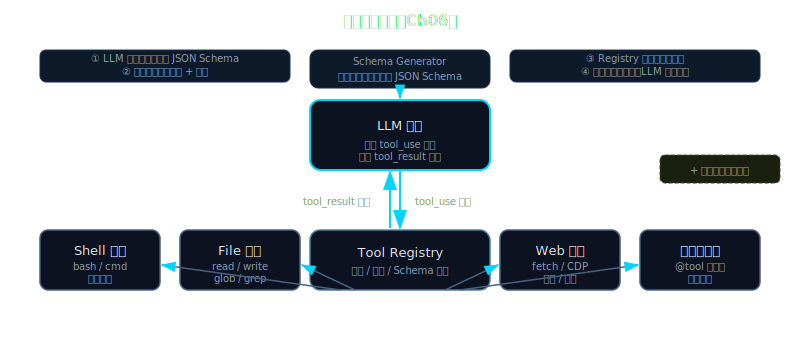

# 第 6 章 — 工具系统：每一项能力都是一个工具

> **[支柱：工具通用性]**
> Lena 从 `v0.3`（一个硬编码工具）跃升至 `v0.6`（四个真实工具，核心循环零改动）。

---

## Beat 1 — 路线图

```
Ch1       Ch2       Ch3       Ch4       Ch5       [Ch6 ← 你在这里]  Ch7
API调用 → ReAct → Lena诞生 → LLM底层 → 技术选型 → 工具系统 → 流式输出
                   v0.3                              v0.6
```

第 3 章结束时，Lena 只会一招：`get_time`。这个工具是硬编码的——它的 schema 字典写在 `lena.py` 里，调度分支也写在 `lena.py` 里，任何人想加第二个工具，都得打开 `lena.py`，希望自己别搞坏什么。

本章从这种脆弱性出发。我们先暴露两文件税的问题（Beat 2），理解注册表真正需要做什么，以及为什么 Pydantic 是从 Python 类型自动生成 JSON Schema 的正确选择（Beat 3），然后构建最小骨架（Beat 4），渐进组装四个工具（Beat 5），最后在终端里端到端运行 Lena v0.6（Beat 6）。

途中会在代码层面遇到一个非直觉的陷阱：工具返回值超出 LLM 上下文预算。我们会看到 Claude Code 为什么使用 `maxResultSizeChars` 机制（来源：`Tool.ts:466`、`toolResultStorage.ts:30`），以及为什么 `FileReadTool` 是整个系统里唯一把这个限制设置为 `Infinity` 的工具——防止一个会让 agent 死锁的自引用循环。

到本章末尾，Lena 拥有四个真实工具。添加第五个工具，`lena.py` 零改动。

> **🧠 聪明度增量（v0.5 → v0.6）**：Lena 第一次拥有完整工具系统——装饰器注册 + Pydantic schema 自动生成 + 统一执行器，加新工具只需写一个函数、核心循环零改动。这一章教读者把"任何能力 = 工具"这个通用 agent 第一支柱长在自己 agent 上的方法。



---

## Beat 2 — 动机：两文件税

在提出解决方案之前，先用实际代码验证问题。

这是 Lena v0.3 的完整工具接线：

```python
# 错误做法 — lena_v03/lena.py（简化版，真实 v0.3 结构）
TOOLS = [
    {
        "name": "get_time",
        "description": "返回当前 UTC 时间",
        "input_schema": {"type": "object", "properties": {}}
    }
]

def run_tool(name: str, args: dict) -> str:
    if name == "get_time":           # ← 硬编码调度
        from datetime import datetime
        return datetime.utcnow().isoformat()
    raise ValueError(f"未知工具: {name}")
```

现在加一个 `web_search`。最少需要改动：

1. **编辑 `TOOLS`** — 在第 12 行附近追加一个新字典。
2. **编辑 `run_tool`** — 在第 20 行附近加一个 `elif name == "web_search":` 分支。
3. **编辑 import** — 在第 1 行附近加实现的 import。

三处独立修改，全在同一个包含 agent 循环的文件里。十个工具之后，`run_tool` 长这样：

```python
# 错误做法 — 朴素扩展到 10 个工具后的调度函数
def run_tool(name: str, args: dict) -> str:
    if name == "get_time":
        ...
    elif name == "web_search":
        ...
    elif name == "read_file":
        ...
    elif name == "write_file":
        ...
    elif name == "shell":
        ...
    elif name == "send_email":
        ...
    elif name == "list_dir":
        ...
    elif name == "grep_files":
        ...
    elif name == "create_event":
        ...
    elif name == "delete_file":
        ...
    raise ValueError(f"未知工具: {name}")
```

团队里每次合并冲突都发生在这个函数上。新人加 `delete_file` 在第 60 行，不小心在第 40 行的 `read_file` 分支里引入了一个差一错误。测试全过，因为测试不覆盖交互路径。

更深层的问题：**agent 循环不应该知道有哪些工具**。它应该在运行时问"注册了哪些工具？"，让注册表回答。Claude Code 的生产实现注册了 40+ 个内置工具，加上可以在运行时添加更多工具的开放式 MCP 协议——如果循环硬编码工具名称，这一切都不可能实现。

我们想把这个数字降到零：**`lena.py` 里因新增工具而必须改动的行数**。目标是零。注册表通过让循环在运行时询问注册表来实现这一点。

---

## Beat 3 — 理论铺垫

### 3.1 Pydantic 作为 Schema 编译器（本节无代码）

Anthropic API 要求每个工具都以 JSON Schema 格式描述——一个指定参数名称、类型、描述以及哪些参数是必填项的 JSON 对象。模型读取这个 schema，以便知道调用工具时应该产生什么参数。

手写 JSON Schema 既繁琐又容易出错：

```json
{
  "type": "object",
  "properties": {
    "path": {"type": "string", "description": "文件路径"},
    "offset": {"type": "integer", "description": "起始行"},
    "limit": {"type": "integer", "description": "最大行数"}
  },
  "required": ["path"]
}
```

一个工具还好。十个工具之后，问题是 schema 漂移：JSON Schema 字典和 Python 处理函数是两个独立的产物。函数里重命名了参数，忘了更新字典，模型发的是旧参数名，函数期待的是新参数名——运行时出现无声的 `TypeError`。

**Pydantic** 通过自动将 Python 类注解转成 JSON Schema 来解决这个问题。声明一个类：

```python
class ReadFileInput(BaseModel):
    path: str = Field(description="文件路径")
    offset: int = Field(default=0, description="起始行（从 0 开始）")
    limit: int = Field(default=200, description="最大读取行数")
```

然后调用 `ReadFileInput.model_json_schema()`，就能得到正确的 JSON Schema，一行 JSON 都不用手写。schema 和处理函数共享同一个真相来源：Pydantic 类。把 `path` 改名为 `file_path`，下次 import 时 schema 自动更新。

**Convention：`schema 生成`** = 将 Pydantic model 类转换为 JSON Schema 字典（在启动时执行一次，`model_json_schema()`）；**`schema 验证`** = 检查来自 LLM 的具体参数字典是否满足该 schema（每次工具调用时执行，`model.model_validate(args)`）。这两个操作发生在生命周期的不同时间点，服务不同的目的。

这是 Claude Code 在 TypeScript 里用 Zod 做同样事情的 Python 等价物。源码显示 `readonly inputSchema: Input`（来源：`Tool.ts:396`）。原理相同：声明一次，到处派生。

### 3.2 三旗安全契约（本节无代码）

每个工具必须声明三个属性。这不是风格建议——它们决定 agent 循环如何调度工具调用，以及在运行工具前是否需要用户确认。

**Convention：`is_read_only`** = 工具只观察状态，从不改变状态；**`is_destructive`** = 工具执行不可逆操作（删除、覆盖、发送邮件、扣款）；**`is_concurrency_safe`** = 工具可以和同一轮的其他工具调用安全地并行运行。

为什么恰好是这三个？每个都对应一个调度器的具体决策：

**`is_concurrency_safe`** 决定循环是否可以在上一个工具还没结束时就触发这个工具。Claude Code 的 `StreamingToolExecutor` 使用的正是这个信号：随着 API 响应流式传来，每个 `tool_use` 块触发 `addTool(block)`。如果该块的工具 `isConcurrencySafe = true`，执行立即开始——模型甚至还没生成完响应（来源：`StreamingToolExecutor.ts:40`）。这就是为什么 `web_search` 可以和 `read_file` 重叠执行：两者都是只读的，可以安全地并行。`write_file` 不能：两次并发写入同一路径会交叉写入，损坏文件。

**`is_read_only`** 进入权限层。在 Claude Code 的 `plan` 模式下——agent 可以读取一切但写之前必须询问——循环会自动批准声明了 `isReadOnly = true` 的工具，无需提示用户。权限决策树在检查模式特定规则之前先评估 `isReadOnly`（来源：`Tool.ts:402-404`）。

**`is_destructive`** 是硬覆盖。源码注释很清晰：*"默认为 false。仅当工具执行不可逆操作（删除、覆盖、发送）时才设置"*（来源：`Tool.ts:405-406`）。破坏性工具总是触发确认对话框，无论权限模式如何。如果 `delete_file` 是破坏性的，即使在 `bypassPermissions` 模式下，循环也会强制一个确认步骤。

三个标志构成一个决策矩阵：

| 场景 | `is_read_only` | `is_destructive` | `is_concurrency_safe` |
|------|:-:|:-:|:-:|
| `read_file` | ✓ | — | ✓ |
| `web_search` | ✓ | — | ✓ |
| `write_file` | — | ✓ | — |
| `shell` | — | ✓ | — |
| `list_dir` | ✓ | — | ✓ |
| `send_email` | — | ✓ | — |

一个工具可以既不是只读也不是破坏性的——例如 `create_file` 创建新文件但不覆盖或删除任何东西，所以不是破坏性的；但它确实修改了状态，所以也不是只读的。三个标志是独立的布尔值，不是一个单一的分类。

### 3.3 大结果问题（本节无代码）

当工具返回一个大结果——比如读取一个 500 KB 的源文件——整段文本会落入对话历史里。每次后续 API 调用都带着那 500 KB 的 token。几轮之后，上下文窗口填满，agent 以 `prompt_too_long` 错误崩溃。

生产级 agent 用**结果预算**来处理这个问题：如果工具结果超过某个字符阈值，就把它持久化到磁盘，给 LLM 一个紧凑的引用而不是完整文本。Claude Code 把这个阈值叫做 `maxResultSizeChars`（来源：`Tool.ts:466`）：当工具结果超过它时，`applyToolResultBudget()` 把内容写入临时文件，并用 `<persisted-output path="/tmp/lena-result-abc123.txt"/>` 替换对话消息（来源：`toolResultStorage.ts:30`）。模型收到的是路径，不是内容。

有一个显眼的例外：`FileReadTool.maxResultSizeChars = Infinity`。源码注释解释了原因：

> *"对不能持久化输出的工具设为 Infinity（例如 Read，因为持久化会创建一个 Read→file→Read 的循环回路，而且该工具已通过自身的 limit 参数自我限制大小）。"*

如果 `FileReadTool` 有一个有限的 `maxResultSizeChars`，就会发生这种情况：

1. Agent 调用 `read_file("large_codebase.py")` → 返回 600 KB
2. 600 KB > 预算 → 系统将内容持久化到 `/tmp/result-001.txt`
3. 模型收到 `<persisted-output path="/tmp/result-001.txt"/>`
4. 模型调用 `read_file("/tmp/result-001.txt")` 来读取持久化内容
5. 该文件包含 600 KB → 预算再次超出 → 持久化到 `/tmp/result-002.txt`
6. 模型调用 `read_file("/tmp/result-002.txt")` → 死循环

将 `maxResultSizeChars = Infinity` 通过契约打破了这个循环：`FileReadTool` 的结果永远不会被外部化。相反，工具自己的 `limit` 参数（默认：200 行）保持每次结果足够小。工具是自我限制的，不需要外部预算管理。

在我们的 Lena 实现里，`ToolMeta` 中用 `max_result_chars=None` 表示 `Infinity`。注册表只在字段是有限整数时才应用截断。

---

## Beat 4 — 脚手架：最小 ToolRegistry

Let's implement the smallest working registry——能注册工具并导出 schema——在添加任何真实工具之前。这是我们将在 Beat 5 继续构建的骨架。

```python
# lena-v0.6/registry.py  (~50 行，仅骨架)
from __future__ import annotations

from dataclasses import dataclass
from typing import Any, Callable, Optional, Type

from pydantic import BaseModel


@dataclass
class ToolMeta:
    """agent 循环需要了解一个工具的全部信息。"""
    name: str
    description: str
    input_model: Type[BaseModel]    # Pydantic 类 — JSON Schema 从这里派生
    handler: Callable               # async def handler(**kwargs) -> str

    # 三旗安全契约（来源：CC Tool.ts:402-406）
    is_read_only: bool = False
    is_destructive: bool = False
    is_concurrency_safe: bool = False

    # 结果预算（来源：CC Tool.ts:466）；None = Infinity
    max_result_chars: Optional[int] = 8_000


class ToolRegistry:
    def __init__(self) -> None:
        self._tools: dict[str, ToolMeta] = {}

    def register(self, meta: ToolMeta) -> None:
        self._tools[meta.name] = meta

    def get(self, name: str) -> Optional[ToolMeta]:
        return self._tools.get(name)

    def names(self) -> list[str]:
        return list(self._tools.keys())

    def get_schemas(self) -> list[dict[str, Any]]:
        """生成 Anthropic 格式的工具 schema。由 agent 循环调用。"""
        schemas = []
        for meta in self._tools.values():
            schemas.append({
                "name": meta.name,
                "description": meta.description,
                # Pydantic 自动生成 JSON Schema — 无需手写
                "input_schema": meta.input_model.model_json_schema(),
            })
        return schemas
```

在接触任何真实工具之前，先验证这个骨架能生成正确的 schema：

```python
# verify_registry.py
from pydantic import BaseModel, Field
from registry import ToolRegistry, ToolMeta
import json

class EchoInput(BaseModel):
    message: str = Field(description="要回显的文本")

async def echo_handler(message: str) -> str:
    return f"ECHO: {message}"

registry = ToolRegistry()
registry.register(ToolMeta(
    name="echo",
    description="将消息回显",
    input_model=EchoInput,
    handler=echo_handler,
    is_read_only=True,
    is_concurrency_safe=True,
))

print(json.dumps(registry.get_schemas(), indent=2))
```

运行结果：

```json
[
  {
    "name": "echo",
    "description": "将消息回显",
    "input_schema": {
      "properties": {
        "message": {
          "description": "要回显的文本",
          "title": "Message",
          "type": "string"
        }
      },
      "required": ["message"],
      "title": "EchoInput",
      "type": "object"
    }
  }
]
```

一个类，一次 `register()` 调用，`required` 由 Pydantic 自动推断——没有默认值的字段会自动进入 `required`。

注意我们*没有*手写什么：没有 `"required"` 列表，没有 `"type": "object"` 包装，没有重复字段名。Pydantic model 是唯一的真相来源。

现在我们准备好添加真实工具了。

---

## Beat 5 — 渐进组装：四个真实工具

以下是我们将要添加的四个工具，每个都有具体的动机：

| 工具 | Lena 为何需要它 | `is_read_only` | `is_destructive` | `is_concurrency_safe` | `max_result_chars` |
|------|----------------|:-:|:-:|:-:|:-:|
| `read_file` | 不读文件就无法分析代码或数据 | ✓ | — | ✓ | None（Infinity）|
| `write_file` | 只能观察无法行动的 agent 意义有限 | — | ✓ | — | 8 000 |
| `shell` | 大多数真实任务最终都需要运行命令 | — | ✓ | — | 8 000 |
| `web_search` | 模型训练数据之外的实时信息 | ✓ | — | ✓ | 8 000 |

**扩展 1：`read_file`**

`max_result_chars=None` 的理由直接来自 §3.3：如果我们将 `read_file` 的结果外部化，agent 会陷入死循环。工具通过 `limit` 参数自我管理这个问题——它从不返回超过 `limit` 行，所以不需要外部预算。

```python
# lena-v0.6/tools/read_file.py
import pathlib
from pydantic import BaseModel, Field
from registry import ToolMeta


class ReadFileInput(BaseModel):
    path: str = Field(description="要读取的文件路径")
    offset: int = Field(default=0, description="起始行号（从 0 开始）")
    limit: int = Field(default=200, description="最大返回行数")


async def _read_file(path: str, offset: int = 0, limit: int = 200) -> str:
    p = pathlib.Path(path)
    if not p.exists():
        return f"错误：文件不存在: {path}"
    if not p.is_file():
        return f"错误：不是文件: {path}"
    lines = p.read_text(errors="replace").splitlines()
    total = len(lines)
    chunk = lines[offset : offset + limit]
    result = "\n".join(f"{offset + i + 1}\t{line}" for i, line in enumerate(chunk))
    if offset + limit < total:
        result += f"\n... （还有 {total - offset - limit} 行，使用 offset 继续）"
    return result


READ_FILE = ToolMeta(
    name="read_file",
    description="读取文件的若干行。用 offset+limit 翻页浏览大文件。",
    input_model=ReadFileInput,
    handler=_read_file,
    is_read_only=True,
    is_concurrency_safe=True,
    max_result_chars=None,    # Infinity — 工具自我限制；见 §3.3
)
```

快速验证：

```python
import asyncio
result = asyncio.run(_read_file("registry.py", offset=0, limit=5))
print(result)
# 1   """
# 2   Lena v0.6 — ToolRegistry
# 3   Pydantic 驱动的 schema 生成 + 三旗安全契约。
# 4   """
# 5
```

行号让 LLM 在后续工具调用里能引用具体行——这个细节让多步文件编辑变得可操作。

**扩展 2：`write_file`**

`is_destructive=True` 是因为覆盖不可逆。一个把 `""` 写入 `report.md` 的 agent，就销毁了里面原有的内容。调度器在完全自主模式下运行这个工具之前应该暂停并确认。

```python
# lena-v0.6/tools/write_file.py
import pathlib
from pydantic import BaseModel, Field
from registry import ToolMeta


class WriteFileInput(BaseModel):
    path: str = Field(description="要写入的文件路径（父目录不存在时自动创建）")
    content: str = Field(description="要写入的内容 — 覆盖已有文件")


async def _write_file(path: str, content: str) -> str:
    p = pathlib.Path(path)
    p.parent.mkdir(parents=True, exist_ok=True)
    p.write_text(content)
    return f"已写入 {len(content)} 个字符到 {path}"


WRITE_FILE = ToolMeta(
    name="write_file",
    description="用给定内容创建或覆盖文件。",
    input_model=WriteFileInput,
    handler=_write_file,
    is_read_only=False,
    is_destructive=True,         # 覆盖是不可逆的
    is_concurrency_safe=False,   # 两次并发写同一路径会损坏文件
)
```

**扩展 3：`shell`**

`shell` 是这组工具中最强大也最危险的。`is_destructive=True` 因为它可以删除文件、发送网络请求或修改系统状态——agent 和用户对"运行一条命令"的理解可能不一致。`is_concurrency_safe=False` 因为两条 shell 命令如果接触共享路径或环境变量，会相互干扰。

`timeout` 参数至关重要：没有它，一个长时间运行的进程（无限循环、挂起的网络请求）会无限期地阻塞 agent 循环。默认值是 30 秒。

```python
# lena-v0.6/tools/shell.py
import asyncio
from pydantic import BaseModel, Field
from registry import ToolMeta

DEFAULT_TIMEOUT = 30


class ShellInput(BaseModel):
    command: str = Field(description="要运行的 shell 命令")
    timeout: int = Field(default=DEFAULT_TIMEOUT, description="超时秒数")


async def _shell(command: str, timeout: int = DEFAULT_TIMEOUT) -> str:
    try:
        proc = await asyncio.create_subprocess_shell(
            command,
            stdout=asyncio.subprocess.PIPE,
            stderr=asyncio.subprocess.STDOUT,
        )
        stdout, _ = await asyncio.wait_for(proc.communicate(), timeout=timeout)
        output = stdout.decode(errors="replace")
        return f"exit_code={proc.returncode}\n{output}"
    except asyncio.TimeoutError:
        return f"错误：命令在 {timeout} 秒后超时"
    except Exception as e:
        return f"错误：{e}"


SHELL = ToolMeta(
    name="shell",
    description="运行 shell 命令，返回合并的 stdout+stderr 以及退出码。",
    input_model=ShellInput,
    handler=_shell,
    is_read_only=False,
    is_destructive=True,         # shell 可以删文件、修改系统状态
    is_concurrency_safe=False,
)
```

验证：

```python
result = asyncio.run(_shell("echo hello && python3 --version"))
print(result)
# exit_code=0
# hello
# Python 3.14.4
```

注意结果字符串里包含了 `exit_code`。模型需要它来判断命令是否成功。一个调用 `git commit` 后不知道退出码的 agent，可能会在提交实际失败时愉快地继续执行。

**扩展 4：`web_search`**

`is_concurrency_safe=True` 是因为独立的网络读取不会冲突。如果模型在一轮里发起三次 `web_search` 调用——比如它正在同时研究多个子课题——它们可以同时触发，没有数据损坏的风险。这个标志在第 7 章中解锁了并行执行。

```python
# lena-v0.6/tools/web_search.py
import json
import urllib.parse
import urllib.request
from pydantic import BaseModel, Field
from registry import ToolMeta

# DuckDuckGo 即时答案 API — 无需 API Key
DDG_URL = "https://api.duckduckgo.com/"


class WebSearchInput(BaseModel):
    query: str = Field(description="搜索查询词")


async def _web_search(query: str) -> str:
    params = urllib.parse.urlencode({"q": query, "format": "json", "no_html": "1"})
    url = f"{DDG_URL}?{params}"
    try:
        with urllib.request.urlopen(url, timeout=10) as resp:
            data = json.loads(resp.read())
        abstract = data.get("AbstractText", "")
        topics = [r.get("Text", "") for r in data.get("RelatedTopics", [])[:5]]
        combined = "\n".join(filter(None, [abstract] + topics))
        return combined or "未找到结果。"
    except Exception as e:
        return f"搜索错误: {e}"


WEB_SEARCH = ToolMeta(
    name="web_search",
    description="使用 DuckDuckGo 搜索网页，返回最相关的结果。",
    input_model=WebSearchInput,
    handler=_web_search,
    is_read_only=True,
    is_concurrency_safe=True,
)
```

**连接注册表：**

四个工具都定义好后，来看看它们如何接入注册表。关键点是 `lena.py` 只 import `ToolMeta` 实例——它从不直接引用 `_read_file`、`_write_file`、`_shell` 或 `_web_search`。调度完全在 `registry.execute()` 内部完成。

```python
# lena-v0.6/lena.py — 注册表设置部分
from registry import ToolRegistry
from tools.read_file import READ_FILE
from tools.write_file import WRITE_FILE
from tools.shell import SHELL
from tools.web_search import WEB_SEARCH

registry = ToolRegistry()
for tool in [READ_FILE, WRITE_FILE, SHELL, WEB_SEARCH]:
    registry.register(tool)

print(f"已注册 {len(registry.names())} 个工具: {registry.names()}")
# 已注册 4 个工具: ['read_file', 'write_file', 'shell', 'web_search']
```

快速查看安全标志：

```python
for meta in [READ_FILE, WRITE_FILE, SHELL, WEB_SEARCH]:
    print(f"{meta.name:15} read_only={meta.is_read_only!s:5} destructive={meta.is_destructive!s:5} "
          f"concurrency_safe={meta.is_concurrency_safe!s:5} max_result_chars={meta.max_result_chars}")
```

输出：

```
read_file       read_only=True  destructive=False concurrency_safe=True  max_result_chars=None
write_file      read_only=False destructive=True  concurrency_safe=False max_result_chars=8000
shell           read_only=False destructive=True  concurrency_safe=False max_result_chars=8000
web_search      read_only=True  destructive=False concurrency_safe=True  max_result_chars=8000
```

规律很清晰：对于只读工具，`is_read_only` 和 `is_concurrency_safe` 同步为 True。`is_destructive` 专属于有写入能力的工具，强制顺序执行。

现在给 `ToolRegistry` 添加一个应用结果预算的 `execute()` 方法：

```python
# 添加到 registry.py 中的 ToolRegistry 类
async def execute(self, name: str, args: dict[str, Any]) -> str:
    meta = self._tools.get(name)
    if meta is None:
        return f"错误：未知工具 '{name}'"
    try:
        result = str(await meta.handler(**args))
    except TypeError as e:
        return f"错误：'{name}' 的参数不正确: {e}"
    except Exception as e:
        return f"错误：工具 '{name}' 执行失败: {e}"

    # 应用结果预算（None = Infinity，永不截断）
    if meta.max_result_chars is not None and len(result) > meta.max_result_chars:
        result = result[: meta.max_result_chars] + "\n...[已截断]"

    return result
```

捕获 `TypeError` 很重要。LLM 偶尔会在 schema 说 `path` 是字符串时发送 `{"path": 42}`。没有这个捕获，处理函数会抛出一个毫无用处的 `TypeError: expected str, got int`。捕获的错误消息会作为工具结果反馈给模型，让它有机会用正确的参数重试。

---

## Beat 6 — 运行：Lena v0.6 端到端

来组装完整的 `lena.py` 并运行实时演示。任务：读取一个 Python 文件，描述某个特定类存储了什么。

```python
# lena-v0.6/lena.py  (完整版，约 80 行)
import asyncio
import json
import os
import sys

import anthropic

from registry import ToolRegistry
from tools.read_file import READ_FILE
from tools.write_file import WRITE_FILE
from tools.shell import SHELL
from tools.web_search import WEB_SEARCH


def build_registry() -> ToolRegistry:
    r = ToolRegistry()
    for tool in [READ_FILE, WRITE_FILE, SHELL, WEB_SEARCH]:
        r.register(tool)
    return r


async def run(task: str, max_steps: int = 10) -> None:
    client = anthropic.Anthropic(api_key=os.environ["ANTHROPIC_API_KEY"])
    registry = build_registry()

    print(f"工具: {registry.names()}")
    print(f"任务: {task}\n{'─' * 60}")

    messages: list[dict] = [{"role": "user", "content": task}]

    for step in range(1, max_steps + 1):
        print(f"\n[步骤 {step}] 调用模型...")
        resp = client.messages.create(
            model="claude-haiku-4-5-20251001",
            max_tokens=2048,
            tools=registry.get_schemas(),
            messages=messages,
        )

        messages.append({"role": "assistant", "content": resp.content})

        if resp.stop_reason == "end_turn":
            for block in resp.content:
                if hasattr(block, "text"):
                    print(f"\n[Lena] {block.text}")
            break

        if resp.stop_reason != "tool_use":
            print(f"[意外的 stop_reason: {resp.stop_reason}]")
            break

        # 执行工具调用；并发版本见第 7 章
        tool_results = []
        for block in resp.content:
            if block.type != "tool_use":
                continue
            args_str = json.dumps(block.input)
            preview = args_str[:80] + ("..." if len(args_str) > 80 else "")
            print(f"  → {block.name}({preview})")

            result_text = await registry.execute(block.name, block.input)

            result_preview = result_text[:120].replace("\n", " ")
            print(f"  ← {result_preview}{'...' if len(result_text) > 120 else ''}")

            tool_results.append({
                "type": "tool_result",
                "tool_use_id": block.id,
                "content": result_text,
            })

        messages.append({"role": "user", "content": tool_results})
    else:
        print(f"\n[已停止: max_steps={max_steps} 已达到]")


if __name__ == "__main__":
    task = (sys.argv[1] if len(sys.argv) > 1
            else "读取 registry.py，描述 ToolMeta 存储了什么。")
    asyncio.run(run(task))
```

运行：

```bash
$ python lena.py
```

预期输出（实际模型文本会有变化，结构不会）：

```
工具: ['read_file', 'write_file', 'shell', 'web_search']
任务:  读取 registry.py，描述 ToolMeta 存储了什么。
────────────────────────────────────────────────────────────

[步骤 1] 调用模型...
  → read_file({"path": "registry.py", "offset": 0, "limit": 200})
  ← 1   """  2   Lena v0.6 — ToolRegistry  3   Pydantic 驱动的 schema 生成...

[步骤 2] 调用模型...

[Lena] `ToolMeta` 是一个数据类，存储了描述单个工具所需的全部信息：
`name` 和 `description`（发送给模型的 JSON Schema 里使用），`input_model`
（一个 Pydantic 类，schema 从这里自动生成），以及 `handler`（工具运行时以
关键字参数调用的异步函数）。它还保存三个布尔安全标志——`is_read_only`、
`is_destructive` 和 `is_concurrency_safe`——控制调度和权限决策，以及用于
结果预算的 `max_result_chars`（None 表示无限制）。
```

两步：一步读文件，一步综合答案。模型不需要知道有多少工具，也不需要知道用哪个工具"读文件"——它收到 schema 列表并自主选择了 `read_file`。

**常见失败诊断：**

`AuthenticationError: invalid x-api-key` — `ANTHROPIC_API_KEY` 环境变量未设置。`export ANTHROPIC_API_KEY=sk-ant-...` 后重新运行。

`TypeError: handler() got an unexpected keyword argument` — 模型发送了处理函数不接受的参数名。这通常意味着 Pydantic model 的字段名和处理函数的参数名不匹配。检查 `ReadFileInput.path` 对应的是 `_read_file(path: str, ...)`。这是构建工具时最常见的集成错误。

`stop_reason='max_tokens'` 而不是 `end_turn` — 模型的回答被截断了。增加 `messages.create()` 调用里的 `max_tokens`，或缩短系统提示。

**添加第五个工具是什么样的：**

```python
# tools/list_dir.py
import pathlib
from pydantic import BaseModel, Field
from registry import ToolMeta

class ListDirInput(BaseModel):
    path: str = Field(default=".", description="要列出的目录路径")

async def _list_dir(path: str = ".") -> str:
    p = pathlib.Path(path)
    if not p.is_dir():
        return f"错误：不是目录: {path}"
    entries = sorted(p.iterdir(), key=lambda x: (x.is_file(), x.name))
    return "\n".join(
        f"{'[目录]' if e.is_dir() else '[文件]'} {e.name}" for e in entries
    )

LIST_DIR = ToolMeta(
    name="list_dir",
    description="列出给定路径下的文件和目录。",
    input_model=ListDirInput,
    handler=_list_dir,
    is_read_only=True,
    is_concurrency_safe=True,
)
```

然后在 `lena.py` 里：

```python
from tools.list_dir import LIST_DIR
# ... 把 LIST_DIR 加到注册循环里
```

**现有文件零改动。** 一个新文件，两行新 import。这就是 SPEC 所说的"加工具不改核心循环"。

---

## Beat 7 — Design Note

> **为什么用 Pydantic Schema 生成，而不是手写 JSON Schema？**

最显而易见的替代方案是手写 JSON Schema 字典——很多教程这样做，三个工具的演示里看起来还不错：

```python
# 错误模式 — 教程里常见，规模化后会崩
TOOLS = [
    {
        "name": "read_file",
        "description": "读取文件",
        "input_schema": {
            "type": "object",
            "properties": {
                "path": {"type": "string", "description": "文件路径"},
                "offset": {"type": "integer", "description": "起始行"},
                "limit": {"type": "integer", "description": "最大行数"},
            },
            "required": ["path"],
        }
    }
]
```

这个模式在规模化时有三个具体的失败模式：

**1. Schema 漂移。** JSON Schema 字典和处理函数是两个独立的产物。当你在函数里把 `path` 改名为 `file_path`（为了符合新的命名规范），Python 没有任何机制阻止你忘记更新字典。模型发送 `file_path=...`（因为 schema 说的是 `file_path`）；旧的处理函数崩溃，因为它期待的是 `path=...`。用 Pydantic，类*既是* schema *也是*验证接口——它们不可能漂移。

**2. 没有运行时验证。** 手写字典不验证 LLM 发送的参数。一个在 schema 说 `path` 是字符串时产生幻觉的模型可能发送 `{"path": 42}`，整数会无声地传入期待字符串的函数。`pathlib.Path(42)` 在处理函数深处抛出一个 `TypeError`，栈跟踪告诉你的是哪个模型发送了错误类型之外的什么都没有。用 Pydantic，`model.model_validate(args)` 在处理函数被调用之前就捕获类型错误，并向模型返回一个结构化的错误，让它可以据此重试。

**3. 维护成本随工具数量线性增长。** 手工维护 40 个 JSON Schema 字典——每个都有 `required` 列表、类型注解、`description` 字符串和复杂类型的嵌套 `$ref` 引用——是一个巨大的错误面。每个添加工具的新开发者都必须学习 schema 格式，而不只是 Python。Pydantic 把认知负担降低为"了解 Python 类型提示"。Claude Code 有 40+ 个内置工具；这个规模只有在 schema 生成是自动的情况下才可行。

**权衡：** Pydantic 增加了一个依赖和首次 import 时约 20ms 的开销。对于 CLI agent，这是不可见的。对于高请求量的 serverless 函数，在模块加载时预计算 `get_schemas()` 并缓存结果——`ToolRegistry` 类正好支持这一点：调用一次 `get_schemas()`，存储结果，重复使用。

**在生产系统中：** 给每个输入 model 添加 `model_config = ConfigDict(strict=True)`。严格模式拒绝像整数→字符串这样的强制转换，在参数到达处理函数之前捕获更多幻觉参数错误。Claude Code 通过 Zod 的 `.strict()` 选项实现等效功能（来源：`Tool.ts:472`，`readonly strict?: boolean`）。

**推荐做法是明确的：** 使用 Pydantic。只有在你对输入类定义没有控制权时才手写 JSON Schema——例如包装第三方 MCP 工具，其 schema 以原始 JSON blob 的形式到来。在这种情况下，使用 Claude Code 提供的 `inputJSONSchema?` 转义舱口（来源：`Tool.ts:397`），它绕过 Zod/Pydantic，直接将原始 schema 传递给 API。

---

## 挑战

1. **添加 `list_dir`** 作为第五个工具，参照 Beat 6 中的 `list_dir.py` 片段。注册它，验证 Lena 能回答"当前目录里有哪些文件？"，且 `lena.py` 无需任何改动。

2. **模拟大结果预算：** 修改 `web_search`，让它返回一个 20 000 字符的字符串（用 `"X" * 20_000` 模拟）。然后观察 `registry.execute()` 将其截断为 8 000 字符。接下来在 `execute()` 里添加 `persist_to_disk` 路径：不截断，而是将完整结果写入 `/tmp/lena-result-{name}-{hash[:8]}.txt` 并返回 `<persisted-output path="..."/>`。这就是 `toolResultStorage.ts:30` 在 Claude Code 里做的事。

3. **并发执行预览：** 在当前的 `run()` 循环里，工具调用是顺序执行的。修改循环，对所有 `meta.is_concurrency_safe == True` 的工具调用使用 `asyncio.gather()`，同时继续顺序执行不安全的工具。运行 `lena.py "搜索 Python asyncio 最佳实践，并且搜索 Pydantic v2 的特性"` 并测量有无并发时的挂钟时间。

---

Lena 现在能读文件、写文件、运行 shell 命令、搜索网页——全部通过一个注册表路由，agent 循环完全通过名称在运行时寻址。没有 `elif` 链，没有硬编码工具列表，没有两文件税。但她每次只执行一个工具，等每个结果返回后才问模型下一步。在生产里，模型经常在单轮里产生多个工具调用——同时发五次 `web_search`，或者交错使用 `read_file` 和 `shell`——顺序等待它们会让 agent 感觉迟钝。下一章解决流式输出和并发工具执行：当流式响应中一个调用块到达时就立刻触发工具的机制，甚至在模型还没生成完响应之前。

---

## 参考来源

- `Tool.ts:362–472` — `Tool` 接口定义，三个安全标志，`maxResultSizeChars`
- `Tool.ts:396` — `readonly inputSchema: Input`（Zod 相当于 Pydantic）
- `Tool.ts:466` — `maxResultSizeChars` 字段，含 Infinity 情形的注释说明
- `toolResultStorage.ts:30` — `applyToolResultBudget()`，`<persisted-output>` 格式
- `StreamingToolExecutor.ts:40` — 使用 `isConcurrencySafe` 在流中途触发工具
- Pydantic v2 `model_json_schema()` — 官方文档：https://docs.pydantic.dev/latest/concepts/json_schema/

所有源码引用指向 Claude Code 开源仓库 `source/src/`。Pydantic 版本：≥ 2.0。如果使用 Pydantic v1，请将 `model_json_schema()` 替换为 `.schema()`。

---

## 导航

[← Ch 5. 技术选型](../ch05-tech-selection/README.md) · [下一章 →](../ch07-streaming-concurrent/README.md) · [📘 目录](../../README.md)
