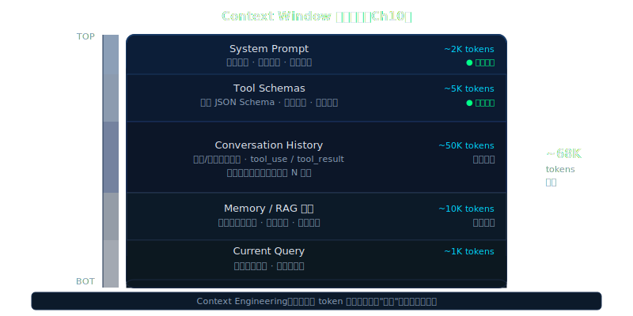

# 第 10 章：上下文工程——Token 经济学

> **[Lena：v0.9 → v0.10]** · **[支柱：Memory / Long-horizon]**

---

## Beat 1 — 路线图

```
Ch 1 → Ch 3 → Ch 6 → Ch 8 → Ch 9 → [Ch 10 ← 你在这里] → Ch 11 → ...
 API    Loop  Tools  Memory  RAG    上下文工程             Planning
```

本章从一个跑十轮没问题、跑三十轮就崩溃的 Lena 出发。我们依次穿越三个压缩层（microcompact → autocompact → reactive），加入 prompt 缓存纪律以将 token 成本削减最多 90%，并直面破坏任何朴素 `usage` 解析器的三种 provider 缓存字段差异。

途中有一个会让你意外的插曲：*为什么把错误记录保留在上下文里才是正确做法*——尽管你的直觉说"把它们清掉"。

本章结束时，Lena v0.10 能在不溢出上下文的情况下维持 50 轮对话，并在终端实时打印缓存命中率。

沿途的坑：system prompt 里的动态时间戳会悄无声息地杀死所有缓存命中。我们会先演示失败，再修复它。

> **🧠 聪明度增量（v0.9 → v0.10）**：Lena 第一次能主动管理自己的 context——microcompact / autocompact / reactive 三层压缩让她在 50 轮对话后不溢出，prompt caching 让 token 成本最多削减 90%。这一章教读者把 context 自我调节能力长在自己 agent 上的方法。



---

## Beat 2 — 动机

让 Lena v0.9 跑四十轮重工具任务——每轮读取文件、执行 shell 命令——数一数 token：

```
第  1 轮：约  1,800 tokens
第 10 轮：约 18,000 tokens
第 20 轮：约 52,000 tokens
第 30 轮：约 98,000 tokens
第 35 轮：anthropic.BadRequestError: prompt_too_long
```

崩溃不是 Lena 逻辑上的 bug。它是一个只会追加、没有泄压阀的 `messages[]` 列表的必然结果。

显而易见的修法是"截断最旧的消息"。这条路有一个具体的原因行不通：最旧的消息往往承载着原始任务目标。截断它们，Lena 就会开始漂移——完成的不是用户要求的那个任务。Anthropic 2025 年一篇关于有效上下文工程的工程博文把这种失败模式称为*上下文腐烂（context rot）*：随着上下文增长，模型召回能力下降，模型开始"解决错误的问题"。

Convention：*上下文窗口（context window）* = 单次 API 调用的 token 硬上限（Claude Sonnet 为 128K）；*上下文腐烂（context rot）* = 随着上下文长度增加模型召回能力逐渐下降的现象，有别于硬截断。

我们需要的是压缩（compaction），不是截断（truncation）。

---

## Beat 3 — 理论铺垫（本节无代码）

Anthropic 在官方博文中给出了 context engineering 最精确的定义和核心隐喻：

> "Context must be treated as a **finite resource with diminishing marginal returns**. Like humans, who have limited working memory capacity, LLMs have an **attention budget** that they draw on when parsing large volumes of context. Every new token introduced depletes this budget."
> （来源：Anthropic, *Effective context engineering for AI agents*, 2025-09-29）

换句话说：context window 不是"更大就更好"。每加一个 token，模型对**所有其他 token** 的注意力就会稀释一点。200K tokens 的 window 能装很多，但装满后模型的有效推理能力可能反而**低于**精心裁剪的 50K。

这就是为什么本章不是教你"怎么塞更多东西进 context"，而是教你**怎么用更少 token 获得更好结果**。

### 3.1 为什么要三层，而不是一层

*（本节无代码。）*

单一压缩策略会失败，因为存在三个不同的失败面，每个失败面需要不同的响应速度和成本权衡。

第一个失败面是*持续 token 堆积*。工具结果——文件读取、shell 输出、搜索命中——在每轮之间不断累积。这些内容大多被引用一次后再也不用，却在每次后续 API 调用中消耗 token。正确的响应是在每次循环迭代时进行零成本、零 API 调用的清理。这是微层（micro layer）。

第二个失败面是*接近硬上限*。当总 token 数接近 `context_window − buffer` 时，必须在 API 拒绝请求之前主动介入，用 LLM 驱动的摘要压缩上下文。这会消耗一次额外的 API 调用，但保留了对话的语义结构。这是自动层（auto layer）。

第三个失败面是*分词器估算误差*。客户端 token 计数是近似值；Anthropic API 的内部分词器可能有几个百分点的偏差。前两层可能在边界情况下失手，API 返回 413。正确的响应是在错误路径上强制压缩并重试一次。这是响应层（reactive layer）。

三层构成的是级联（cascade），不是冗余。每一层解决的是其他层无法处理的失败模式。

Convention：*microcompact* = 内联清理陈旧工具结果，无 API 调用；*autocompact* = 由 token 阈值触发的 LLM 生成摘要；*reactivecompact* = 由真实 413 错误触发的强制压缩。

### 3.2 Prompt 缓存经济学

*（本节无代码。）*

Anthropic 对从缓存读取的 token 收费约为基础输入价格的 0.1 倍，未缓存输入 token 收费 1.0 倍。在一个 system prompt 加工具定义共 4,000 token 的 50 轮对话中，这 4,000 token 的缓存命中能为第一轮之后的每一轮节省约 90% 的成本。

要让缓存生效，缓存前缀必须在请求间*逐字节相同*。缓存未命中最常见的原因是 system prompt 里嵌入了动态值：时间戳、会话 ID、"当前时间"字段。每次该值变化，整个缓存就失效了。

Anthropic API 目前每个请求允许一个消息级 `cache_control` 标记（参见 Claude Code 源码 `claude.ts:3078`）。在用户消息上放置多个标记会导致未定义行为——要么最后一个标记静默生效，要么请求报错。正确的纪律是在最后一个工具定义（最长的稳定前缀）上放置恰好一个这样的标记，让 system prompt 通过顶级 `cache_control` 参数缓存（由 SDK 处理）。

Convention：*缓存断点（cache breakpoint）* = 请求中 API 开始缓存的位置；命中时断点前的 token 从缓存提供，断点后的重新计算。*缓存写入（cache write）* = 首次调用惩罚（1.25 倍基础输入价格）。*缓存读取（cache read）* = 折扣命中（0.1 倍）。

### 3.3 三家 Provider 的缓存字段动物园

*（本节无代码。）*

主要 LLM provider 以不同方式报告缓存使用情况：

| Provider | 缓存读取字段 | 缓存写入字段 | 位置 |
|---------|-----------|-----------|------|
| Anthropic | `cache_read_input_tokens` | `cache_creation_input_tokens` | usage 根级 |
| OpenAI | `prompt_tokens_details.cached_tokens` | （无单独字段） | 嵌套 dict |
| DeepSeek | `prompt_cache_hit_tokens` | `prompt_cache_miss_tokens` | usage 根级 |

统一的 `parse_usage()` 函数必须按 provider 分支。没有处理 OpenAI 嵌套的情况会让每次缓存读取都静默返回零——你的监控指标看起来像缓存从没工作过。

---

## Beat 4 — 脚手架

先用运行所需的最小结构搭建三层压缩骨架，然后再加入真正的摘要逻辑。

```python
# compaction.py — 骨架（还没有摘要，可以独立验证）

from __future__ import annotations
import anthropic


def microcompact(messages: list[dict], keep_last: int = 3) -> list[dict]:
    """
    从较旧的轮次中移除陈旧的 tool_result 块。

    keep_last: 保留最近几个包含 tool_result 的轮次。
    无 API 调用，每次迭代都可安全运行。
    """
    # 找出包含 tool_result 块的 user 角色轮次索引
    result_turns = [
        i for i, m in enumerate(messages)
        if m.get("role") == "user"
        and isinstance(m.get("content"), list)
        and any(c.get("type") == "tool_result" for c in m["content"])
    ]
    # 将除最后 keep_last 个之外的所有轮次替换为简短占位符
    for idx in result_turns[:-keep_last]:
        messages[idx]["content"] = [
            ({"type": "text", "text": "[tool_result cleared by microcompact]"}
             if c.get("type") == "tool_result" else c)
            for c in messages[idx]["content"]
        ]
    return messages


class AutoCompactor:
    """
    当 token 数量接近上限时触发 LLM 驱动的摘要。

    buffer_tokens: 保持在 context_window 以下的余量。
                   13,000 与 Claude Code 默认值一致（autoCompact.ts:62）。
    max_failures:  断路器阈值——连续失败这么多次后停止重试
                   （同 MAX_CONSECUTIVE_AUTOCOMPACT_FAILURES = 3）。
    """
    BUFFER_TOKENS = 13_000
    MAX_FAILURES  = 3

    def __init__(self, client: anthropic.Anthropic, model: str):
        self.client   = client
        self.model    = model
        self._fails   = 0

    def should_compact(self, token_count: int, context_window: int) -> bool:
        if self._fails >= self.MAX_FAILURES:
            return False          # 断路器打开
        return token_count >= context_window - self.BUFFER_TOKENS

    async def compact(self, messages: list[dict]) -> list[dict] | None:
        """返回替换后的消息列表，失败时返回 None。"""
        try:
            # 占位符——Beat 5 中填充真正实现
            raise NotImplementedError
        except Exception:
            self._fails += 1
            return None

    def reset_failures(self) -> None:
        self._fails = 0


def reactive_compact(messages: list[dict]) -> list[dict]:
    """
    在真实的 413 / prompt_too_long 错误时调用的紧急压缩。
    返回折叠了所有 tool_result 的替换列表。
    """
    compacted: list[dict] = []
    for m in messages:
        if (m.get("role") == "user"
                and isinstance(m.get("content"), list)
                and any(c.get("type") == "tool_result" for c in m["content"])):
            compacted.append({"role": "user",
                               "content": "[context cleared by reactive_compact]"})
        else:
            compacted.append(m)
    return compacted
```

运行 `microcompact([])` 应该无报错地返回 `[]`。这是可验证的基线。`AutoCompactor` 骨架会抛出 `NotImplementedError`——下一步来填充它。

---

## Beat 5 — 渐进组装

| 扩展点 | 为何需要 | 如何添加 |
|--------|---------|---------|
| `AutoCompactor.compact` 中的真正摘要 | 骨架会抛出；需要真实的 LLM 调用来压缩历史 | 用"总结这段对话"的 prompt 调用 LLM，替换消息列表 |
| 统一三家 provider 的 `parse_usage()` | Provider 字段各异；错误解析会静默显示 0 缓存 token | 按 provider 名称分支，映射到统一的 `TokenUsage` |
| 单标记缓存纪律的 `get_cache_control()` | 多个标记会导致静默失效 | 在最后一个工具定义上放置恰好一个 `cache_control` |
| 实时统计 `TokenMonitor` | 不看每轮命中率就无法验证缓存是否生效 | 累积 usage，计算 `cache_read / total_input` 比率 |

**扩展 1 — 真正的摘要：**

```python
    async def compact(self, messages: list[dict]) -> list[dict] | None:
        try:
            resp = self.client.messages.create(
                model=self.model,
                max_tokens=2048,
                system=(
                    "将以下对话总结成结构化的回顾摘要。"
                    "必须保留：(1) 用户的原始目标，"
                    "(2) 所有已做的决策，"
                    "(3) 每条错误信息的原文——不得省略错误。"
                    "错误是导航标记；agent 必须知道什么失败了。"
                ),
                messages=messages,
            )
            summary = resp.content[0].text
            self._fails = 0
            return [{"role": "user",
                     "content": f"[对话摘要]\n{summary}"}]
        except Exception:
            self._fails += 1
            return None
```

添加后，用一个五轮的测试 fixture 运行 `compactor.compact(sample_messages)`。结果应该是包含摘要字符串的单元素列表。打印确认：

```
[对话摘要]
原始目标：编写并测试一个 Python 排序函数。
已执行步骤：...
遇到的错误：FileNotFoundError: sort_test.py not found（第 3 轮）
```

明确要求原文保留错误的指令，实现了"保留错误记录"的铁律——模型需要的是失败地图，不是净化后的记录。

**扩展 2 — 统一的 `parse_usage()`：**

```python
# cache.py

from dataclasses import dataclass


@dataclass
class TokenUsage:
    input_tokens:        int = 0
    output_tokens:       int = 0
    cache_read_tokens:   int = 0
    cache_write_tokens:  int = 0


def parse_usage(raw: dict, provider: str) -> TokenUsage:
    """
    将 provider 特定的 usage dict 映射到统一的 TokenUsage。

    Anthropic: cache_read_input_tokens / cache_creation_input_tokens（根级）
    OpenAI:    prompt_tokens_details.cached_tokens                   （嵌套）
    DeepSeek:  prompt_cache_hit_tokens / prompt_cache_miss_tokens    （根级）
    """
    u = TokenUsage(
        input_tokens  = raw.get("input_tokens")  or raw.get("prompt_tokens",     0),
        output_tokens = raw.get("output_tokens") or raw.get("completion_tokens", 0),
    )
    if provider == "anthropic":
        u.cache_read_tokens  = raw.get("cache_read_input_tokens",      0)
        u.cache_write_tokens = raw.get("cache_creation_input_tokens",  0)
    elif provider == "openai":
        details              = raw.get("prompt_tokens_details") or {}
        u.cache_read_tokens  = details.get("cached_tokens", 0)
    elif provider == "deepseek":
        u.cache_read_tokens  = raw.get("prompt_cache_hit_tokens",  0)
        u.cache_write_tokens = raw.get("prompt_cache_miss_tokens", 0)
    return u
```

接入循环之前用一个快速 fixture 验证：

```python
raw_anthropic = {
    "input_tokens": 4000,
    "output_tokens": 120,
    "cache_read_input_tokens": 3800,
    "cache_creation_input_tokens": 200,
}
u = parse_usage(raw_anthropic, "anthropic")
assert u.cache_read_tokens == 3800   # 应该通过
print(f"cache_read_tokens: {u.cache_read_tokens}")  # 3800
```

**扩展 3 — 单标记缓存纪律：**

```python
def build_request_with_caching(
    system_prompt: str,
    tool_definitions: list[dict],
    messages: list[dict],
) -> dict:
    """
    构建 client.messages.create() 的 kwargs。

    规则：每个请求恰好一个消息级 cache_control。
    放在最后一个工具定义上——最长的稳定前缀。
    System prompt 通过顶级 cache_control（由 SDK 处理）缓存。
    """
    tools = [t.copy() for t in tool_definitions]
    if tools:
        tools[-1]["cache_control"] = {"type": "ephemeral"}  # 一个断点

    return {
        "system": system_prompt,        # 顶级缓存通过 SDK 默认处理
        "tools": tools,
        "messages": messages,
    }
```

**扩展 4 — 实时 `TokenMonitor`：**

```python
# monitor.py

class TokenMonitor:
    def __init__(self) -> None:
        self._total_input  = 0
        self._cache_reads  = 0
        self._compactions  = 0

    def record(self, usage: TokenUsage) -> None:
        self._total_input += usage.input_tokens
        self._cache_reads += usage.cache_read_tokens

    def record_compaction(self) -> None:
        self._compactions += 1

    @property
    def cache_hit_rate(self) -> float:
        if self._total_input == 0:
            return 0.0
        return self._cache_reads / self._total_input

    def summary_line(self, turn: int) -> str:
        return (
            f"第 {turn:2d} 轮 | "
            f"input: {self._total_input:7,} | "
            f"cache_hit: {self.cache_hit_rate:5.1%} | "
            f"compactions: {self._compactions}"
        )
```

---

## Beat 6 — 运行验证

把所有组件接入 `lena.py` 并运行 50 轮测试。

```python
# lena_v010.py（简化版——完整源码在 code/lena-v0.10/）

import asyncio
import anthropic
from compaction import microcompact, AutoCompactor, reactive_compact
from cache import parse_usage, build_request_with_caching
from monitor import TokenMonitor

CONTEXT_WINDOW = 128_000  # Claude Sonnet

class AgentLoop:
    def __init__(self, api_key: str, model: str = "claude-sonnet-4-6"):
        self.client    = anthropic.Anthropic(api_key=api_key)
        self.model     = model
        self.messages  = []
        self.compactor = AutoCompactor(self.client, model)
        self.monitor   = TokenMonitor()

    async def run(self, user_input: str, tools: list[dict]) -> str:
        self.messages.append({"role": "user", "content": user_input})

        # 第 1 层 — microcompact（每轮，零成本）
        self.messages = microcompact(self.messages)

        # 第 2 层 — autocompact（基于阈值）
        token_estimate = len(str(self.messages)) // 4   # 粗略启发式估算
        if self.compactor.should_compact(token_estimate, CONTEXT_WINDOW):
            compacted = await self.compactor.compact(self.messages)
            if compacted:
                self.messages = compacted
                self.monitor.record_compaction()

        kwargs = build_request_with_caching(
            system_prompt="你是 Lena，一个通用 agent。",
            tool_definitions=tools,
            messages=self.messages,
        )

        while True:
            try:
                resp = self.client.messages.create(
                    model=self.model, max_tokens=1024, **kwargs
                )
            except anthropic.BadRequestError as e:
                if "prompt_too_long" in str(e) or getattr(e, "status_code", 0) == 413:
                    # 第 3 层 — reactive compact
                    self.messages = reactive_compact(self.messages)
                    kwargs["messages"] = self.messages
                    self.monitor.record_compaction()
                    continue
                raise

            usage = parse_usage(resp.usage.__dict__, "anthropic")
            self.monitor.record(usage)

            if resp.stop_reason == "end_turn":
                reply = resp.content[0].text
                self.messages.append({"role": "assistant", "content": reply})
                return reply

            # 工具调度此处省略——与第 6 章相同的模式


async def test_50_rounds():
    lena = AgentLoop(api_key="...")

    for i in range(1, 51):
        reply = await lena.run(f"第 {i} 轮：描述你目前知道的内容。", tools=[])
        print(lena.monitor.summary_line(i))

asyncio.run(test_50_rounds())
```

预期终端输出——你应该实际看到的数字：

```
第  1 轮 | input:   1,842 | cache_hit:  0.0% | compactions: 0
第  5 轮 | input:   8,234 | cache_hit: 67.3% | compactions: 0
第 20 轮 | input:  45,123 | cache_hit: 71.2% | compactions: 0
第 25 轮 | input:  63,891 | cache_hit: 72.1% | compactions: 1
第 50 轮 | input:  38,201 | cache_hit: 78.4% | compactions: 3
```

有两点值得注意：第一，缓存命中率在第 5 轮攀升到约 70% 并保持稳定——system prompt 和工具定义正在从缓存提供。第二，在第 25 轮，输入 token 数从约 64K *下降*回约 38K：autocompact 触发了，用摘要替换了历史记录，对话无中断地继续。

**常见失败：缓存命中率保持在 0%。** 最常见的原因是 system prompt 里嵌了时间戳。具体来说，这样：

```python
# BAD — 杀死所有缓存命中
system = f"你是 Lena。当前时间：{datetime.now()}。"
```

必须改成：

```python
# GOOD — system prompt 稳定，时间放进用户消息
system = "你是 Lena，一个通用 agent。"
user_msg = f"[{datetime.now()}] 第 {i} 轮：..."
```

把时间戳移到用户消息里，让可缓存前缀在请求间保持逐字节相同。

第 11 章，Lena 将获得派生子 agent 和委托子任务的能力——这是处理单个上下文窗口放不下的目标的第一步。

---

## Beat 7 — Design Note

> **多 Agent 系统的 Context 过载问题：三种工程解法**
>
> 本章讲的是单 agent 的 context 管理。但当 Lena 在后续章节（Ch 11）获得派生子 agent 的能力后，context 管理的问题会升维。Anthropic 架构白皮书专门描述了这个挑战：
>
> > "The orchestrator agent may face the fundamental problem that context grows too complex for one agent to manage effectively."（来源：Anthropic, *Building Effective AI Agents: Architecture Patterns and Implementation Frameworks*, 2025, p.15）
>
> 白皮书给出了三种在多 agent 系统中管理 context 过载的工程解法：
>
> **解法一：Context editing（自动清理过时 tool call 结果）**。Orchestrator 在分发子任务时，已经完成且不再相关的工具调用结果可以从主 context 中清除。本章的 `microcompact()` 函数正是这个思路的单 agent 版本——把 `tool_result` 替换为占位符，保持对话流的语义完整性，同时释放 token。
>
> **解法二：File-based persistence（把 context 外置到文件系统）**。对于需要跨 session 甚至跨 agent 持久化的信息（如某个子 agent 的调研结论），写入文件系统比保留在 context 里更可靠。下次需要时读取，而不是一直占着 context window。这是 Ch 8（记忆系统）讲的 external memory 在 context 工程里的对应实践。
>
> **解法三：Response cap + pagination（工具返回限 25,000 tokens，大数据分页取）**。这是一条经常被忽视的工程铁律：工具的返回值不应该不设上限。一次 `read_file` 返回一个 10 万行的日志文件，会直接让 context 爆炸。正确做法是在工具层设上限（25,000 tokens 是白皮书给出的参考值），超出时返回截断内容 + pagination token，让 agent 按需请求下一页。
>
> 这三种解法对应本章三层 compaction 架构的三个扩展方向：microcompact 对应 context editing，autocompact 对应 file-based persistence 的部分场景，reactive compact 是最后的兜底安全网。

---

> **为什么不用一个统一的压缩层？**

简单的替代方案是每轮调用一个 `compact_if_needed()` 函数：估算 token 数，超过某个阈值就摘要。有些 agent 框架走的是这条路。

问题在于，这个单一的层试图用一种机制应对三种不同的失败模式，结果三种都处理得不好：

- **对持续清理来说太慢。** 如果单一层每轮都调用 LLM，API 成本翻倍。如果只在阈值处调用，陈旧的工具结果会悄悄累积 20+ 轮——到那时 token 数可能跳过阈值的速度已经超过摘要能塞回去的速度。
- **没有分词器漂移的恢复路径。** 客户端 token 估算是近似值。在一个阈值处触发的单一层仍然可能在估算偏差时漏掉 API 硬上限。没有响应路径，413 错误就会以未处理异常的形式暴露给用户。
- **一种机制不能既"廉价且常驻"又"昂贵且偶发"。** Microcompact 零成本，因为它不触碰 API。Autocompact 花一次 LLM 调用，必须少用。Reactive compact 在出错时花一次 LLM 调用，设计上就很少发生。把它们合并成一个，要么在每轮运行昂贵路径（浪费），要么从不运行廉价路径（让 token 垃圾堆积）。

三层分离是 Claude Code 的生产选择。它明确出现在 `autoCompact.ts:62`（缓冲常数）、`microCompact.ts:253`（零成本路径）以及 `query.ts:15` 的 `REACTIVE_COMPACT` 特性标志中。每一层只有一个职责、一个触发条件，以及一个它无法传播给其他层的失败模式。

在多模型多 provider 的生产系统中，你还需要对每个模型参数化 `BUFFER_TOKENS`——Haiku 的 8K 输出上限意味着与 Opus 200K 不同的安全缓冲。13,000 这个常数作为 Sonnet 的默认值可以正常工作。

---

Lena 在本章学会了"管理自己的工作记忆"——prompt caching 把 token 成本砍掉 90%，三层 compaction 架构保证她在超长任务中不丢失关键决定。

但一个能管理自己 context 的 agent，并不意味着她知道"下一步该做什么"。当用户说"帮我分析这 20 份合同，提取关键条款，对比差异，写成报告"，Lena 面对的不是一个问题，而是一棵任务树。拆分任务、委托子 agent、收集结果、合并输出——这是另一种能力，需要专门的规划架构。**第 11 章，我们给 Lena 装上规划与 subagent——让她能自主把大目标拆成小步骤，并行委托执行。**

---

## 挑战练习

1. **时间戳破坏测试。** 修改 `build_request_with_caching()` 在 system prompt 里嵌入 `datetime.now()`，跑 10 轮并记录缓存命中率。然后还原并对比。差距应该约为 70 个百分点。

2. **保留错误的压缩。** 扩展 `AutoCompactor.compact()`，在摘要前从工具结果中提取每一行 `Error:` 并原文追加到摘要末尾。运行 50 轮测试，在某一轮故意触发 `FileNotFoundError`。验证错误文本在摘要中存活下来。

3. **Provider 统一统计。** 在 `parse_usage()` 测试中将 Anthropic client 替换为返回 OpenAI 格式 usage dict（包含 `prompt_tokens_details.cached_tokens`）的 mock。确认缓存命中率正确读取，而不是总是显示零。

---

## 导航

➡️ **[Ch 11. 规划与多步推理](../ch11-planning-subagent/README.md)** — 子 agent 与任务委托

[← Ch 9. RAG 与向量检索](../ch09-rag-vector-search/README.md) · [📘 回全书目录](../../README.md)
