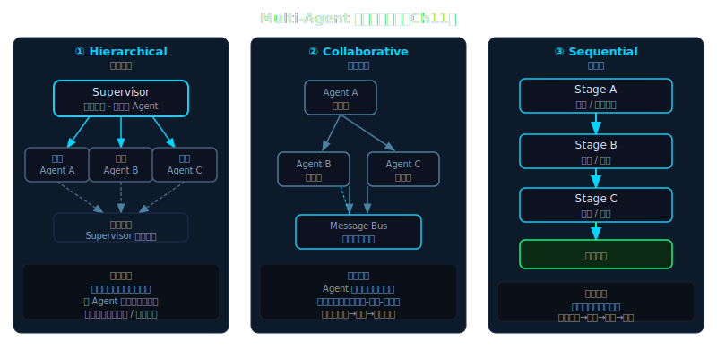

# 第 11 章：Planning 与 Subagent——让 Agent 拆任务

> **[支柱：Planning + Long-horizon]**
> Lena v0.10 → v0.11

---

## Beat 1 — 路线图

```
Ch01 → Ch02 → Ch03 → Ch04 → Ch05 → Ch06 → Ch07 → Ch08 → Ch09 → Ch10
→ [Ch11 ← 你在这里] → Ch12 → Ch13 → ...
```

本章从一个能用工具、有记忆、会压缩 context 的 Lena（v0.10）出发，经过三个关键转折——① LLM 自主决定"拆成几件事"、② 每件事交给独立子 agent 并发执行、③ 结果以结构化 XML 汇回——最终到达 Lena v0.11：接到"调研 X"就能自动并发派 3 个 Worker。

途中会踩一个坑：**TodoWrite 的 `agentId` 隔离失效问题**——父子 agent 共享 session key 时，父 agent 的 todo 列表会被子 agent 覆盖。理解为什么这里要用 `agentId ?? sessionId` 是本章最重要的工程细节。

本章后 Lena 新增能力：自主任务规划 + 并发 Worker 分发。

> **🧠 聪明度增量（v0.10 → v0.11）**：Lena 第一次能派出小弟——LLM 自主将大任务拆分，每个子任务交给独立 subagent 并发执行，各自持有独立 context，不再让主 agent 一个人扛所有认知负担。这一章教读者把任务分发与并发编排能力长在自己 agent 上的方法。

这三个转折对应三种核心问题：时间浪费（串行）、质量不稳（context 污染）、格式混乱（没有统一的 Worker 输出约定）。下图预览了本章要实现的 Hierarchical 多 agent 拓扑，以及它与 Collaborative、Agentic Workflow 两种变体的对比——具体含义在 Beat 3 展开。



---

## Beat 2 — 动机

让我们先看看没有 subagent 时会发生什么。

```python
# lena-v0.10：串行执行
start = time.time()
r1 = ask(lena, "调研 LangGraph 框架")   # 约 3.2s
r2 = ask(lena, "调研 CrewAI 框架")      # 约 3.8s
r3 = ask(lena, "调研 AutoGen 框架")     # 约 4.1s
total = time.time() - start             # 约 11.1s

print(f"总耗时: {total:.1f}s")
# 输出: 总耗时: 11.1s
```

这三个任务彼此完全独立，串行执行浪费了约 60% 的时间。更深的问题是：**一个 agent 连续切换"LangGraph 专家"→"CrewAI 专家"→"AutoGen 专家"三个角色，比三个各自专注一件事的 agent 产出质量更低。**

同样的任务，如果三个 Worker 并发：

```
[sub-001] 查 LangGraph  ████████████ 3.2s ✓
[sub-002] 查 CrewAI     ██████████████ 3.8s ✓
[sub-003] 查 AutoGen    ████████████████ 4.1s ✓
                           ↑ 三者重叠，总耗时 ≈ 4.1s（最慢 Worker）
```

总耗时压缩到 4.1s，节省 63%。这不是优化，是架构改变。

---

## Beat 3 — 理论铺垫

### 3.1 ReAct 的隐含假设

> **Convention — ReAct 循环（Reasoning + Acting）**：agent 的基础执行单元——每一步先 Think（推理当前状态、决定下一步行动），再 Act（调用工具），再观察 Observation，循环往复直到任务完成。在单 agent 场景，一个 ReAct 循环负责整个任务；在 Orchestrator-Worker 场景，**每个 Worker 持有自己独立的 ReAct 循环**，互不干扰。
>
> ```python
> # ReAct 循环的最小实现（与 Ch03 一致，此处作对比背景）
> async def react_loop(agent_id: str, task: str) -> str:
>     messages = []
>     while True:
>         thought = await llm_think(messages, task)   # Reason
>         if thought.is_done:
>             return thought.answer
>         obs = await tool_call(thought.action)        # Act
>         messages.append({"thought": thought, "obs": obs})  # Observe
> # 关键：每个 Worker 独立调用此函数，messages 列表不共享 → 零 context 污染
> ```

第 3 章建立的 ReAct 循环：Think → Action → Observation → Think → ...有一个始终未被挑战的假设：**所有推理都发生在同一个上下文里，串行进行**。

这个假设在单线程任务时很合理。但它造成两个天花板：

> **Convention — 时间天花板（Time Ceiling）**：N 个独立任务的总耗时 = 每个任务耗时之和。单 agent 串行执行无法改善这个等式；并发才能把"和"压缩成"最大值"。
>
> **Convention — 质量天花板（Quality Ceiling）**：单个 agent 切换任务时，context 里残留上一个任务的信息。查完 LangGraph 的细节再去查 CrewAI，LangGraph 的信息就在 context 里"污染"着（称为 **context 污染**），影响注意力分配，产出质量不稳定。

打破这两个天花板，需要一个新模式。

> **Convention — Orchestrator（大脑）**：负责规划、拆任务、调度 Worker、汇总结果的主 agent。它不执行具体子任务，只做决策。
>
> **Convention — Worker / Subagent（双手）**：被 Orchestrator 派出去、负责执行单一子任务的独立 agent 实例。每个 Worker 有自己的消息历史、自己的 agentId、自己的工具权限，彼此之间**不共享 context**。

### 3.1b 多 Agent 比单 Agent 强多少？

Anthropic 在 2024 年 12 月发布的官方博客 *Building effective agents* 中多次论证了 orchestrator-workers 拓扑的收益：它能突破单 agent 的上下文窗口限制、让独立子任务真正并行执行，并通过角色专注提升各子任务的产出质量。博客的核心观点是：

> "The key insight is that intelligence reaches a threshold where multi-agent systems become a vital way to scale performance."（来源：Anthropic, *Building effective agents*, 2024-12-19）

在选择架构之前，先明确一点：**多 agent 系统存在多种拓扑形态**，并非只有"一个主 agent 派出多个 Worker"这一种选法。官方博客同时给出了三种主要的多 agent 架构变体，以及它们各自适用的场景：

| 模式 | 核心思想 | 何时用 | 典型特征 |
|---|---|---|---|
| **Hierarchical** | supervisor 用 tool calling 调 subagent | 任务可分解为明确子任务 | 调度可见、出错可定位、结果可预期 |
| **Collaborative** | peer-to-peer 无中心，多 agent 相互协商 | 探索性 / 创意任务 | 无单点控制，协调通过消息广播涌现，适合开放式问题 |
| **Agentic Workflow** | 预定义执行图（Sequential / Parallel 步骤） | 可预测 / 固定步骤流程 | 流程固化，可复现，每个节点是 agent 而非固定函数 |

三种模式的核心区别：**Hierarchical** 有明确的上下级（谁调谁由代码决定）；**Collaborative** 无上下级（agent 之间平等协商，最终结果由博弈产生）；**Agentic Workflow** 有固定流程图（执行顺序由图结构决定，agent 只填格子）。

本章实现的 Orchestrator-Worker 拓扑对应的是 **Hierarchical** 模式——Orchestrator 是 supervisor，Worker 通过 tool calling 被调度。这也是实践中最常见、最容易调试的形态。

同一篇博客也给出了一个重要的反向建议，防止过度工程：

> "Before scaling to multi-agent systems, consider whether adding specialized skills to your single agent might achieve your accuracy requirements more efficiently."

换句话说，在上多 agent 之前，先问一句：给单 agent 加更好的 skills（参见 Ch 12）能不能达到目标？如果能，不要用多 agent。多 agent 的价值在于突破单 agent 的时间和质量天花板，而不是"看起来更复杂"。

> **Convention — 多 agent 合法性检验（The Parallelism Test）**：
> 只有当同时满足以下两个条件时，才值得引入多 agent：
> 1. 子任务之间**真正独立**（A 的输出不是 B 的输入）
> 2. **并发执行**能带来可测量的时间或质量提升
>
> 反例：如果"调研 LangGraph、CrewAI、AutoGen"这三个任务中，你只是懒得写三次 prompt，用多 agent"感觉更优雅"，但单 agent + ResearchSkill 能达到同等质量——**这不是合法理由**。不必要的多 agent 引入了协调开销（网络延迟 × N、agentId 管理、结果聚合）和调试复杂度，反而降低整体效率。

（来源：Anthropic, *Building effective agents*, 2024-12-19）

### 3.1c 学术研究中的多 Agent 加速效果

两篇有代表性的同行评议研究给出了可以核查的数据。

**AutoGen（arXiv:2308.08155）**：微软研究院在 2023 年发布的 AutoGen 框架论文，在 ALFWorld、HumanEval、MATH、Ravens 等多个基准任务上系统性地对比了单 agent 和多 agent 方案。在 ALFWorld（家务自动化任务）的成功率上，双 agent（Orchestrator + Executor 角色分离）比单 agent 提升了 **11-15 个百分点**；在 MATH 数学推理任务上，多 agent 的 majority voting 策略在 Pass@1 上的增益依任务难度在 **5-20%** 区间波动。结论是：任务需要连续多步骤决策且每步有独立出错空间时，角色专注的多 agent 更占优；纯记忆类或格式转换任务则无显著差异。

**MetaGPT（arXiv:2308.00352）**：香港大学和清华大学 2023 年合作发表的研究。MetaGPT 把软件团队角色（PM / Architect / Engineer / QA）映射为独立 agent，在 HumanEval 和 MBPP 代码生成基准上，多角色协作方案的 Pass@1 分别达到 **85.9%** 和 **87.7%**，高于同期单 agent 基线。更重要的发现是：多 agent 系统在任务中**生成了真实可运行的结构化文档**（PRD / 架构图 / 测试用例），单 agent 方案无法自然产出这类中间产物。

**More Agents Is All You Need（arXiv:2402.05120，Li et al. 2024）**：Agent Forest 方法通过对同一个模型跑 N 个独立 agent 再做 majority voting，在数学推理任务上相对单 agent 提升 **34%（GPT-3.5）到 200%（Llama-2 13B）**。最有冲击力的发现是跨模型比较：**40 个 Llama-2 13B agent 的集成（59% 准确率）反而超过了单个 Llama-2 70B（54% 准确率）**——说明"更多小 agent 协作"在某些任务上可以替代"更大模型"，这是单 agent 范式里看不到的路径。

这三个研究都指向同一个模式：**任务的自然分解点和 agent 边界对齐时，多 agent 系统的收益是结构性的**——不只是速度，而是单 agent 范式里天然缺失的中间产物（文档 / 审查 / 专项检查）得以涌现。这正是 Orchestrator-Worker 的核心价值所在，而不是任何单一的百分比数字。

### 3.2 Orchestrator-Worker 拓扑

```
用户
 └─ Orchestrator（规划层）
      ├─ 分析任务，识别可并发的独立子任务
      ├─ 为每个子任务生成四要素 Prompt
      ├─ 并发分发给 Worker（asyncio.gather）
      └─ 汇总 <task-notification> 结果
           ├─ Worker-1（独立 ask() 链，独立 agentId）
           ├─ Worker-2（独立 ask() 链，独立 agentId）
           └─ Worker-3（独立 ask() 链，独立 agentId）
```

Anthropic 在其工程博客中将这种设计称为 *decoupling the brain from the hands*：Orchestrator 专注决策（调用更强的模型），Worker 专注执行（调用更轻的模型），两者各司其职。

关键事实：**Worker 不是线程，是独立的 LLM 调用链。** 每个 Worker 有自己的消息历史、自己的 agentId、自己的工具权限——它们之间不共享 context。

### 3.3 TodoWrite 的 agentId 设计

CC 的 `TodoWriteTool.ts` 只有 115 行，核心是一行：

```
AppState.todos[agentId ?? sessionId] = newTodos  // :67
```

**为什么用 `agentId ?? sessionId` 而不是统一用 `sessionId`？**

先看如果统一用 `sessionId` 会出什么 bug。假设三个 Worker 并发运行在同一个 session 下：

```
t=0.0s  Worker-1  写 todos[sessionId] = ["查 LangGraph → in-progress"]
t=0.1s  Worker-2  写 todos[sessionId] = ["查 CrewAI → in-progress"]
         ↑ 直接覆盖 Worker-1 的 todo 条目！Worker-1 的进度消失
t=0.2s  Worker-3  写 todos[sessionId] = ["查 AutoGen → in-progress"]
         ↑ 再次覆盖，现在 todo 表里只剩 Worker-3 的条目

Orchestrator 轮询 todos[sessionId]，看到的永远只是最后写入者的状态。
```

这是典型的 **last-writer-wins race condition**：三个 Worker 并发写同一个 key，后来者静默覆盖先来者。没有报错，只有静默的数据丢失。

`agentId ?? sessionId` 的语义是：有 agentId 就用 agentId（每个 Worker 写自己的独立 todo 表），没有 agentId 就回退到 sessionId（顶层 Orchestrator 的 todo 表）。结果：三个 Worker 各自维护一张互不干扰的 todo 表，Orchestrator 的 todo 表独立存在。

> **Convention — agentId**：Worker 实例的唯一标识符，格式为 `sub-xxxxxx`（`uuid.hex[:6]` 截断）。每次 `spawn_subagent()` 调用生成一个新的 agentId。
>
> **Convention — sessionId**：整个对话的唯一标识符。Orchestrator 和所有 Worker 共享同一个 sessionId，但 Worker 不用它作为 todo key。
>
> **关系**：agentId 是 sessionId 的子域——一个 session 下可以有多个 agentId，每个 agentId 对应一个 Worker 实例。

### Beat 3 小结：本章 5 个核心命题

读完这一节，你应该能不看书说出这 5 句话：

| # | 命题 | 一句话锚点 |
|---|------|-----------|
| 1 | 串行执行存在两个天花板 | 时间天花板（耗时之和）+ 质量天花板（context 污染），单 agent 无法突破 |
| 2 | 并发的关键是 asyncio.gather | 让 N 个 Worker 同时启动，总耗时 = 最慢 Worker，而不是所有 Worker 耗时之和 |
| 3 | 多 agent 需要过"并行合法性检验" | 子任务真正独立 + 并发带来可测量提升，两个条件都要满足；单 agent + skill 能搞定就不用多 agent |
| 4 | agentId 隔离是防 race condition 的核心设计 | 三个 Worker 并发写同一个 sessionId = last-writer-wins bug；`agentId ?? sessionId` 让每个 Worker 写自己的独立 todo 表 |
| 5 | Worker 指令必须包含输出格式约束 | 没有明确输出格式，Worker 各自用 Markdown / JSON / 表格，Orchestrator 汇总时格式不兼容，结果质量崩塌（Beat 5 展开） |

---

## Beat 4 — 脚手架

先建立最小的 Orchestrator 骨架——它只做一件事：把任务喂给三个 Worker 然后等结果。

下面验证能派发三个 Worker 并收集结果的最小 Orchestrator：

```python
# orchestrator_skeleton.py — Beat 4 脚手架（约 50 行，只跑通核心结构）
import asyncio
import uuid
from dataclasses import dataclass


@dataclass
class SubagentResult:
    agent_id: str          # 对应 CC 的 context.agentId
    task: str
    content: str
    elapsed: float

    def to_xml(self) -> str:
        """模拟 CC <task-notification> XML 回传格式"""
        return (
            f'<task-notification agent_id="{self.agent_id}" status="completed">\n'
            f'{self.content}\n'
            f'</task-notification>'
        )


class SubagentWorker:
    """独立 ask() 调用链的最小实现"""

    def __init__(self, task: str, parent_system_prompt: str):
        self.agent_id = f"sub-{uuid.uuid4().hex[:6]}"  # 全局唯一
        self.task = task
        # Fork 继承：Worker 的 system prompt = 父 prompt（共享 prompt cache）
        self.system_prompt = parent_system_prompt

    async def run(self) -> SubagentResult:
        import time
        start = time.time()
        # 骨架阶段：用 echo 代替真实 LLM 调用
        await asyncio.sleep(0.1)  # 模拟网络延迟
        content = f"[{self.agent_id}] 完成任务：{self.task}"
        return SubagentResult(self.agent_id, self.task, content, time.time() - start)


async def run_parallel(tasks: list[str], system_prompt: str) -> list[SubagentResult]:
    """并发派发：asyncio.gather 是关键"""
    workers = [SubagentWorker(t, system_prompt) for t in tasks]
    return list(await asyncio.gather(*[w.run() for w in workers]))


# 验证骨架
if __name__ == "__main__":
    results = asyncio.run(run_parallel(
        ["查 LangGraph", "查 CrewAI", "查 AutoGen"],
        system_prompt="你是一个调研 Worker。"
    ))
    for r in results:
        print(r.to_xml())
```

运行 `python3 orchestrator_skeleton.py` 应看到三条 `<task-notification>` XML 块。每条有唯一的 `agent_id`（`sub-xxxxxx` 格式），这是 agentId 隔离的基础。

---

## Beat 5 — 渐进组装

从骨架出发，依次加入三个真实系统需要的特性：

| 扩展点 | 为何需要 | 如何加 |
|--------|---------|--------|
| LLM 规划（plan phase） | Worker 数量和内容由任务决定，不能硬编码 | Orchestrator 先调用一次 LLM 分析任务，输出 JSON 拆分方案 |
| 四要素 Prompt | Worker 接到模糊指令时质量不稳定 | 每个 Worker 收到 Scope/Goal/Constraints/Output 四字段结构化 prompt |
| `<task-notification>` 聚合 | Orchestrator 需要统一格式才能汇总 | Worker 结果序列化为 XML，Orchestrator 再 LLM 汇总 |

**扩展 1：LLM 规划阶段**

Orchestrator 不应该硬编码"拆三个"——它应该让 LLM 决定。

```python
PLANNER_PROMPT = """分析任务，判断能否拆分为独立并发子任务。
输出 JSON（只输出 JSON，不加说明）：
{"can_parallelize": true/false, "subtasks": [{"id": "1", "task": "..."}]}"""

async def plan(task: str, client) -> dict:
    resp = await client.converse(
        system=PLANNER_PROMPT,
        user=f"任务：{task}",
        max_tokens=400,
    )
    # 解析 LLM 输出的 JSON
    import re, json
    m = re.search(r'\{.*\}', resp, re.DOTALL)
    return json.loads(m.group()) if m else {"can_parallelize": False, "subtasks": [{"id":"1","task":task}]}
```

中间结果验证：把 `"调研 LangGraph CrewAI AutoGen 并对比"` 输入 `plan()`，应得到 `can_parallelize: true` 和 3 个 subtask。如果得到 `can_parallelize: false`，说明 planner prompt 需要调整——这是真实踩坑，不是理论。

**扩展 2：四要素 Prompt 注入**

裸指令 `"查 LangGraph"` 让 Worker 自由发挥，结果格式各异，汇总困难。四要素框架强制对齐：

```python
def make_worker_prompt(scope: str, goal: str, constraints: str, output_format: str) -> str:
    return f"""### Scope（范围）
{scope}

### Goal（目标）
{goal}

### Constraints（约束）
{constraints}

### Output（输出格式）
{output_format}"""
```

关键是 **Output 字段**：告诉 Worker 返回什么格式，Orchestrator 的汇总 LLM 才能可预测地处理。

**为什么 Output 是最关键的字段？** 看这个反例：

```
# 没有 Output 字段时的三个 Worker 实际返回：
Worker-1 (LangGraph)：
  "LangGraph 是 LangChain 的扩展，支持有向图工作流..."
  [返回了 3 段自由格式 Markdown，含代码块]

Worker-2 (CrewAI)：
  {"name": "CrewAI", "type": "multi-agent", "stars": 28400, ...}
  [返回了 JSON 格式，含字段名]

Worker-3 (AutoGen)：
  | 框架 | 版本 | License | 主要特性 |
  |------|------|---------|---------|
  | AutoGen | 0.4 | MIT | ... |
  [返回了 Markdown 表格]

# Orchestrator 汇总 LLM 收到三种完全不同的格式，无法统一对比。
```

有了 `Output` 字段（"输出 JSON，含 name/pros/cons/use_case 四字段"），三个 Worker 的输出格式对齐，Orchestrator 直接 `json.loads()` 后合并，不需要格式转换。

> **Convention — 四要素 Prompt（Four-Element Prompt）**：Worker prompt 必须包含：
> - **Scope**（范围）：限定 Worker 只处理什么，不处理什么
> - **Goal**（目标）：这个 Worker 需要产出什么
> - **Constraints**（约束）：禁止做什么（如"不访问其他框架"）
> - **Output**（输出格式）：返回值的具体格式（JSON schema / Markdown 结构等）
>
> 缺少任何一个字段都会导致问题，但缺少 **Output** 最致命——因为格式不一致会在 Orchestrator 的汇总阶段放大，导致结果聚合质量崩塌。

中间结果验证：把四要素 prompt 打印出来，确认 `Scope` 里只提到目标框架，`Constraints` 里有明确的"不访问其他框架"约束，`Output` 里有精确的 JSON schema。

**扩展 3：`<task-notification>` 聚合**

```python
async def aggregate(original_task: str, results: list[SubagentResult], client) -> str:
    # 拼合所有 Worker 的 XML 输出
    notifications = "\n\n".join(r.to_xml() for r in results)
    return await client.converse(
        system="你是信息整合专家，将多个子 agent 结果整合为完整报告。",
        user=f"原始任务：{original_task}\n\n各子 agent 结果：\n{notifications}",
        max_tokens=2000,
    )
```

中间结果验证：打印 `notifications`，应看到三块 `<task-notification>` XML，每块有不同的 `agent_id`，证明 agentId 隔离正确工作。

---

## Beat 6 — 运行验证

组合为完整产物。完整代码在 `code/lena-v0.11/`，这里给出运行方式和预期输出：

```bash
# 需要 AWS credentials（us-west-2，Bedrock 访问权限）
cd code/lena-v0.11
python3 lena.py
```

预期交互（数字会因网络条件浮动 ±20%）：

```
Lena v0.11 — Orchestrator-Worker Mode
==================================================
> 调研 2026 年 AI Agent 三大框架（LangGraph/CrewAI/AutoGen）并对比

[Orchestrator] 分析任务...
[Orchestrator] 拆分为 3 个独立子任务

  [sub-4a2f1c] ⏳ 调研 LangGraph 框架...
  [sub-9b3e7d] ⏳ 调研 CrewAI 框架...
  [sub-2c8f4a] ⏳ 调研 AutoGen 框架...

  [sub-4a2f1c] ✓ 调研 LangGraph 框架... (3.2s)
  [sub-2c8f4a] ✓ 调研 AutoGen 框架... (4.0s)
  [sub-9b3e7d] ✓ 调研 CrewAI 框架... (4.5s)

[Orchestrator] 汇总结果...（总耗时: 6.8s，估计串行需要 11.7s）
```

遇到 `botocore.exceptions.NoCredentialsError`：检查 `~/.aws/credentials` 或 `AWS_ACCESS_KEY_ID` / `AWS_SECRET_ACCESS_KEY` 环境变量。

遇到 `ModelNotReadyException`：inference profile ID 必须是 `us.anthropic.claude-haiku-4-5`（含 `us.` 前缀），不是 `anthropic.claude-haiku-4-5`——这是 Bedrock inference profile 的血泪坑，model ID 和 profile ID 格式不同。

---

## Beat 7 — Design Note

**Why Not Persist the Todo List?**

`TodoWriteTool.ts:67` 的实现让不少人第一次看到时愣住：`AppState.todos` 是纯内存对象，没有任何 I/O。进程退出，所有 todo 消失。

替代方案：把 todo 写入 SQLite 或本地 JSON 文件，支持跨 session 恢复。

权衡分析：

- **持久化 todo 的代价**：每次 `TodoWrite` 触发磁盘 I/O，在高频 agent 循环里（每几秒一次）增加可见延迟；更严重的是，持久化意味着需要处理"上次 session 的残留 todo"——它们是有效待办还是过期垃圾？需要 TTL 或手动清理逻辑，复杂度显著上升。

- **纯内存 todo 的哲学**：TodoWrite 的使用场景是 **agent 的工作草稿**，不是面向用户的任务管理系统。它的作用是让 LLM 在一次 session 里维护当前进度的短期记忆，而不是构建持久化任务队列。session 结束 → todo 自然清空，下次从头规划，这符合 agent 的设计直觉。

- **agentId 隔离是纯内存设计的保证**：正因为 todo 只在内存里，`agentId ?? sessionId` 的 key 设计才能保证多个并发 Worker 不互相干扰，没有锁竞争，没有事务需求。

当前选择的理由：对于 session 内的短期任务追踪，纯内存 + agentId 隔离是最简设计，且足够。

如果在生产系统里需要跨 session 恢复（比如第 14 章的 long-running task），会考虑一个带 TTL 的轻量 checkpoint 机制，而不是给 TodoWrite 加持久化——两个不同的关注点应该分开。

---

## Lena v0.11 新增能力

| 能力 | 说明 |
|------|------|
| 自主规划 | Orchestrator 调用 LLM 分析任务可并发性，输出拆分方案 |
| 并发分发 | `asyncio.gather` 并发启动 N 个 Worker，时间压缩至最慢 Worker 耗时 |
| agentId 隔离 | 每个 Worker 有独立 `agent_id`，todo 状态不互相干扰 |
| 四要素 Prompt | Scope/Goal/Constraints/Output 结构化 Worker 指令，汇总质量稳定 |
| XML 汇回 | `<task-notification>` 格式回传，Orchestrator 统一聚合 |

---

## 扩展阅读

- CC 源码 `AgentTool.tsx:196`、`forkSubagent.ts:60`、`TodoWriteTool.ts:67`——本章所有 CC 细节的第一手来源
- `forkSubagent.ts` 里的 `buildForkedMessages()`：Fork 子 agent 如何用相同的 placeholder tool_result 让所有 Worker 共享 prompt cache 前缀
- `builtInAgents.ts`：CC 内置的四种 agent 类型（generalPurpose / plan / explore / verification）——可以理解为对 Orchestrator-Worker 模式的一层封装，把常见的任务规划、探索、验证场景预置为具体角色，读者在此基础上可以快速派生自己的专用 Worker 类型

---

*下一章 →* **Ch 12：Skills——可复用的能力单元**

"Lena v0.11 已经能拆任务了。但每个子 agent 都从零描述怎么做——如果能给它们注入已经写好的'技能包'呢？"
