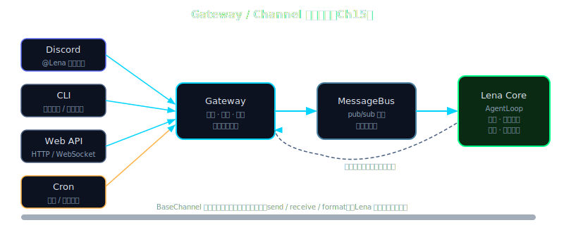

# Ch 15 — Gateway 与 Channel：让 Agent 住进你的 Telegram

---

## Beat 1 — 路线图

```
Ch 13 输入层安全 → Ch 14 执行层安全 → [Ch 15 你在这里] → Ch 16 MessageBus → Ch 17 Heartbeat
```

本章从一个**每次运行完就死掉**的 CLI Lena（v0.14 产物）出发，经过 Gateway 的双入口设计和 BaseChannel 抽象，最终到达 **Lena v0.15**——她在后台常驻，Telegram 和 Console 两个 channel 可以热插拔，断线会自动按指数退避重连。

途中会遇到一个直觉陷阱：你可能以为 channel 是 agent 的一部分，应该编译进核心代码。但正确答案是 **channel 是插件，核心不知道 channel 的存在**。这个翻转是本章最值得带走的一个模型。

本章需要建的东西不多——约 200 行新代码——但架构上的跨越是整本书最大的一步：Lena 从一个命令行小工具变成一个真正的 always-on 进程，可以在你睡觉时接收 Telegram 消息、响应 HTTP 调用，或者等待 cron 在凌晨触发她去做某件事。

**Lena 本章新能力**：从 v0.14（CLI 执行完退出）→ v0.15（常驻后台，Telegram + Console 双 channel 热插拔，断线指数退避）。

> **🧠 聪明度增量（v0.14 → v0.15）**：Lena 第一次跨界面运行——Gateway + BaseChannel 抽象让她从"运行完就死"的 CLI 工具变成常驻后台进程，Telegram、Console 两个 channel 可热插拔，核心代码不知道 channel 的存在。这一章教读者把多界面适配能力长在自己 agent 上的方法。



---

## Beat 2 — 动机

运行下面这行命令：

```bash
python3 lena-v0.14/main.py
```

你输入一个问题，Lena 回答，然后——进程退出。关掉 terminal，Lena 就消失了。

这不只是"不方便"。它是一类根本性的无法完成：

- 你在手机上打开 Telegram，发不了消息给 Lena
- 你让 Lena 每小时监控某个数据，她没有办法保持存在
- 你的 cron job 在凌晨 2 点触发，你在睡觉——没有人能启动进程

**两个显而易见的解决方向，都走不通：**

第一个方向：在脚本里写一个 `while True` 无限循环。问题是，这只能处理一个输入源——你写死了从 `stdin` 读。想同时接 Telegram 和 Discord？你得在同一个 `while True` 里处理两种协议，代码很快变成一坨。更根本的问题：Telegram 的 polling 是异步的，Discord 的 gateway 协议需要维持长连接的心跳，两套协议的生命周期完全不同，硬塞在一个循环里会产生大量针对特定平台的 `if/elif` 分支，维护起来是噩梦。

第二个方向：每个 channel 单独跑一个进程。Telegram 进程、Discord 进程各自独立。问题是，它们共享同一个 Lena 的对话历史和工具执行上下文——两个进程之间没有办法同步这些状态。你可以用 Redis 或数据库做中间层，但这把一个本来是应用级别的问题变成了基础设施问题，复杂度大幅上升。

**真正的答案**是：一个常驻的 Gateway 进程，统一管理所有连接入口，把消息路由到单一的 AgentLoop。每个 channel 作为插件注册进来，只负责"如何收消息、如何发消息"，不需要知道 AgentLoop 的存在。这是本章要建的东西。

---

## Beat 3 — 理论铺垫

> 本节是纯理论，分三个小节。

操作系统曾经面对一个类似的问题：硬件千差万别，但程序不可能为每块硬件单独编写。解法是**虚拟化**——把物理资源抽象成"进程"、"文件"这样的通用接口，让"还没被想到的程序"也能运行。Gateway + Channel 的设计在 agent 层做的是同一件事：把"用户从哪来"这个变量虚拟化，让 Lena 的 AgentLoop 不需要知道消息来自 Discord、CLI 还是邮件；Gateway 负责翻译。

本章的 Gateway + Channel 对应的正是这个**中间层**。

### 3.1 Gateway 的本质是什么

乍看 Gateway 像是"一个监听消息的服务器"。但实际上它更像**一个消息的交通枢纽**——不生产消息，不消费消息，只负责把来自不同入口的消息统一格式化，送到 AgentLoop；把 AgentLoop 的输出，送回到对应的出口。

这个定义有两个关键后果。

**后果一：Gateway 对 channel 是透明的。** 它不知道消息是从 Telegram 来的还是从 Discord 来的，只知道"有一条消息需要处理，来自用户 ID=xxx，内容是 yyy"。反过来，AgentLoop 也不知道自己的回复最终会被发到哪个平台。Gateway 承担了这两层之间的适配责任。

**后果二：Gateway 的核心状态是连接表，而不是对话历史。** 连接表记录"哪个 channel 当前处于什么状态"；对话历史是 AgentLoop 的内部状态，Gateway 完全不碰。这个分工让两者都保持简单：Gateway 可以崩溃重启而不丢失对话上下文（因为上下文在 AgentLoop 里），AgentLoop 可以不关心消息从哪里来（因为格式化已经在 Gateway 层完成了）。

Convention：**Gateway** = 管理连接生命周期 + 消息路由的进程；**Channel** = 具体的消息入口/出口插件（Telegram / Discord / Console 等）；**AgentLoop** = 处理消息、调用工具、生成回复的核心逻辑。三者职责不重叠，是本章架构的三个独立关注点。

### 3.2 Channel as Plugin 设计哲学

为什么 channel 要做成插件，而不是直接写进 AgentLoop？

想象两种实现方式。

**方式 A（编译时集成）**：AgentLoop 直接 import TelegramBot，在自己的消息循环里处理 Telegram 的 webhook 格式、Discord 的 gateway 协议、飞书的消息推送。每次新增一个平台，就要改 AgentLoop 的核心代码。接入 10 个平台，AgentLoop 就要 import 10 个 SDK，处理 10 种格式差异。

**方式 B（channel as plugin）**：AgentLoop 只知道一个抽象接口——"发消息"和"收消息"。每个平台实现这个接口，在配置时注册，运行时按需加载。新增飞书 channel 不需要动 AgentLoop 一行代码。

方式 A 的问题不只是"不优雅"。它把两类完全不同的**变化原因**耦合在了一起："消息路由逻辑变了"和"接入的平台变了"，这两件事应该独立演进。软件设计里把这叫做"单一职责原则"，但更直觉的理解是：**Telegram 今天改了 API，不应该让 AgentLoop 文件出现 git diff。**

生产系统里，这个分离的价值在具体场景里最清晰：把一个每日摘要任务从 Discord 推送切换到飞书推送，改动只有配置文件里的一行——delivery channel 是配置，intelligence 是代码。这种分离在初期看起来是多余的抽象，但你第一次需要切换 channel 时，它的价值会立即显现。

> channel as plugin 的核心结论背后，来自"关注点分离"这个软件设计原则（来源：《A Philosophy of Software Design》by John Ousterhout，2018，第 4 章"Modules Should Be Deep"，不需要读完，只需要知道这个结论：**把不同变化速率的东西放在不同模块里**）。

值得一提的是，这个设计在生产级别可以走到更极致的形态：OpenClaw 的 `src/channels/plugins/catalog.ts` 实现了一个完整的 channel 发现机制——每个 channel 是一个独立的 npm 包，在运行时动态扫描已安装的包，通过 `package.json` 里的 `openclaw` 字段声明自己是 channel，gateway 进程不需要重新编译就能新增 channel。本章的 lena-v0.15 是这个设计的教学版，用静态注册代替动态发现，保留核心思想的同时大幅降低复杂度。

还有一个教学版和生产版在代码规模上的差异值得直视：nano-claw 的 `gateway/server.ts` 是 219 行，描述了完整的消息路由骨架；而 OpenClaw 的 `src/gateway/` 目录下有约 230 个文件，处理鉴权、TLS、Tailscale 暴露、canvas host、配置热重载、多账号管理、健康检查、metrics……等等数十个生产级关切。这不是"过度设计"，而是生产系统真实的复杂度。本章带你建的是 219 行教学版，帮你理解核心原理；230 文件的产品级细节，在你需要它们的时候，你已经有了足够的上下文去阅读和理解。

### 3.3 指数退避的数学直觉

断线重连的最朴素策略是立即重试。问题是，如果服务器短暂不可达（网络抖动、服务器重启、Telegram 维护），所有客户端同时立即重试会产生**惊群效应**（Thundering Herd）——服务器刚恢复就被大量请求同时打到，可能再次因过载崩溃，形成正反馈循环。

指数退避打破这个循环：

```
直觉版：第 n 次失败后，等 min(初始延迟 × 2^n, 上限) 毫秒再试
数学版：delay(n) = min(d₀ × 2ⁿ,  d_max)
```

参数的选择不是任意的，每一个都有工程理由：

- `d₀ = 5s`（初始延迟）：网络抖动通常在 1-5s 内恢复，第一次等 5s 覆盖绝大多数短暂抖动
- `d_max = 300s`（5 分钟上限）：超过 5 分钟的中断通常意味着需要人工干预；无限等待没有意义，而且会让用户以为 agent 崩了
- `max_attempts = 10`：10 次的等待窗口约为 5s + 10s + 20s + 40s + 80s + 160s + 300s + 300s + 300s + 300s = 约 1515s ≈ 25 分钟，覆盖绝大多数短暂中断场景

加入随机 jitter（抖动量 ±10%）是为了错开多个 channel 同时重连的时间点，避免它们在同一个时刻轰击服务器。比如你同时跑了 5 个 bot，都断线了，没有 jitter 的话它们会在完全相同的时刻发出重连请求；加了 ±10% 随机之后，5 个请求会分散在 4.5s 到 5.5s 这个区间里，负载平滑很多。

这套参数与 OpenClaw 的生产实现（`server-channels.ts:12-17`）一致：`initialMs: 5_000, maxMs: 5 * 60_000, factor: 2, jitter: 0.1`，最多 10 次。这是经过生产验证的参数组合，直接复用。

Convention：**退避（backoff）** = 每次重试前等待的延迟策略，让重试在时间上分散；**抖动（jitter）** = 在延迟上加随机量，让多个客户端的重试时间错开。两者通常同时使用。

### 3.4 消息流转的完整路径

在写代码之前，先把从"用户在 Telegram 发消息"到"Lena 回复"的完整路径走一遍，这样每一段代码都有明确的位置感：

```
用户发 Telegram 消息
    │
    ▼
[TelegramBot polling] — 这是 node-telegram-bot-api 内部，每秒向 Telegram API 轮询
    │ bot.on("message") 触发
    ▼
[TelegramChannel.onMessage handler]
    │ allowFrom 检查
    │ 通过 → 调用 Gateway 注入的 handler(userId, content)
    ▼
[GatewayServer]
    │ handler = agent.run(content)
    ▼
[AgentLoop.run()]
    │ LLM 推理 → 可能调用工具 → 生成回复
    ▼
[GatewayServer handler 返回 reply 字符串]
    │
    ▼
[TelegramChannel]
    │ bot.sendMessage(chatId, reply)
    ▼
用户收到 Telegram 回复
```

整个路径有五个角色，每个角色只做自己的事：TelegramBot 处理协议细节，TelegramChannel 处理白名单和格式化，Gateway 处理路由，AgentLoop 处理智能，Telegram API 负责最终投递。

这个路径在本章的代码里是完整的，你可以在每一层加 `console.log` 来追踪消息流动，这是调试的有效方法。

---

## Beat 4 — 脚手架

下面构建最小的 Gateway 骨架——能连接两个 channel 并端到端路由一条消息。Python 版本用 `abc.ABC` 定义 `BaseChannel` 接口，用 `asyncio` 驱动并发连接：

```python
# lena-v0.15/gateway/server.py — 最小骨架（约 50 行）
import asyncio
from abc import ABC, abstractmethod
from typing import Awaitable, Callable

# MessageHandler：Gateway 注入给 channel 的回调类型
MessageHandler = Callable[[str, str], Awaitable[str]]


class BaseChannel(ABC):
    """每个 channel 只需要实现这五件事。"""

    @property
    @abstractmethod
    def id(self) -> str: ...

    @abstractmethod
    async def connect(self) -> None: ...

    @abstractmethod
    async def disconnect(self) -> None: ...

    @abstractmethod
    def on_message(self, handler: MessageHandler) -> None:
        """Gateway 调用此方法注入 handler；channel 收到消息后调用 handler。"""

    @abstractmethod
    async def send(self, user_id: str, content: str) -> None: ...

    def snapshot(self) -> dict:
        return {"id": self.id, "status": "running", "retries": 0}


class GatewayServer:
    def __init__(self) -> None:
        self._channels: list[BaseChannel] = []

    def register(self, ch: BaseChannel) -> None:
        """运行时注册 channel；不修改 GatewayServer 源码。"""
        self._channels.append(ch)

    async def start(self, http_port: int = 3000) -> None:
        # 连接所有已注册的 channel，注入 echo handler（骨架阶段）
        for ch in self._channels:
            ch.on_message(self._echo_handler)
            await ch.connect()
            print(f"[Gateway] Channel [{ch.id}] connected")

        print(f"[Gateway] HTTP :{http_port}")
        # HTTP 服务器在 Beat 5 扩展 4 加入，此处占位
        await asyncio.Event().wait()  # 保持进程存活

    @staticmethod
    async def _echo_handler(user_id: str, content: str) -> str:
        return f"[echo] {content}"
```

以下是同等逻辑的 TypeScript 参考（nano-claw 原生语言）：

```typescript
// lena-v0.15/gateway/server.ts — 最小骨架（约 45 行）
import { WebSocketServer } from "ws";
import * as http from "http";

// BaseChannel 接口：每个 channel 只需要实现这四件事
interface BaseChannel {
  readonly id: string;
  connect():                                            Promise<void>;
  disconnect():                                         Promise<void>;
  // handler 由 Gateway 注入，channel 收到消息后调用，返回 Lena 的回复
  onMessage(handler: (userId: string, content: string) => Promise<string>): void;
  send(userId: string, content: string):                Promise<void>;
}

export class GatewayServer {
  private channels: BaseChannel[] = [];

  // 注册 channel：运行时调用，不修改 GatewayServer 源码
  register(ch: BaseChannel) {
    this.channels.push(ch);
  }

  async start(wsPort = 8765, httpPort = 3000) {
    // 1. WebSocket 服务器（Web 客户端、内部调试用）
    const wss = new WebSocketServer({ port: wsPort });
    console.log(`[Gateway] WebSocket :${wsPort}`);

    // 2. HTTP 服务器（webhook、curl 测试用）
    const server = http.createServer();
    server.listen(httpPort);
    console.log(`[Gateway] HTTP :${httpPort}`);

    // 3. 连接所有已注册的 channel，注入消息处理函数
    for (const ch of this.channels) {
      ch.onMessage(async (userId, content) => {
        // 骨架阶段：直接 echo 回去，AgentLoop 在 Beat 5 接入
        return `[echo] ${content}`;
      });
      await ch.connect();
      console.log(`[Gateway] Channel [${ch.id}] connected`);
    }
  }
}
```

运行这个骨架，你应该看到（约 0.5 秒内出现全部三行）：

```
[Gateway] WebSocket :8765
[Gateway] HTTP :3000
[Gateway] Channel [console] connected
```

Console 提示符出现，输入任意文字，会得到 `[echo] 你的输入`。这证明消息流转通路已经打通——用户输入 → channel 收到 → handler 被调用 → 返回值 → channel 发回用户。只是 handler 现在还是 echo，AgentLoop 还没接进来。

注意 `register()` 方法的设计：它在运行时调用，而不是编译时写死在 `GatewayServer` 里。这意味着你可以在 `main.ts` 里按需注册 channel，`GatewayServer` 的代码从来不需要知道有哪些 channel 存在。这就是"channel as plugin"在代码层面的体现。

---

## Beat 5 — 渐进组装

从骨架出发，我们依次加入四个真实系统需要的特性：

| 扩展点 | 为何需要 | 如何加 |
|--------|---------|--------|
| 接入 AgentLoop | echo 没有智能，需要让 LLM 处理消息 | 把 `onMessage` 的 handler 换成 `agentLoop.run()` |
| 指数退避重连 | Telegram 网络抖动时不应该立即放弃 | 在 channel 的 `connect()` 里包 retry 循环 + `ExponentialBackoff` |
| `allowFrom` 白名单 | 防止陌生人消费 LLM 资源，channel 层过滤比 AgentLoop 层更早更干净 | channel 收到消息时先检查 `allowFrom`，不通过则静默丢弃 |
| `GET /status` runtime snapshot | 监控 channel 连接状态、重连次数，为未来的监控面板做准备 | Gateway HTTP 服务增加 `/status` 端点，返回各 channel 的 snapshot |

**扩展 1：接入 AgentLoop**

`onMessage` 的 handler 替换为真实的 AgentLoop，只需要修改 `GatewayServer` 的构造函数和 `start` 方法：

```typescript
// lena-v0.15/gateway/server.ts（接入 AgentLoop）
import { AgentLoop } from "../agent/loop";

export class GatewayServer {
  constructor(private readonly agent: AgentLoop) {}  // 注入 AgentLoop

  async start(wsPort = 8765, httpPort = 3000) {
    // ... WS/HTTP 服务启动同骨架，省略

    for (const ch of this.channels) {
      ch.onMessage(async (userId, content) => {
        // 替换 echo，接入真实 AgentLoop
        const reply = await this.agent.run(content);
        return reply;
      });
      await ch.connect();
    }
  }
}
```

启动后在 Console 输入 "现在几点？"，Lena 应该调用 `get_time` 工具并回复。终端打印：

```
[Gateway] Channel [console] connected
你: 现在几点？
[Lena] 现在是 2026年5月5日 14:23:07 CST
```

AgentLoop 接入之后，Gateway 和 channel 就退到了"管道"的角色——它们只负责传递消息，不参与任何 LLM 推理逻辑。

**扩展 2：ExponentialBackoff 类**

退避策略作为独立模块，不放在 channel 内部，原因是多个 channel 可能共享同一套退避逻辑，抽出来也便于测试：

```python
# lena-v0.15/backoff.py
import math
import random


class ExponentialBackoff:
    """指数退避计算器（与 OpenClaw server-channels.ts:12-17 参数一致）。"""

    def __init__(
        self,
        initial_ms: int = 5_000,    # 第一次等 5s；覆盖绝大多数网络抖动
        max_ms: int = 300_000,      # 上限 5min；超过则需人工干预
        max_retries: int = 10,      # 十次窗口 ≈ 25 分钟
        jitter: float = 0.1,        # ±10% 随机抖动；错开多 bot 重连时机
    ) -> None:
        self._initial_ms = initial_ms
        self._max_ms = max_ms
        self._max_retries = max_retries
        self._jitter = jitter
        self._attempt = 0

    def next_delay(self) -> float:
        """返回本次应等待的毫秒数，并推进计数器。"""
        base = min(self._initial_ms * (2 ** self._attempt), self._max_ms)
        jitter_ms = base * self._jitter * (random.random() * 2 - 1)
        self._attempt += 1
        return round(base + jitter_ms)

    def reset(self) -> None:
        self._attempt = 0

    def exhausted(self) -> bool:
        return self._attempt >= self._max_retries

    @property
    def count(self) -> int:
        return self._attempt
```

验证退避序列（直接在 Python REPL 或脚本里跑）：

```python
# 快速验证：固定 jitter=0 使结果确定
import random as _r
_r.random = lambda: 0.5  # jitter 乘以 0 → 无抖动

b = ExponentialBackoff()
for i in range(5):
    print(f"attempt {i + 1}: {b.next_delay()}ms")
# 预期输出（趋势是翻倍）：
# attempt 1: 5000ms
# attempt 2: 10000ms
# attempt 3: 20000ms
# attempt 4: 40000ms
# attempt 5: 80000ms
```

TypeScript 原版供参考：

```typescript
// lena-v0.15/backoff.ts
export class ExponentialBackoff {
  private attempt = 0;

  constructor(
    private readonly initialMs  = 5_000,   // 第一次等 5s
    private readonly maxMs      = 300_000, // 上限 5min（openclaw server-channels.ts:12-17 参数）
    private readonly maxRetries = 10,
    private readonly jitter     = 0.1,    // ±10% 随机抖动
  ) {}

  nextDelay(): number {
    const base     = Math.min(this.initialMs * 2 ** this.attempt, this.maxMs);
    const jitterMs = base * this.jitter * (Math.random() * 2 - 1);
    this.attempt++;
    return Math.round(base + jitterMs);
  }

  reset()     { this.attempt = 0; }
  exhausted() { return this.attempt >= this.maxRetries; }
  get count() { return this.attempt; }
}
```

验证退避序列（运行一个小脚本）：

```typescript
const b = new ExponentialBackoff();
for (let i = 0; i < 5; i++) {
  console.log(`attempt ${i + 1}: ${b.nextDelay()}ms`);
}
```

应该打印类似（每次随机略有浮动，但趋势是翻倍）：

```
attempt 1: 5123ms
attempt 2: 10234ms
attempt 3: 20198ms
attempt 4: 40087ms
attempt 5: 80312ms
```

**扩展 3：带重连的 TelegramChannel**

TelegramChannel 是本章代码中最复杂的部分，因为它同时处理三件事：初始连接、断线检测、退避重连。把它们拆开看就清晰了：

```typescript
// lena-v0.15/channels/telegram.ts（关键逻辑，完整版见 code/）
import TelegramBot from "node-telegram-bot-api";  // npm install node-telegram-bot-api
import { ExponentialBackoff } from "../backoff";

export class TelegramChannel {
  readonly id = "telegram";
  private bot?: TelegramBot;
  private handler?: (userId: string, content: string) => Promise<string>;
  private backoff = new ExponentialBackoff();
  private aborted = false;  // disconnect() 后设为 true，防止继续重连

  constructor(
    private readonly token:     string,
    private readonly allowFrom: string[],  // ["*"] = 允许所有人，["123456"] = 只允许特定 user
  ) {}

  onMessage(handler: (userId: string, content: string) => Promise<string>) {
    this.handler = handler;
  }

  // connect() = 外层退避循环
  async connect(): Promise<void> {
    this.aborted = false;
    this.backoff.reset();

    while (!this.aborted) {
      try {
        await this.tryConnect();   // 内层：尝试一次真实连接
        this.backoff.reset();
        return;
      } catch (err) {
        if (this.aborted) return;  // disconnect() 被调用了，不再重连
        if (this.backoff.exhausted()) {
          console.error(`[Telegram] 放弃重连，已尝试 ${this.backoff.count} 次`);
          return;
        }
        const delay = this.backoff.nextDelay();
        console.log(
          `[Telegram] 连接失败，${Math.round(delay / 1000)}s 后重试` +
          `（第 ${this.backoff.count} 次 / 最多 10 次）: ${String(err)}`
        );
        await new Promise<void>(r => setTimeout(r, delay));
      }
    }
  }

  // tryConnect() = 一次真实连接尝试，失败抛异常给外层
  private async tryConnect(): Promise<void> {
    this.bot = new TelegramBot(this.token, { polling: true });

    this.bot.on("message", async (msg) => {
      const userId  = msg.from?.id?.toString() ?? "";
      const content = msg.text ?? "";
      if (!content) return;

      // allowFrom 检查：在 channel 层做，不在 AgentLoop 层
      const allowed = this.allowFrom.includes("*") || this.allowFrom.includes(userId);
      if (!allowed) {
        console.log(`[Telegram] 忽略未授权用户 ${userId}`);
        return;  // 静默丢弃，不回复，不报错
      }

      const reply = await this.handler?.(userId, content) ?? "";
      await this.bot!.sendMessage(msg.chat.id, reply);
    });

    console.log("[Telegram] 已连接，polling 中");

    // 等待 polling_error 触发（= 网络断线，需要重连）
    await new Promise<void>((_, reject) => {
      this.bot!.on("polling_error", (err) => {
        console.error(`[Telegram] polling_error: ${err.message}`);
        reject(err);  // 抛给外层 catch → 触发退避重连
      });
    });
  }

  async disconnect() {
    this.aborted = true;
    await this.bot?.stopPolling();
  }

  snapshot() {
    return {
      id:      this.id,
      status:  this.aborted ? "stopped" as const : "running" as const,
      retries: this.backoff.count,
    };
  }
}
```

注意 `allowFrom` 检查在 channel 层完成，不在 AgentLoop 层。这是一个明确的设计决策：**AgentLoop 永远只处理通过了安全检查的消息**，它不需要知道"这条消息该不该理"。

为什么不把 allowFrom 放在 AgentLoop 层？有三个理由：

**理由一：防止白名单绕过。** 如果 AgentLoop 检查白名单，那消息已经进入了 AgentLoop 的处理队列，即使拒绝，也已经消耗了资源（解析、格式化、进入队列）。在 channel 层检查，未授权消息甚至进不了 AgentLoop，更早、更干净。

**理由二：不同 channel 有不同策略。** Telegram 私聊不需要 `requireMention`，但群组里的 bot 通常需要 `@botname` 才能触发——这个逻辑属于 channel，不属于 AgentLoop。如果放在 AgentLoop 里，你就需要在 AgentLoop 里感知"这条消息来自哪个 channel 的哪种上下文"，复杂度大幅上升。

**理由三：fail-safe 设计。** 安全检查越早，影响范围越小。channel 层拒绝一条消息，最多是静默丢弃；AgentLoop 层拒绝，意味着已经做了 LLM 调用然后说"对不起我不能回复你"——浪费了 token，也向未授权用户泄露了"这个 agent 在运行"的信息。

把安全检查放在更外层，还有一个好处：不同的 channel 可以有不同的 allowFrom 策略，而不需要 AgentLoop 针对每个 channel 写特殊逻辑。

**扩展 4：ConsoleChannel + `/status` 端点**

ConsoleChannel 是本地调试的利器：零依赖、无需 token，在 terminal 里直接和 Lena 对话。它的实现简单，但它的价值在于：在接入真实 Telegram 之前，你可以用 Console channel 测试整个 Gateway + AgentLoop 的流程，不需要申请 Bot Token、不需要配置 webhook：

```python
# lena-v0.15/channels/console.py
import asyncio
import sys
from typing import Optional

from gateway.server import BaseChannel, MessageHandler


class ConsoleChannel(BaseChannel):
    """零依赖本地调试 channel，从 stdin 读取输入，向 stdout 输出回复。"""

    def __init__(self) -> None:
        self._handler: Optional[MessageHandler] = None
        self._running = False

    @property
    def id(self) -> str:
        return "console"

    def on_message(self, handler: MessageHandler) -> None:
        self._handler = handler

    async def connect(self) -> None:
        self._running = True
        print("[Console] 已连接，直接输入消息")
        loop = asyncio.get_event_loop()
        loop.add_reader(sys.stdin, self._on_stdin)

    def _on_stdin(self) -> None:
        line = sys.stdin.readline().strip()
        if not line or not self._handler:
            return
        asyncio.ensure_future(self._dispatch(line))

    async def _dispatch(self, content: str) -> None:
        reply = await self._handler("console-user", content)
        print(f"[Lena] {reply}")

    async def disconnect(self) -> None:
        self._running = False
        loop = asyncio.get_event_loop()
        loop.remove_reader(sys.stdin)

    async def send(self, user_id: str, content: str) -> None:
        print(f"[Lena] {content}")

    def snapshot(self) -> dict:
        return {"id": self.id, "status": "running", "retries": 0}
```

Python 版 `/status` 端点（用标准库 `http.server` 实现，无第三方依赖）：

```python
# lena-v0.15/gateway/status_server.py
import asyncio
import json
import time
from http.server import BaseHTTPRequestHandler, HTTPServer
from threading import Thread
from typing import Callable


def start_status_server(get_snapshot: Callable[[], dict], port: int = 3000) -> None:
    """在后台线程启动 HTTP status 服务。get_snapshot 由 GatewayServer 提供。"""

    class Handler(BaseHTTPRequestHandler):
        def do_GET(self) -> None:  # noqa: N802
            if self.path == "/status":
                body = json.dumps(get_snapshot(), ensure_ascii=False, indent=2)
                self.send_response(200)
                self.send_header("Content-Type", "application/json")
                self.end_headers()
                self.wfile.write(body.encode())
            else:
                self.send_response(404)
                self.end_headers()

        def log_message(self, fmt, *args):  # 静默 access log
            pass

    server = HTTPServer(("", port), Handler)
    Thread(target=server.serve_forever, daemon=True).start()
    print(f"[Gateway] HTTP :{port}")
```

TypeScript 参考实现：

```typescript
// lena-v0.15/channels/console.ts
import * as readline from "readline";

export class ConsoleChannel {
  readonly id = "console";
  private handler?: (userId: string, content: string) => Promise<string>;
  private rl?: readline.Interface;
  private running = false;

  onMessage(handler: (userId: string, content: string) => Promise<string>) {
    this.handler = handler;
  }

  async connect() {
    this.running = true;
    this.rl = readline.createInterface({ input: process.stdin, prompt: "你: " });
    this.rl.prompt();
    this.rl.on("line", async (line) => {
      const content = line.trim();
      if (!content || !this.handler) { this.rl?.prompt(); return; }
      const reply = await this.handler("console-user", content);
      console.log(`[Lena] ${reply}`);
      this.rl?.prompt();
    });
    console.log("[Console] 已连接，直接输入消息");
  }

  async disconnect() { this.running = false; this.rl?.close(); }
  async send(_: string, content: string) { console.log(`[Lena] ${content}`); }
  snapshot() { return { id: this.id, status: "running" as const, retries: 0 }; }
}
```

Gateway HTTP 服务加入 `/status` 端点：

```typescript
// gateway/server.ts 内，handleHttp 方法中增加
if (req.method === "GET" && req.url === "/status") {
  const snapshot = {
    channels:       this.channels.map((ch) => ch.snapshot()),
    wsConnections:  this.wsConns.size,
    uptime:         process.uptime(),
  };
  res.writeHead(200, { "Content-Type": "application/json" });
  res.end(JSON.stringify(snapshot, null, 2));
  return;
}
```

`curl http://localhost:3000/status` 应该返回：

```json
{
  "channels": [
    { "id": "console", "status": "running", "retries": 0 }
  ],
  "wsConnections": 0,
  "uptime": 42.3
}
```

`uptime` 字段的价值：如果你看到 uptime 是 5 秒，说明进程刚刚重启过——这是一个隐性的"有没有发生崩溃"信号。`retries` 字段同样有意义：如果你看到 Telegram channel 的 retries 是 3，说明发生过 3 次断线重连，而你对此毫无感知——这正是退避机制正常工作的证明。

这四个扩展合在一起构成了 lena-v0.15 的核心。它们之间的关系是：接入 AgentLoop 让 Lena 有了智能；退避重连让她在网络抖动时能自愈；allowFrom 白名单让她只响应授权用户；runtime snapshot 让你随时知道她的健康状态。每一个都是独立的，可以单独移除任何一个而不影响其余三个——这种正交性是 channel as plugin 架构的副产品：各个关切被清晰分离之后，每个模块都可以独立演进。

---

## Beat 6 — 运行验证

下面把完整的 Lena v0.15 组装起来并运行。Python 入口文件：

```python
# lena-v0.15/main.py
import asyncio
import os
import signal

from agent.loop import AgentLoop
from channels.console import ConsoleChannel
from gateway.server import GatewayServer
from gateway.status_server import start_status_server


async def main() -> None:
    agent = AgentLoop()
    gateway = GatewayServer(agent)

    # Console channel：本地调试，零依赖，始终注册
    gateway.register(ConsoleChannel())

    # Telegram channel：只在配置了 token 时才注册
    token = os.environ.get("TELEGRAM_BOT_TOKEN")
    allow_from = [s.strip() for s in os.environ.get("TELEGRAM_ALLOW_FROM", "*").split(",")]
    if token:
        from channels.telegram import TelegramChannel
        gateway.register(TelegramChannel(token, allow_from))
        print(f"[Main] Telegram channel 已配置，allow_from: {', '.join(allow_from)}")
    else:
        print("[Main] 未配置 TELEGRAM_BOT_TOKEN，跳过 Telegram channel")

    # 启动 /status HTTP 服务（后台线程，不阻塞事件循环）
    start_status_server(gateway.get_snapshot, port=3000)

    # 优雅退出：Ctrl+C 时关闭所有 channel
    loop = asyncio.get_event_loop()
    loop.add_signal_handler(signal.SIGINT, lambda: asyncio.ensure_future(gateway.stop()))

    print("\n✓ Lena v0.15 已启动")
    print("  Status:    http://localhost:3000/status\n")
    await gateway.start()


if __name__ == "__main__":
    asyncio.run(main())
```

TypeScript 版本（nano-claw 原生）供参考：

```typescript
// lena-v0.15/main.ts
import { GatewayServer } from "./gateway/server";
import { AgentLoop }      from "./agent/loop";
import { ConsoleChannel } from "./channels/console";
import { TelegramChannel } from "./channels/telegram";

async function main() {
  const agent   = new AgentLoop();
  const gateway = new GatewayServer(agent);

  // Console channel：本地调试，零依赖，始终注册
  gateway.register(new ConsoleChannel());

  // Telegram channel：只在配置了 token 时才注册
  const token     = process.env.TELEGRAM_BOT_TOKEN;
  const allowFrom = (process.env.TELEGRAM_ALLOW_FROM ?? "*").split(",").map(s => s.trim());
  if (token) {
    gateway.register(new TelegramChannel(token, allowFrom));
    console.log(`[Main] Telegram channel 已配置，allowFrom: ${allowFrom.join(", ")}`);
  } else {
    console.log("[Main] 未配置 TELEGRAM_BOT_TOKEN，跳过 Telegram channel");
  }

  await gateway.start();

  console.log("\n✓ Lena v0.15 已启动");
  console.log("  WebSocket: ws://localhost:8765");
  console.log("  HTTP POST: http://localhost:3000/message");
  console.log("  Status:    http://localhost:3000/status\n");

  // 优雅退出：Ctrl+C 时关闭所有 channel
  process.on("SIGINT", async () => {
    console.log("\n[Main] 正在停止...");
    await gateway.stop();
    process.exit(0);
  });
}

main().catch((err) => { console.error("启动失败:", err); process.exit(1); });
```

**启动（纯 Console 模式，无需任何 token）**：

```bash
cd code/lena-v0.15
npm install    # 第一次需要，约 30 秒
npm start
```

预期输出（约 1-2 秒内出现全部内容）：

```
[Main] 未配置 TELEGRAM_BOT_TOKEN，跳过 Telegram channel
[Gateway] WebSocket :8765
[Gateway] HTTP :3000
[Gateway] Channel [console] started
[Console] 已连接，直接输入消息

✓ Lena v0.15 已启动
  WebSocket: ws://localhost:8765
  HTTP POST: http://localhost:3000/message
  Status:    http://localhost:3000/status

你:
```

**验证三条通路**（在另一个 terminal 里运行，保持 Lena 运行）：

```bash
# 通路 1：Console（在运行 Lena 的 terminal 里直接输入）
# 你: 现在几点？
# [Lena] 现在是 2026年5月5日 14:23:07 CST

# 通路 2：HTTP POST
curl -s -X POST http://localhost:3000/message \
  -H "Content-Type: application/json" \
  -d '{"content": "你好"}'
# 预期返回（约 2-3 秒）：
# {"reply":"你好！我是 Lena，有什么可以帮你？"}

# 通路 3：Runtime snapshot
curl -s http://localhost:3000/status | python3 -m json.tool
# 预期：channels 数组有 1 个 console channel，status = "running"，uptime = 若干秒
```

**启动（含 Telegram）**：

先申请 Bot Token：打开 Telegram，搜索 `@BotFather`，发送 `/newbot`，按提示操作，拿到形如 `7xxxxxxxx:AAxxx...` 的 token。再发消息给 `@userinfobot` 获取你的 user ID（一串数字）。

```bash
TELEGRAM_BOT_TOKEN=<your-token> \
TELEGRAM_ALLOW_FROM=<your-user-id> \
npm start
```

手机打开 Telegram，给你的 bot 发任意消息。Lena 应该在 2-3 秒内回复。

**常见报错及处理**：

- `Error: 401 Unauthorized`：Bot token 格式错误或已失效，回到 @BotFather 重新 `/newbot` 或 `/revoke`。
- `EADDRINUSE :::8765`：端口被占用，执行 `lsof -i :8765` 找到占用进程，kill 后重启。
- Telegram 发了消息但没有回复（没有报错）：大概率是 `TELEGRAM_ALLOW_FROM` 填的不是你的 user ID。先去掉这个变量（默认 `*` 允许所有人）测试，确认可用后再加白名单。

**这是一个已知的局限性需要说明**：本章的 TelegramChannel 在每次接收消息时都创建一个新的 AgentLoop `run()` 调用。这意味着同一个用户发两条消息，第二条不会记得第一条的内容——因为 AgentLoop 的 `messages` 数组没有按用户 ID 分隔。这是有意的简化：多用户会话管理（用 userId 作为 key 维护多个独立的对话历史）是 Ch 16 MessageBus 之后才加入的能力。本章的 lena-v0.15 假设"只有一个用户在使用"，这在单人私用场景（你和你自己的 Telegram bot）是完全够用的。

**进程守护（可选）**：如果你想让 Lena 在 terminal 关闭后继续运行，可以用 `nohup` 或 `pm2`：

```bash
# 方式一：nohup（简单，日志写到 nohup.out）
nohup npm start &

# 方式二：pm2（推荐，有进程管理界面）
npm install -g pm2
pm2 start "npm start" --name lena
pm2 logs lena          # 看实时日志
pm2 stop lena          # 停止
```

pm2 会在进程崩溃时自动重启，这是手动版的"launchd KeepAlive"，适合本地开发调试。真正的生产部署（systemd / launchd 守护 + 日志轮转 + 健康监控）是 Ch 22 的内容。

Lena v0.15 至此是一个真正的常驻进程——只要 terminal 不关，她就在那里随时可达。下一章，我们要解决一个新问题：当你同时有 Telegram 和 Discord 两个 channel，而 Cron job 需要向特定 channel 推送消息时，谁来做这个路由决策？答案是 MessageBus——一个比 Gateway 更内层的解耦机制，134 行代码，把"谁发消息"和"谁收消息"彻底解开。

---

## Beat 7 — Design Note

> **Why Not Compile Channels Into the Agent Core?**

最显然的替代方案：在 AgentLoop 里直接 `import { TelegramBot }` 和 `import { DiscordClient }`，用 `if/switch` 分发消息，跳过 channel 抽象层。代码量减少约 30%，目录结构更扁平，新手读起来更线性。

这个方案的 tradeoff：

- **测试困难**：每次测试 AgentLoop 都需要 mock 所有 channel 依赖（TelegramBot、DiscordClient……），即使你只想测工具调用逻辑——这是测试粒度的问题
- **新增 channel = 改核心**：加一个飞书 channel，需要动 AgentLoop 的文件；每次改动都有引入其他功能回归的风险
- **无法运行时动态控制**：channel 编译进来之后，想在不重启进程的情况下停掉某个 channel、切换账号或热更新配置，需要在核心循环里增加复杂的状态管理逻辑

plugin 方案的代价：多了 `BaseChannel` 接口定义（约 20 行）；每个 channel 需要实现 `connect/disconnect/onMessage/send/snapshot` 五个方法，有一定的模板代码。

当前选择 plugin 的核心理由：**delivery 路径的变化速率远高于 intelligence 逻辑**。Telegram 的 API 更新、Discord 的 gateway 协议变化、新增飞书 channel——这些都不应该触碰 AgentLoop。两件事情的变化原因不同，就不应该放在同一个模块里。

如果你在构建的是只有一个固定 channel（比如纯 HTTP API 服务）且没有切换计划，直接编译进来也合理——抽象的价值在于你需要它的那一刻。但一旦你有两个以上 channel，或者预期未来会切换，plugin 模式的维护成本优势会立即显现。

在生产系统里（`src/channels/plugins/catalog.ts`），这种设计走到了极致：每个 channel 是一个独立的 npm 包，通过 `openclaw.json` 的 channel 字段声明 id/label/npmSpec，gateway 启动时扫描已安装的包动态发现 channel，不需要重新编译就能新增 channel。这是"channel as plugin"从原则变成工程现实的完整形态，本章的 lena-v0.15 是通往那里的最小步骤。

---

*Challenges*

1. 给 `ExponentialBackoff` 写一个单元测试，验证第 10 次调用 `nextDelay()` 的返回值不超过 `maxMs`（提示：替换 `Math.random` 为固定返回 `0` 的函数，让 jitter 为 0，这样结果是确定的）。

2. 在 `GatewayServer` 里增加 `stopChannel(id: string)` 方法，让某个 channel 可以在运行时热停止，不重启整个 Gateway（提示：找到对应 channel，调用 `disconnect()`，然后从 `this.channels` 里移除）。

3. 为 Telegram channel 实现 **Webhook 模式**（替代 polling）：当环境变量 `TELEGRAM_WEBHOOK_URL` 存在时，自动切换为 webhook 模式，用 `POST /telegram-webhook` 接收 Telegram 的推送，而非主动 polling（提示：`bot.setWebHook(webhookUrl)` + 在 Gateway HTTP 服务里处理该路由）。

---

Lena 已经能跨界面工作。但如果多个界面同时发消息——或者 Lena 要主动广播给所有界面？下一章的 MessageBus 解决这个：pub/sub 解耦，Lena 不用知道谁在听。
