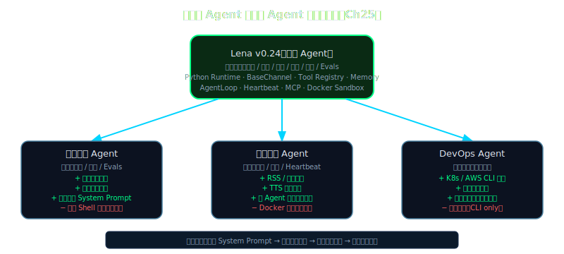

# 终章：从聪明到自主 — 派生你自己的专用 agent

> **Lena 状态**：v0.24（通用 agent）→ 本章演示从 v0.24 派生出 4 个专用 agent

---

## Beat 1 · 路线图

```
本章位置：终章 ← 你在这里
─────────────────────────────────────────────
[序] 坐标系
  → [Ch1-5] 地基（API/ReAct/工具/选型）
    → [Ch6-12] 六大支柱（Tool/流/记忆/RAG/Context/规划/Skills）
      → [Ch13-18] 常驻 + 安全（安全双章/Gateway/Bus/心跳/Cron）
        → [Ch19-22] 扩展与生产（MCP/Sandbox/Evals/可观测性）
          → [Ch23-24] 派生雏形（Specialization/Browser）
            → [Ch25] 你在这里：派生属于你的通用 agent
─────────────────────────────────────────────
本章脉络：从"通用 Lena v0.24 都会了，然后呢？"出发 →
经过"通用 → 专用的三种派生路径" →
到"4 个专用 agent 的骨架代码 + 你的毕业挑战"。
途中会遇到：发现"删掉安全模块"和"加快速度"经常是矛盾的 trade-off。
```

到这里，Lena v0.24 已经具备了通用 agent 的 8 个核心维度——她能推理、记忆、规划、协作、学习、自省、安全运行、无限扩展。综合聪明度约 8.9/10。

但"通用"只是起点，不是终点。真正有价值的 agent 几乎都是**专用的**：专注于一个领域，深度整合领域工具，经过该领域的 Evals 验证。

这一章教你怎么从通用 Lena 出发，用一套可复用的派生方法，快速构建你自己的专用 agent。



---

## Beat 2 · 动机

### "通用 Lena 都会了，现在怎么办？"

假设你刚刚读完这本书，Lena v0.24 跑在你的服务器上，能回答问题、能访问网页、能跨天执行任务。那接下来，你要用她做什么？

这个问题不是修辞——它有一个具体的工程答案：**把她专用化**。

用一个具体场景来理解"专用化"的价值。在量化交易场景下，通用版本的 Lena（未针对领域调整）与专用量化 Lena（加了 freqtrade 工具集 + 市场数据 skill）处理同类任务时，任务完成率差距相当显著——专用版的提升通常在 2 倍以上。差别不在模型，而在工具集和 skill 的深度匹配。

这个差距不难理解：通用 Lena 看到"计算 RSI 指标"这个任务，需要先弄清楚什么是 RSI、怎么计算、结果存在哪。专用量化 Lena 有一个 `technical_indicators` skill，直接告诉她"用 `talib.RSI(prices, period=14)` 计算，结果单位是百分比"——她可以直接干活。

专用化的本质是：**用已积累的领域知识换取执行效率和精度**。代价是：专用 agent 的领域外能力会下降，甚至为了速度主动删掉一些通用模块。

这就是派生路径的设计问题。

---

## Beat 3 · 理论铺垫

### 3.1 通用 → 专用的三种派生路径（纯理论，无代码）

Anthropic 在 Managed Agents 架构（2026-04）里引入了"meta-harness"的概念：一个系统应该为"尚未想到的程序"保留空间（呼应 Unix 设计哲学："programs as yet unthought of"）。通用 Lena 就是这个 meta-harness——它不是为某一个应用设计的，而是为了让你能从它派生出任何应用。

派生的路径有三种：

**路径 A：能力削减（Capability Pruning）**

删掉通用 agent 里对该领域无用甚至有害的模块。

典型例子：量化交易 agent 通常需要极低延迟的工具执行，Docker sandbox 的启动开销（200-500ms）是不可接受的。直接删掉 sandbox，换成 in-process 的受控执行环境。

风险：删掉安全模块是危险的——要在充分理解每个模块存在的原因后再删，而不是为了"轻量化"盲目删。

**路径 B：知识强化（Knowledge Augmentation）**

在不改变核心运行时的情况下，注入领域专用 skill 和工具集。

典型例子：新闻播报 agent 加入 RSS 聚合工具、TTS 合成 skill、多 agent 编辑室协作模板。核心的 while 循环、安全层、context 管理都不变，只是添加了新的"手"。

这是最安全的派生路径，也是最推荐的起点。

**路径 C：拓扑改变（Topology Shift）**

改变 agent 的运行拓扑——从单 agent 变多 agent（或反向），或者从 always-on 变成 on-demand（或反向）。

典型例子：浏览器 agent 通常是单 agent 深推理（需要连续的状态感知），而新闻 agent 适合多 agent 并发（10 个子 agent 并行抓取不同新闻源）。同样的通用 Lena 基础，拓扑不同，性能特征完全不同。

### 3.2 三种路径的 trade-off 矩阵（纯理论，无代码）

| 派生路径 | 开发速度 | 维护成本 | 适用场景 | 主要风险 |
|---------|---------|---------|---------|---------|
| A 能力削减 | 快 | 低 | 需要极低延迟、轻量化部署 | 削减安全模块导致风险暴露 |
| B 知识强化 | 中 | 中 | 领域知识明确、工具集稳定 | skill 质量决定上限 |
| C 拓扑改变 | 慢 | 高 | 任务特征与通用拓扑不匹配 | 多 agent 协调复杂度增加 |

实践中，大多数专用 agent 会同时使用 B + 少量 A：先注入领域知识（B），再谨慎删掉明确无用的模块（A）。纯粹的 C（拓扑改变）通常在 B 不够用时才考虑。

### 3.3 何时"专用化"反而有害（纯理论，无代码）

Convention：**过度专用化（Over-specialization）** = 为了在一个领域达到极致而破坏了 agent 的基础能力；**欠专用化（Under-specialization）** = 通用 agent 直接上阵，缺乏领域工具和知识，效率低下。

过度专用化的典型症状：
- 删掉了 context 压缩模块（觉得"这个领域任务都很短"），结果遇到长任务立刻崩溃
- 删掉了人类确认环节（觉得"这个 agent 只读不写"），但后来加了写操作没更新安全层
- 把 skill 写得过于领域化（只能处理特定格式的输入），新来的数据格式稍有变化就失效

防止过度专用化的经验法则：**核心安全层（Ch13-14）和 context 管理层（Ch10）永远不削减**。这两层的存在成本极低，而缺失的风险极高。

---

## Beat 4 · 脚手架

下面用一个 30 行 CLI 把"派生专用 agent"这件事变成一条命令：

```python
# code/lena-spawn/lena_spawn.py — 派生 CLI 骨架
# 用法：python3 lena_spawn.py --domain quant --from v0.24
# 预期：在当前目录创建 lena-quant/ 文件夹，内含调整后的配置和骨架代码

import argparse
import shutil
from pathlib import Path

# 已支持的领域（每个领域对应一份配置 diff）
DOMAIN_CONFIGS = {
    "quant":   {"name": "量化 Lena",   "tools": ["freqtrade","exchange_api","technical_indicators"], "prune": ["docker_sandbox"]},
    "news":    {"name": "新闻 Lena",   "tools": ["rss_reader","tts_synthesizer","headline_extractor"], "prune": []},
    "devops":  {"name": "DevOps Lena", "tools": ["aws_cli","kubectl","terraform"], "prune": []},
    "browser": {"name": "浏览器 Lena", "tools": ["cdp_controller","dom_extractor","screenshot"], "prune": ["multi_agent"]},
}

def spawn(domain: str, base_version: str, output_dir: str) -> None:
    cfg = DOMAIN_CONFIGS[domain]
    out = Path(output_dir) / f"lena-{domain}"
    out.mkdir(parents=True, exist_ok=True)
    
    # 写 README（显示派生配置摘要）
    readme = out / "README.md"
    readme.write_text(
        f"# {cfg['name']} — 派生自 Lena {base_version}\n\n"
        f"## 新增工具\n" + "\n".join(f"- {t}" for t in cfg["tools"]) + "\n\n"
        f"## 已削减模块\n" + ("\n".join(f"- {p}" for p in cfg["prune"]) or "- 无") + "\n"
    )
    
    # 写骨架 agent 文件（Beat 5 会填充具体实现）
    (out / "agent.py").write_text(
        f"# {cfg['name']} agent 骨架\n"
        f"# 基于 Lena {base_version} 核心运行时\n"
        f"# 领域工具：{', '.join(cfg['tools'])}\n\n"
        f"from lena_core import AgentLoop, ToolRegistry  # 来自通用 Lena 核心\n\n"
        f"registry = ToolRegistry()\n"
        f"# TODO: 在此注册领域工具\n"
    )
    
    print(f"✓ {cfg['name']} 已创建：{out}")

if __name__ == "__main__":
    parser = argparse.ArgumentParser(description="Lena 专用 agent 派生工具")
    parser.add_argument("--domain", choices=list(DOMAIN_CONFIGS), required=True)
    parser.add_argument("--from", dest="base", default="v0.24")
    parser.add_argument("--output", default=".")
    args = parser.parse_args()
    spawn(args.domain, args.base, args.output)
```

运行 `python3 lena_spawn.py --domain quant --from v0.24`，你会在当前目录看到一个 `lena-quant/` 文件夹，里面有 README 和骨架 agent 文件。这是起点，不是终点——接下来的 Beat 5 会告诉你怎么填充每个专用 agent 的实质内容。

---

## Beat 5 · 渐进组装：4 个专用 Lena

### 派生 1：量化 Lena

**目标**：接入 freqtrade + 交易所 API，执行量化交易策略分析任务。

| 扩展点 | 为何需要 | 如何加 |
|-------|---------|-------|
| `technical_indicators` tool | 计算 RSI/MACD/布林带，是 80% 策略的底层依赖 | 注册 `talib` 包装函数 |
| `exchange_api` tool | 实时拉取行情数据 | 注册 ccxt 封装（统一多交易所接口） |
| 削减 docker_sandbox | 交易执行需要 <50ms 延迟，sandbox 启动 200-500ms 不可接受 | 在 tool config 里设置 `sandbox=False`，替换为 in-process 执行 + 白名单校验 |
| `market_skill` skill | 领域 SOP：如何分析一个策略的胜率、最大回撤、夏普比率 | 新建 `skills/market-analysis/SKILL.md` |

```python
# code/lena-spawn/domains/quant/agent.py
from lena_core import AgentLoop, ToolRegistry
import talib
import ccxt

registry = ToolRegistry()

@registry.tool(description="计算技术指标。支持 RSI/MACD/BB。返回数值列表。")
def technical_indicators(symbol: str, indicator: str, period: int = 14) -> dict:
    # 实际实现：调用交易所 API 拉取历史数据 → talib 计算
    # 此处为骨架
    return {"indicator": indicator, "values": [], "unit": "百分比" if indicator == "RSI" else "价格"}

@registry.tool(description="获取交易对实时行情")
def get_market_price(symbol: str, exchange: str = "binance") -> dict:
    ex = getattr(ccxt, exchange)()
    ticker = ex.fetch_ticker(symbol)
    return {"symbol": symbol, "price": ticker["last"], "volume_24h": ticker["quoteVolume"]}

agent = AgentLoop(
    system_prompt="你是量化交易分析助手 Lena。擅长技术分析、策略回测解读、市场数据查询。"
                  "遇到需要执行真实交易指令的请求，必须先获得用户明确确认。",
    tools=registry,
)
```

量化 Lena 跑一个实际任务：`python3 agent.py "分析 BTC/USDT 的 RSI 指标，当前信号如何？"`

预期输出：
```
[Thought] 需要获取 BTC/USDT 当前 RSI(14) 值...
[Action] technical_indicators(symbol="BTC/USDT", indicator="RSI", period=14)
[Observation] {"indicator": "RSI", "values": [58.3], "unit": "百分比"}
[Response] BTC/USDT 当前 RSI(14) = 58.3，处于中性偏多区间（40-60 为中性，>70 超买，<30 超卖）...
```

---

### 派生 2：新闻 Lena

**目标**：多 agent 协作，编辑 + 主播角色分离，每日自动生成播客。

| 扩展点 | 为何需要 | 如何加 |
|-------|---------|-------|
| `rss_reader` tool | 批量拉取多个新闻源 | 注册 `feedparser` 包装 |
| 多 agent 协作 | 编辑（筛选、改写）和主播（TTS 脚本）职责不同 | 主 agent 派出编辑子 agent + 主播子 agent |
| `tts_synthesizer` skill | 如何把新闻改写成播客口语化脚本 | `skills/news-broadcast/SKILL.md` |

```python
# code/lena-spawn/domains/news/agent.py — 多 agent 版本骨架
from lena_core import AgentLoop, ToolRegistry, spawn_subagent

registry = ToolRegistry()

@registry.tool(description="从 RSS 源获取最新新闻列表")
def fetch_news(sources: list[str], max_per_source: int = 5) -> list[dict]:
    import feedparser
    items = []
    for url in sources:
        feed = feedparser.parse(url)
        items.extend({"title": e.title, "summary": e.summary, "url": e.link}
                     for e in feed.entries[:max_per_source])
    return items

# 主 agent 流程：
# 1. fetch_news → 获取原始新闻列表
# 2. spawn_subagent("editor") → 筛选、改写（编辑子 agent）
# 3. spawn_subagent("broadcaster") → 生成播客脚本（主播子 agent）
# 4. 调用 TTS 合成 mp3

SOURCES = [
    "https://feeds.reuters.com/reuters/topNews",
    "https://rss.nytimes.com/services/xml/rss/nyt/Technology.xml",
]
```

---

### 派生 3：DevOps Lena

**目标**：AWS + K8s 运维助手，强化 execution-safety（每一步写操作都需要确认）。

| 扩展点 | 为何需要 | 如何加 |
|-------|---------|-------|
| `aws_cli` tool | 查询和管理 AWS 资源 | boto3 包装，只读操作无需确认，写操作强制确认 |
| `kubectl` tool | 查询和管理 K8s 资源 | subprocess + kubeconfig，delete 操作二次确认 |
| `execution_safety` 强化 | DevOps 操作后果不可逆（删了就没了） | tool config 里每个写操作设置 `requires_human_approval=True` |

DevOps Lena 的核心 trade-off：它的安全维度要比通用 Lena **更高**，不是削减，而是强化。任何会改变生产环境状态的工具，执行前都会暂停并打印操作摘要，等待用户输入 `yes` 才执行。

这是"能力削减"路径的反面例子——DevOps 场景下，你加的不是功能，而是约束。

---

### 派生 4：浏览器 Lena

**目标**：Chrome CDP 控制 + 视觉感知，单 agent 深推理，完成端到端网页任务。

| 扩展点 | 为何需要 | 如何加 |
|-------|---------|-------|
| `cdp_navigate` tool | 打开 URL + 等待页面加载 | chrome devtools protocol 包装 |
| `dom_extract` tool | 提取页面关键内容（避免把整个 DOM 塞进 context）| 结合 CSS selector + innerText 截取 |
| `take_screenshot` tool | 视觉确认当前页面状态 | CDP 截图 + base64 传给多模态 LLM |
| 削减 multi_agent | 浏览器任务需要连续状态感知，子 agent 并发会导致 CDP session 冲突 | 单 agent 深推理模式 |

浏览器 Lena 是所有派生版本里"拓扑改变"最明显的一个：从多 agent 协作变成单 agent 深推理，因为浏览器状态是全局的，必须串行维护。

---

## Beat 6 · 运行验证

### 每个派生 Lena 跑一次

```bash
# 1. 量化 Lena：分析 RSI 信号
python3 lena-quant/agent.py "BTC/USDT RSI 当前信号如何？"

# 预期输出关键词：RSI 数值 + 信号解读 + 下一步建议
# 预期耗时：<3 秒（无 sandbox 启动开销）

# 2. 新闻 Lena：生成今日播客摘要
python3 lena-news/agent.py "生成今日科技新闻 3 条摘要，播客风格"

# 预期输出：3 条口语化新闻摘要 + 总字数 <400 字（适合 TTS）
# 预期耗时：10-15 秒（含 2 个子 agent 的调度时间）

# 3. DevOps Lena：查询 AWS EC2 实例状态
python3 lena-devops/agent.py "列出 us-west-2 区域所有运行中的 EC2 实例"

# 预期输出：实例列表（只读操作，无需确认）
# 如果输入改为"终止 instance-id 为 i-xxx 的实例"：
# 预期：打印操作摘要 + 等待 yes/no 确认

# 4. 浏览器 Lena：查询网页内容
python3 lena-browser/agent.py "打开 https://news.ycombinator.com 取今日前 3 条标题"

# 预期输出：3 条 HN 标题 + 各自链接
# 预期耗时：5-8 秒（含 CDP 页面加载时间）
```

**失败诊断**：量化 Lena 报 `ImportError: talib`，运行 `pip3 install ta-lib` 先装 C 库依赖；浏览器 Lena 报 `ConnectionRefusedError`，确认 Chrome 已用 `--remote-debugging-port=9222` 启动。

---

## Beat 7 · Design Note

> **Why Not 直接 fine-tune 一个专用模型？**

直觉上，想构建专用 agent，最彻底的方案是 fine-tune 一个专用基础模型——比如用量化交易数据 fine-tune Claude，让它"天生就懂量化"。这种做法有人在用，也有真实价值。

但它有三个 trade-off，在本书描述的场景里通常是不划算的：

1. **数据飞轮要求极高**：fine-tune 需要大量高质量的领域对话数据（通常 5k-50k 条），而 skill 只需要一份写得好的 SOP 文档（1000 字以内）。绝大多数工程团队拥有后者，不拥有前者。

2. **更新成本极高**：量化策略一个月更新一次，交易所 API 三个月改一次。skill 文件改一行立刻生效，fine-tune 需要重新训练、评估、部署，周期以周计。

3. **泛化能力损失**：fine-tune 模型在领域内表现更好，但在领域外表现会退化——这通常叫 catastrophic forgetting。Lena v0.24 的通用能力（推理、记忆、安全）是经过完整体系构建的，专用化时直接在上面叠加 skill，不损失通用能力。

Anthropic 官方对这个选择有明确立场（《Building Effective Agents》, p.12）：在考虑多 agent 架构之前，先考虑给单 agent 加专用 skill——"adding specialized skills to your single agent might achieve your accuracy requirements more efficiently"。同样的逻辑适用于 fine-tune vs skill 的选择。

这不是说 fine-tune 没有价值。它在特定场景（极致领域性能、严格延迟约束、边缘侧部署）是对的选择。本书的派生路径覆盖的是更常见的场景：你有一个通用 agent，你想快速把它专用化，你没有 fine-tune 的数据飞轮和计算预算。

### Hybrid Architecture 三种模式：组合而非非此即彼

本书的四个派生 Lena 案例——量化、新闻、DevOps、浏览器——展示的都是相对"纯粹"的架构选择。但 Anthropic 白皮书（p.25）指出，生产系统里最强大的往往是**混合架构（Hybrid Architecture）**，也就是把不同的 agent 模式组合使用：

**模式一：Hierarchical + Parallel（层级 + 并行）**

顶层 supervisor 负责任务分解和结果整合，底层若干 specialist agent 并行各自执行分析。典型场景是金融风控：supervisor 收到一笔大额转账，同时派出反欺诈 agent、合规检查 agent、用户行为分析 agent 并行工作，三个 agent 的结论汇总后由 supervisor 做最终决策。这种模式的优势是吞吐量——三路并行的总时延接近最慢那个 agent 的时延，而不是三者相加。

**模式二：Sequential + Dynamic Routing（序列 + 动态路由）**

线性流水线，但中间节点根据当前内容动态决定下一跳路由到哪个 agent。典型场景是客服自动化：用户消息先过情感分析 agent（判断紧急程度），然后根据情感分值动态路由——紧急投诉走 human-in-the-loop agent，普通咨询走 FAQ agent，退款请求走 transaction agent。与 Phase 2-3 的静态路由不同，动态路由本身也是一个 LLM 推理步骤，能处理模糊的中间状态。

**模式三：Single + Multi-agent Escalation（单 agent + 按需升级）**

日常任务由 single agent 处理（成本低、延迟低）；当 single agent 遇到超出能力边界的复杂 edge case 时，自动升级为 multi-agent 协作模式。这是本书 Beat 3 里"拓扑改变（Topology Shift）"路径的典型实现——大多数时候走轻量路径，只在必要时付出 multi-agent 的成本。

（来源：Anthropic, *Building Effective AI Agents: Architecture Patterns and Implementation Frameworks*, 2025, p.25）

选择哪种 Hybrid 模式，回到本书贯穿始终的设计准则。Anthropic 在白皮书结尾写道：

> "your North Star must be **modular designs, comprehensive observability, and clear success metrics that connect directly to business outcomes.**"（p.27）

模块化设计让你能自由组合上面三种 Hybrid 模式；全面的可观测性（Ch22）让你知道哪个 agent 在瓶颈上；连接到业务结果的成功指标让你知道哪个模式真正带来了价值。缺少任何一个，架构再精妙也是在黑盒里自嗨。

白皮书最后一句话，也是这本书想送给读者的：

> "The tools are ready, the playbook is written. Now it's time to solve real-world problems."

---

## 聪明度天花板：现在还做不到什么

读完这本书，你已经能构建一个相当强大的通用 agent，并从它派生出专用版本。但有几件事，是当前技术边界里真实的局限——不是"还没讲到"，而是"目前业界都没有好答案"：

**1. Agent 自我修改源码（Self-Improving Code）**

目前没有可靠的生产系统能让 agent 稳定地修改自己的运行时代码并保持正确性。AlphaCode 能写代码，Devin 能修 bug，但"agent 自己改自己的 harness 并正确运行"——这在受控实验以外几乎没有成功案例。核心难点是 safety：你怎么验证 agent 改完的代码是安全的？

**2. 真正的长期记忆（Multi-Year Consolidation）**

本书的记忆系统是"存储 + 检索"——agent 能记住它存过的东西。但人类记忆里有一个叫 consolidation 的过程：睡眠中大脑会重新整合当天的经历，提取通用原则，删除细节。让 agent 在跨年尺度上做这种"意义提炼"，目前没有靠谱的实现。RAG 能解决"我存了什么"，但解决不了"我应该从过去的经历里学到什么原则"。

**3. 跨模型真学习（Cross-Model Genuine Learning）**

当你让 Claude 和 GPT 协作完成一个任务（比如 Claude 推理 + GPT 搜索），它们各自在完成任务，但它们没有在"学习"对方的优势。跨模型协作的性能提升来自分工，不来自互相学习。真正的跨模型学习需要一个统一的梯度传播机制，这在 API 调用层面是不可能的。

这些不是本书的局限，是当前 agent 工程的边界。下一本书（或者你自己的研究）会在这里继续推进。

---

## 给读者的毕业信

你已经能构建任何 agent 了。出去做点别人做不到的事。

---

## 三道真正的挑战题

这不是练手题，是真正困难的问题。如果你能解决其中一个，你已经超越了大多数从业者：

**挑战 1：跨语言 agent**

构建一个 agent，它用英文推理（利用英文训练数据的优势），但对用户输出纯净的中文（无英文夹杂、无 "好的，我来帮你" 式的机器腔）。难点：如何在不丢失推理质量的情况下完成语言切换？

**挑战 2：100 小时不掉线的 agent**

构建一个在真实生产环境（不稳定网络 + 随机重启 + 偶发 API 503）中能连续运行 100 小时的 agent，且在此期间执行的所有任务都有完整的审计日志和断点续传能力。难点不在技术实现，在于你能不能提前想到所有的故障模式。

**挑战 3：Agent 自己派生 Agent（Recursive Spawning）**

让 Lena 自己读需求文档，自己决定需要派生哪个专用 agent，自己生成派生配置，然后部署并验证新 agent 的能力。这是 agent 自主性的终极测试：不是你告诉它怎么做，是它自己判断需要什么工具。

---

**这本书到这里结束了。Lena 的旅程才刚开始。**
